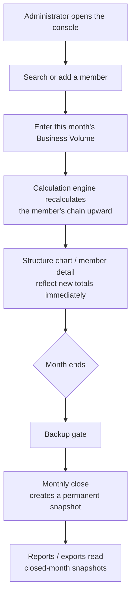
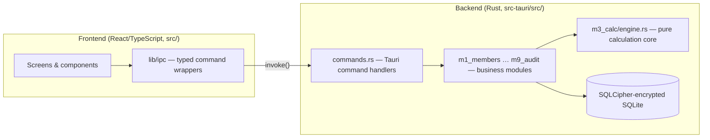
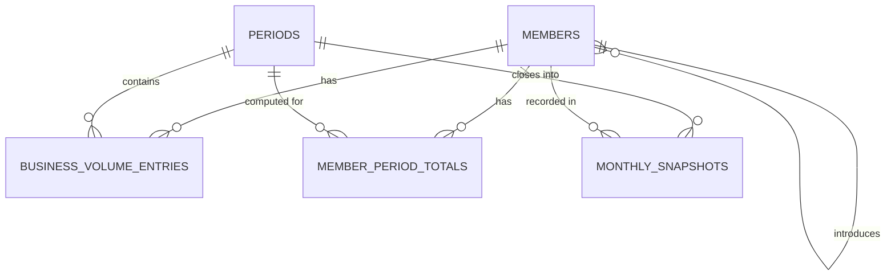

# Member Rewards Console

> An offline desktop application for tracking a referral-based member network and calculating each member's monthly Rewards from a configurable, multi-level percentage-slab model.

## Table of Contents

- [Overview](#overview)
- [Business Context](#business-context)
- [Key Capabilities](#key-capabilities)
- [Core Business Concepts](#core-business-concepts)
- [Core Workflows](#core-workflows)
- [Architecture](#architecture)
- [Technology Stack](#technology-stack)
- [Project Structure](#project-structure)
- [Data Model](#data-model)
- [Installation & Prerequisites](#installation--prerequisites)
- [Configuration](#configuration)
- [Running the Application](#running-the-application)
- [Testing](#testing)
- [Build & Packaging](#build--packaging)
- [Security](#security)
- [Error Handling & Logging](#error-handling--logging)
- [Important Design Decisions](#important-design-decisions)
- [Documentation](#documentation)
- [Known Limitations](#known-limitations)
- [Development & Maintenance Guide](#development--maintenance-guide)
- [License](#license)

## Overview

Member Rewards Console (package name `bvconsole`) is a single-administrator, fully offline Tauri desktop application. It holds a permanent, tree-shaped member hierarchy, accepts one monthly Business Volume figure per member, and instantly recalculates each member's Business Volume totals and Rewards up the chain. It is built for one operator managing a network of roughly 500–5,000 members (architected for up to 25,000), with no network members ever having system access.

The application holds no currency figure anywhere — every stored number is a unitless volume or reward amount. Conversion to a real-world currency, if any, happens entirely outside the software.

## Business Context

- **Problem solved**: replaces a manual, hand-calculated process for tracking member contributions and computing referral-based rewards across a multi-level hierarchy.
- **Primary user**: a single business owner/administrator who records data and reviews results. This person may have limited technical skill and will not read documentation.
- **Secondary subjects**: network members, who exist only as records in the system — they never log in and have no access.
- **Maintainer**: the developer who builds and supports the console on request, with no standing operational role.

Source: `PRODUCT.md`, `documents/refinement/01-product-and-scope.md`.

## Key Capabilities

- **Member/structure management** — a single permanent root member, an introducer-fixed-forever tree, six-digit member IDs, deactivate/reactivate (never permanent delete).
- **Business Volume entry** — single-field monthly entry per member, searchable by name, ID, or phone number.
- **Calculation engine** — computes each member's Total Business Volume, applicable slab, differential reward, royalty, and own-volume reward; recalculates the affected chain immediately on every entry, with no manual "recalculate" control anywhere.
- **Structure chart & Full Hierarchy Window** — a focused single-branch chart on the main screen, and a separate read-only window that draws the entire network at a point in time.
- **Monthly close** — closes a period behind a mandatory backup gate; closed periods remain correctable via new snapshot versions.
- **Reporting & export** — monthly, yearly-average, and low-contribution spreadsheet extracts, closed-month re-download, and a per-member PDF export.
- **Settings** — every scheme parameter (slab table, royalty rules, etc.) is editable by the administrator; nothing is hardcoded to a specific scheme.
- **Authentication & backup/restore** — single-operator login (PIN and/or password) with lockout and recovery codes, plus whole-console backup and restore on any machine, including a fresh install.

Only capabilities confirmed in `src-tauri/src/commands.rs` and the corresponding frontend screens are listed here.

## Core Business Concepts

The calculation engine (`src-tauri/src/m3_calc/engine.rs`) computes, for each member `x`, working up the tree from direct children:

```
TotalBusinessVolume(x) = BusinessVolume(x) + sum of TotalBusinessVolume(c) for each direct child c
slab%(x)                = highest configured slab threshold that is <= TotalBusinessVolume(x)
Differential(x)          = sum over direct children c of (slab%(x) - slab%(c)) * TotalBusinessVolume(c)
Royalty(x)                = sum of (royalty_rate * TotalBusinessVolume(c)) for direct children on the top slab,
                             only if the count of such children meets the configured minimum; otherwise 0
OwnReward(x)              = slab%(x) * BusinessVolume(x)
Rewards(x)                = Differential(x) + Royalty(x) + OwnReward(x)
```

Structural guarantees enforced by the engine and its test suite:

- Differential is never negative.
- Royalty and differential never double-pay the same volume.
- Rewards are a separate ledger — they never feed back into Business Volume or Total Business Volume.
- Recalculation walks only the affected chain upward (not the whole tree) inside a single database transaction.
- An inactive member still contributes fully to every calculation; deactivation is a display-only flag.

The slab table, royalty rate, and royalty qualification rule are all administrator-editable in Settings — the formulas above are the fixed shape of the calculation, not fixed numbers.

Source: `src-tauri/src/m3_calc/engine.rs`, `documents/refinement/03-business-rules.md`.

## Core Workflows



A closed month is not frozen: a correction re-enters the same flow and produces a new, versioned snapshot rather than overwriting history.

## Architecture

The application is a Tauri v2 desktop shell: a React/TypeScript frontend running in the OS webview, communicating only through typed Tauri commands with a Rust backend that owns all business logic and the encrypted SQLite database.



The frontend never touches the filesystem or database directly; every action goes through one wrapper (`src/lib/ipc/client.ts`) that calls a specific, allowlisted Tauri command. The Rust side is organized into nine numbered modules mirroring the documented functional areas:

| Module | Responsibility |
| --- | --- |
| `m1_members` | Member records and hierarchy |
| `m2_entries` | Business Volume entry |
| `m3_calc` | Calculation engine (Total Business Volume, slabs, differential, royalty, own-reward) |
| `m4_search` | Search, structure chart data, per-member PDF export |
| `m5_close` | Monthly close |
| `m6_reports` | Reporting and spreadsheet exports |
| `m7_settings` | Scheme configuration (slab table, royalty rules, console settings) |
| `m8_auth` | Login, lockout, recovery codes, key management |
| `m9_audit` | Audit log |

The main application window and the Full Hierarchy window run as separate Tauri windows with separate, narrower Tauri capability grants (`src-tauri/capabilities/`) — the hierarchy window is read-only by permission, not just by convention.

Source: `src-tauri/src/lib.rs`, `src-tauri/capabilities/`, `documents/refinement/04-technical-architecture.md`.

## Technology Stack

| Technology | Role |
| --- | --- |
| Tauri v2 | Desktop application shell and the only bridge between frontend and backend |
| React 19 + TypeScript | User interface |
| Vite | Frontend build/dev tooling |
| Tailwind CSS v4 + shadcn/ui primitives | Styling and base component library |
| Rust | All business logic, calculation engine, persistence, authentication, backups |
| SQLite via `rusqlite` (bundled SQLCipher) | Encrypted, embedded, offline data store |
| Argon2id + AES-256-GCM | Key derivation and master-key wrapping for the encrypted database |
| `rust_xlsxwriter` | Server-side (Rust) generation of spreadsheet exports |
| `genpdf` | Server-side generation of the per-member PDF export |
| Vitest + Testing Library | Frontend unit/component tests |
| `cargo test` (with `proptest`) | Rust unit, contract, and property-based tests |
| WebdriverIO + `tauri-driver` | End-to-end tests (Windows/Linux only — see [Known Limitations](#known-limitations)) |
| release-please | Version bump and changelog automation |

Source: `package.json`, `src-tauri/Cargo.toml`.

## Project Structure

```text
management_system/
├── src/                    # React/TypeScript frontend
│   ├── screens/             # One file per primary view (home, member detail, entry, close, ...)
│   ├── windows/              # Full Hierarchy window (separate Tauri window, own root)
│   ├── components/           # Shared UI, including components/ui/ (shadcn-based primitives)
│   ├── lib/                  # Auth/theme/navigation context, hooks
│   └── lib/ipc/               # Typed wrappers around every Tauri command
├── src-tauri/               # Rust backend
│   ├── src/m1_members … m9_audit/   # Business modules (see Architecture)
│   ├── src/db/                # SQLite schema/migrations
│   ├── src/commands.rs        # Tauri command handlers
│   ├── capabilities/           # Per-window Tauri permission grants
│   └── tests/                  # Contract, golden-scenario, property, performance tests
├── e2e/                     # WebdriverIO end-to-end specs
├── documents/
│   ├── implementation-readiness/  # Original requirements/design documentation
│   ├── refinement/                 # Refined, corrected requirements — build reference
│   ├── design/                      # UI design tokens/prototype
│   └── qa/                           # Manual verification checklists, test-data notes
├── PI/                      # Program-increment planning (backlog, roadmap, decisions)
├── scripts/                 # Vocabulary gate, version sync, dev data reset
├── DESIGN.md                # Visual design system reference
├── PRODUCT.md                # Product scope and principles
└── README.md
```

## Data Model



Key entities (`src-tauri/src/db/migrations/0001_initial.sql`):

- **members** — the hierarchy, self-referencing via an introducer reference; a member's introducer can never change.
- **business_volume_entries** — append-only ledger of monthly entries.
- **member_period_totals** — live, recalculated totals for any period not yet closed.
- **periods** — a period's lifecycle: open, awaiting close, or closed.
- **monthly_snapshots** — the permanent, versioned record of a closed period; all reporting reads from snapshots, never live values.
- **slab_table** — the administrator-editable percentage-band configuration.
- **backups**, **settings**, **auth**, **audit_log** — supporting tables for backup/restore, configuration, authentication, and the audit trail.

All volume and reward figures are stored as fixed-point integers (scaled by 100), never as floating point, to avoid rounding drift in the calculation chain.

## Installation & Prerequisites

- **Node.js** and **npm** (frontend build).
- **Rust** toolchain (stable, edition 2021) and **Tauri CLI** — the Rust dependencies build native SQLCipher, which requires a standard C toolchain for your OS (see the [Tauri prerequisites guide](https://tauri.app/start/prerequisites/) for OS-specific requirements).
- Windows or macOS as the target platform (the application is not built or tested for Linux as a runtime target).

```bash
npm install
```

## Configuration

The application is fully offline and has no environment-variable-based configuration; there is no `.env` file and no network endpoint to configure. Runtime behavior (scheme parameters, backup schedule, etc.) is configured from within the application's Settings screen and stored in the encrypted local database, not in source-controlled configuration files.

`src-tauri/tauri.conf.json` defines build-time application settings (product name, window size, bundle targets); it contains no secrets.

## Running the Application

**Development:**

```bash
npm run tauri dev
```

This starts the Vite dev server and launches the Tauri window against it.

**Frontend only** (for isolated UI work, without the Rust backend):

```bash
npm run dev
```

**Production build:**

```bash
npm run build      # vocabulary gate + typecheck + Vite build
npm run tauri build
```

`npm run build` runs the vocabulary gate (`vocab-grep`) before compiling — it fails the build if any excluded word appears in a user-visible string.

## Testing

| Command | Covers |
| --- | --- |
| `npm test` | Frontend unit/component tests (Vitest) and script-level tests (`scripts/*.test.mjs`) |
| `cargo test` (from `src-tauri/`) | Rust unit tests, IPC contract tests, the six golden-scenario regression tests, differential non-negativity property test, and the performance harness |
| `npm run test:e2e` | WebdriverIO end-to-end specs via `tauri-driver` (Windows/Linux only) |

The golden-scenario tests (`src-tauri/tests/golden_scenarios.rs`) pin six worked examples of the calculation engine's output; they are the primary regression guard for the calculation logic and are treated as must-never-move. macOS has no automated end-to-end coverage — see [Known Limitations](#known-limitations).

## Build & Packaging

- `npm run tauri build` produces platform installers via Tauri's bundler (targets configured as "all" in `tauri.conf.json`).
- Release automation is handled by **release-please**: conventional commits (`feat`, `fix`, `perf`, `revert`, `refactor`, `docs`) drive version bumps and `CHANGELOG.md` generation; `scripts/sync-version.mjs` keeps the version aligned across `package.json`, `src-tauri/Cargo.toml`, and `tauri.conf.json`.
- There is no CI pipeline; the release process runs from a scripted local pre-release gate. Windows builds are self-signed (no paid code-signing certificate); macOS builds are unsigned.

## Security

- **Authentication**: single-operator login with PIN and/or password, lockout after repeated failures, and recovery codes.
- **Data at rest**: the SQLite database is encrypted with SQLCipher. The master key is derived with Argon2id and wrapped with AES-256-GCM rather than being derived directly from the credential.
- **Frontend isolation**: the webview has no direct filesystem or network access. Every action is a specific, allowlisted Tauri command (`src-tauri/capabilities/`); the Full Hierarchy window is granted only a read-only subset of commands.
- **No network access**: the application does not call out to any network endpoint; there is no attack surface beyond the local machine and its saved backups.
- **No secrets in source control**: no credentials, keys, or tokens are stored in the repository.

## Error Handling & Logging

Backend errors are represented by a single shared `AppError` type (`src-tauri/src/error.rs`) that every command handler returns through, giving the frontend one consistent error shape (normalized further into presentation form by `src/lib/ipc/client.ts`). An append-only audit log (`m9_audit`) records administrator actions; two specific pre-authentication events (login-lockout transitions and recovery-code use) are documented as intended but not implemented, because no authenticated database connection exists at that point in the flow — this is a known, deliberate gap, not an oversight.

## Important Design Decisions

- **No currency figure anywhere** — the system stores and displays unitless volume and reward numbers only; currency conversion is explicitly out of scope, keeping the software independent of any specific compensation scheme's monetary details.
- **Restricted vocabulary** — user-visible strings avoid commercial/transactional terms (a fixed excluded-word list enforced by `scripts/vocabulary-grep.mjs` as part of every build) to keep the product's language discreet and non-commercial.
- **No delete, anywhere** — members, entries, and closed periods can be deactivated or corrected but never permanently deleted, preserving a complete historical record.
- **No manual recalculation control** — recalculation is always automatic and immediate; there is deliberately no button that could leave the displayed totals stale or inconsistent with stored data.
- **Fixed-point arithmetic** — all volume/reward figures are stored as scaled integers rather than floating point, to keep the calculation chain exact.
- **Chain-upward recalculation, not whole-tree** — an entry recalculates only the affected member's ancestor chain, keeping recalculation fast at scale.

Source: `PRODUCT.md`, `documents/refinement/05-decisions-and-gaps.md` (also mirrored in `PI/05-decisions-and-gaps.md`).

## Documentation

```text
documents/
├── implementation-readiness/   # Original requirements and design documentation
├── refinement/                 # Refined, corrected requirements — treat as the build reference
├── design/                     # UI design tokens and prototype used for sign-off
└── qa/                         # Manual verification checklists and test-data notes
PI/                              # Program-increment planning: backlog, roadmap, test plan, decisions, traceability
DESIGN.md                        # Current visual design system
PRODUCT.md                       # Product scope, users, and guiding principles
CHANGELOG.md                     # Generated release history
```

`documents/refinement/` supersedes `documents/implementation-readiness/` where the two disagree; consult it first for current, corrected business rules.

## Known Limitations

- **No automated end-to-end coverage on macOS** — `tauri-driver` cannot drive the macOS webview, so macOS release verification relies on a manual checklist (`documents/qa/macos-manual-verification-checklist.md`) rather than automated tests.
- **Slab-table monotonicity is not validated** — the application does not check that configured slab percentages increase consistently with volume; this was a deliberate, accepted risk rather than an oversight.
- **No CI pipeline** — verification before release runs from a local scripted gate rather than a hosted CI system.
- **Unsigned/self-signed builds** — Windows installers are self-signed and macOS builds are unsigned, since no paid code-signing certificate is used.
- **Two audit events not recorded** — login-lockout transitions and recovery-code use are not written to the audit log, because no authenticated database connection exists before login completes.

## Development & Maintenance Guide

- **New business rules or changes to the calculation** belong in `src-tauri/src/m3_calc/engine.rs`, with a corresponding update to the golden-scenario tests (`src-tauri/tests/golden_scenarios.rs`) if expected totals change.
- **New or changed backend behavior** belongs in the relevant `mN_*` module in `src-tauri/src/`, exposed through a new or updated handler in `src-tauri/src/commands.rs`, and registered in `src-tauri/src/lib.rs`; add the command to the appropriate `src-tauri/capabilities/*.json` file or it will be inaccessible from the frontend.
- **New frontend↔backend calls** belong in `src/lib/ipc/` as a typed wrapper — screens and components should never call Tauri's `invoke` directly.
- **New UI screens** go in `src/screens/`; shared UI primitives belong in `src/components/ui/` and should follow the visual system in `DESIGN.md`.
- **Database changes** are additive migrations under `src-tauri/src/db/migrations/`; there is no destructive schema-migration path in the current design.
- **Any new user-visible string** must stay within the restricted vocabulary — run `npm run vocab-grep` (or `npm run build`, which includes it) before committing.
- **Tests** for backend logic go under `src-tauri/tests/` (Rust) or as `#[cfg(test)]` modules colocated with the code; frontend tests are colocated `*.test.tsx` files next to the component they cover.

## License

See [`LICENSE`](LICENSE).
