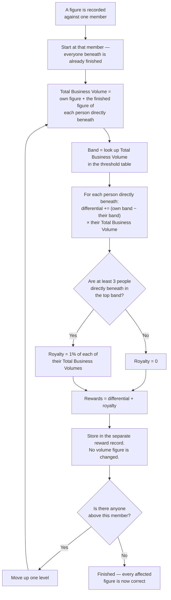
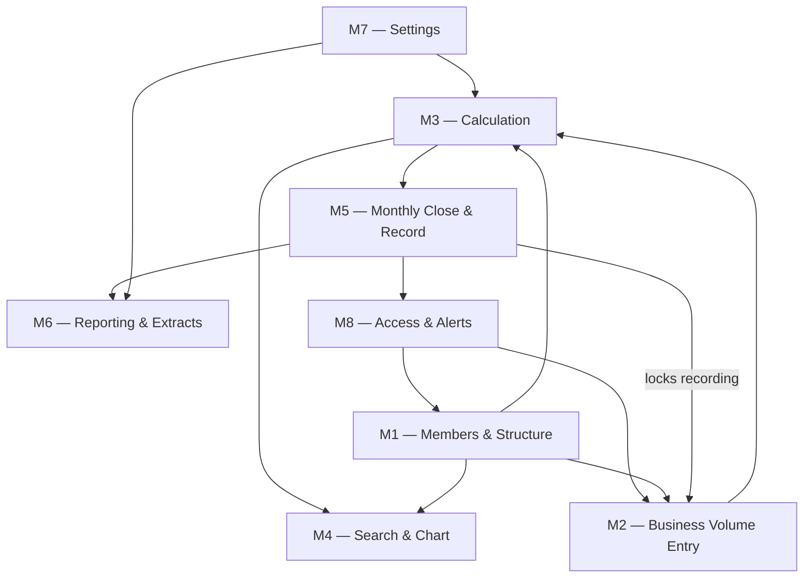
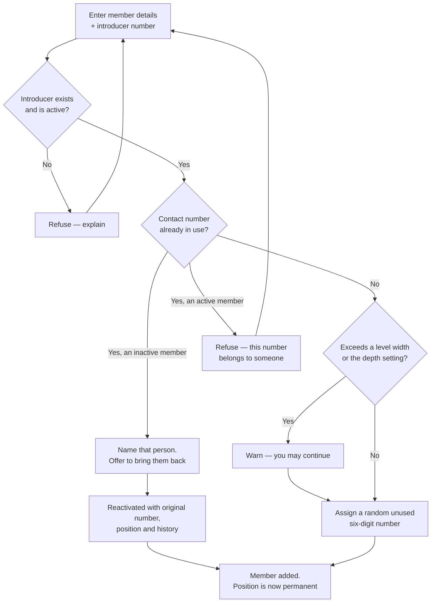
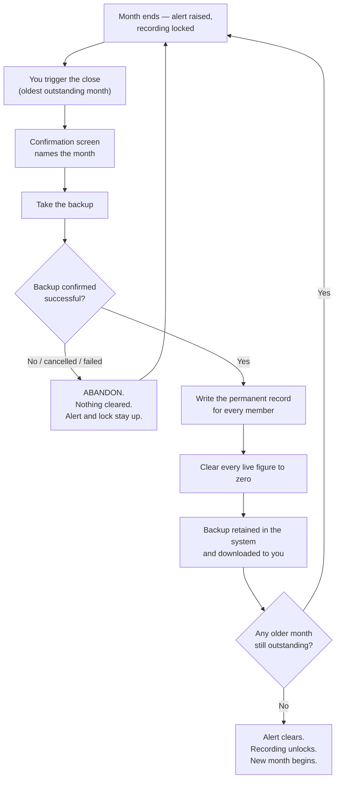

# Client Requirements Validation Document
## Distributor Business Volume & Beneficiary Management System

| | |
|---|---|
| **Client** | Siddharth Patel |
| **Prepared by** | Keyur Patel — Business Analysis & Solution Architecture |
| **Document type** | Requirements Validation — for client confirmation before design begins |
| **Version** | 1.0 |
| **Date** | 3 August 2026 |
| **Status** | Awaiting client confirmation |
| **Companion document** | [User Needs Document](user-needs-document.md) |
| **Source material** | [requirement-draft.md](../draft/requirement-draft.md), [requirement-spec.md](../draft/requirement-spec.md), [open-questions-checklist.md](../draft/open-questions-checklist.md) |

---

### Purpose of this document

This document exists for one reason: **to confirm that we have understood your requirements correctly,
before any design or building begins.**

It sets out what we believe the system must do, module by module, in business language. Nothing here is a
technical document. Where we have inferred something you did not say, it is marked 🟡 and stated separately
rather than folded in. Where we have found a genuine gap or a contradiction, it is raised rather than filled
in with our best guess.

**What we need from you:**

1. Read [§6 Functional Scope](#6-functional-scope) and [§7 End-to-End Workflow](#7-end-to-end-workflow) — this is what we think you asked for.
2. ~~Resolve the five contradictions in [§10.1](#101-contradictions-in-the-existing-documents).~~ **Done — all five resolved 3 August 2026.**
3. Answer the sixteen questions in [§10.2](#102-new-questions).
4. Work through the checklist in [§15](#15-items-requiring-client-confirmation), ticking **Confirmed** or **Needs clarification** against each item.
5. Sign [§16](#16-client-approval-section).

Markers used throughout: 🟢 confirmed · 🟡 assumption · 🔴 risk.

---

## 1. Project Overview

You run a referral-based distribution network in which every member is introduced by an existing member.
That produces a structure many levels deep, holding — on your own estimate — between 500 and 5,000 people.

Each month you record a figure of business activity against individual members. From those figures you work
out what every member has earned, based not only on their own activity but on the activity of everyone
beneath them in the structure. Today that calculation is done by hand.

This system takes over that calculation. It holds the structure, accepts your monthly figures, works out
every member's reward instantly, closes each month with a permanent record, and produces the monthly and
yearly extracts you need.

It is used by you and nobody else. It moves no money. Members never see it.

| | |
|---|---|
| **Expected network size** | 500 – 5,000 members 🟢 |
| **Users** | One — you 🟢 |
| **Operating cycle** | Calendar month, closed manually by you 🟢 |
| **Outputs** | On-screen figures, three spreadsheet extracts, permanent monthly records 🟢 |
| **Not included** | Money movement, stock, member access, currency conversion 🟢 |

---

## 2. Business Problem

| # | The problem | What it costs you today |
|---|---|---|
| **2.1** | The calculation is layered. Each member's figure depends on the figures of everyone beneath them being finished first. | Working must go level by level from the bottom. It takes hours, and one error near the bottom silently corrupts everything above it. |
| **2.2** | The structure exists partly on paper and partly in your head. | No single place to check who introduced whom, and no way to prove it if a member disputes their position. |
| **2.3** | When a member asks why their figure is what it is, the answer has to be reassembled by hand. | Every query is a piece of work, and the answer depends on the working being found again. |
| **2.4** | Once a month passes, what it contained is not recorded anywhere consistent. | You cannot reliably go back to a past month and see what it actually looked like. |
| **2.5** | Yearly comparisons need twelve months of separate working brought together. | Rarely done, so patterns of underperformance go unnoticed for a long time. |
| **2.6** | Off-the-shelf software for networks like yours uses commercial language you will not use. | Nothing available fits, so nothing has been adopted. |

---

## 3. Proposed Solution Summary

A private, single-user dashboard that does five things:

1. **Holds the structure.** Every member, their number, their details, and the person who introduced them —
   fixed permanently from the moment they are added.
2. **Accepts your figures.** One screen: find a member, record their Business Volume, done. No second field,
   no mode to pick, no currency.
3. **Works everything out immediately.** The moment you save, every affected figure up to the top of the
   structure is correct — team totals, bands, differential rewards and royalty.
4. **Closes each month safely.** You are alerted the moment a month ends and recording is locked until it is
   closed. Closing takes a backup first, refuses to proceed without one, writes a permanent record of the
   month, and only then clears the live figures.
5. **Produces your reports.** The month's figures, yearly averages per member, and a list of members whose
   personal contribution has fallen below your threshold — all as spreadsheets.

### 3.1 The three figures the system keeps apart

This is the most important thing in the document. Your original notes used one word for all three.

| Figure | What it is | Where it comes from |
|---|---|---|
| **Business Volume** | What you type in directly against one member. | You. Nothing else changes it. |
| **Total Business Volume** | That member's own figure **plus** the Total Business Volume already worked out for each person directly beneath them. | Calculated. Decides which band they fall into. |
| **Rewards** | What that member has earned this month — the band difference against each person directly beneath them, plus royalty where they qualify. | Calculated. Kept entirely separate; never added back into any volume. |

---

## 4. Project Scope

### 4.1 Included 🟢

| Area | In scope |
|---|---|
| Structure | One top-level member; every other member introduced by an existing one; adjustable depth and level widths, treated as guidance |
| Members | Add, edit, deactivate, reactivate; unique random six-digit numbers; unique contact numbers |
| Recording | Search by name or number; record Business Volume with up to two decimal places |
| Calculation | Team totals, band assignment, differential rewards, royalty, immediate recalculation on every entry |
| Viewing | Home search; structure chart; member detail with direct team and reward detail |
| Monthly close | Manual close, undismissable alert, recording lock, mandatory backup, permanent monthly record, clearing of all live figures |
| Reporting | Monthly extract with adjustable columns; yearly average extract; low-contribution report |
| Settings | Thresholds, percentages, band rows, depth, widths, royalty rate and qualifying count, yearly cycle, low-contribution threshold, reference unit value, default extract columns |
| Access | One administrator login with failed-attempt lockout |
| Language | Restricted, non-commercial vocabulary everywhere visible |

### 4.2 Excluded 🟢

| Excluded | Why |
|---|---|
| Any member login or member-facing screen | Confirmed — members have no access of any kind |
| Any currency figure on any screen, report or extract | Confirmed — you convert by hand, outside the system |
| Any movement of money | The system produces figures only |
| Any discount capability | Confirmed — "final discounts" in your notes meant final Rewards, which the system already produces |
| Multiple logins or user roles | Confirmed — one account, yours |
| Changing a member's introducer | Confirmed — positions are permanent |
| Permanent deletion of a member | Confirmed — deactivation only |
| Automatic monthly close | Confirmed — the close is always yours to trigger |

### 4.3 Future scope 🟡

Not in this piece of work, but the system will be built so none of these requires starting again.

| Future item | Why it is deferred |
|---|---|
| Currency conversion inside the system | You explicitly do not want it now; it may be added later if asked |
| Viewing a past month on screen | Only extracts are specified today — see [RQ-14](#rq-14--viewing-a-past-month-on-screen) |
| Member self-service view | Not required; would be a separate piece of work |
| Additional logins or roles | Not required today |
| Use on a phone or tablet | Never discussed — see assumption [BA-5](#8-business-assumptions-) |

---

## 5. User Roles

| Role | Who | Access | What they do |
|---|---|---|---|
| **Administrator** 🟢 | You, and only you | Full — every screen and every setting | Everything: onboarding, recording, closing, reporting, settings |
| **Member** 🟢 | Everyone in the network | **None** | Nothing inside the system. Their details are held; their rewards are calculated; they never log in |
| **Maintainer** 🟡 | Keyur Patel | Support only, on request | Builds and supports the system; applies changes beyond what settings allow |

There are no other roles and no permission levels.

---

## 6. Functional Scope

Eight modules. Every business rule is cited by its number from the specification so that any statement here
can be traced back.

---

### 6.1 Module M1 — Member & Structure Management

**Purpose.** Hold the network structure and every member's details, permanently and unambiguously. This is
the foundation of every figure the system produces.

**Major functions**

| # | Function |
|---|---|
| M1.1 | Create the single top-level member, once, during initial setup, without an introducer |
| M1.2 | Add a member with name, contact number, email (optional), address and a mandatory introducer number |
| M1.3 | Assign a random, unused six-digit number automatically |
| M1.7 | 🟢 **New, confirmed 4 August 2026** ([RQ-22](#rq-22--should-consent-be-captured-in-the-system-or-only-obtained-outside-it)). A mandatory checkbox at the Add Member screen — "the member has consented to their name, contact number and address being recorded in this system" — with the date captured automatically |
| M1.4 | Edit any member's details at any time |
| M1.5 | Mark a member inactive; recognise and reactivate a returning member by their contact number |
| M1.6 | Refuse any attempt to move a member to a different introducer |

**Dependencies.** None. Every other module depends on this one.

**Business rules**

| Rule | Statement |
|---|---|
| **Rule 1** | One top-level member, permanently. Level widths (9 / 6 / 3) are guidance only and never block an addition |
| **Rule 2** | Every member has a unique six-digit number, used as the primary way to find and link them |
| **Rule 28** | Edit freely; deactivate rather than delete; a member is never permanently removed |
| **Rule 30** | The introducer number must resolve to an existing, active member; the top-level member is created once at setup; no member may be positioned beneath their own team |
| **Rule 32** | Exceeding the maximum depth warns but allows |
| **Rule 34** | A contact number identifies exactly one member across the whole system, active or inactive |
| **Rule 35** | Numbers are chosen at random from those still free in 100000–999999, never in sequence, and never reissued. 🟢 **Confirmed 4 August 2026:** the usable range starts at **100001** — 100000 itself is never assigned |
| **Rule 37** | A member's introducer is fixed at creation and can never change. No override |

**Validation rules**

| # | Rule | On failure |
|---|---|---|
| V1.1 | Name is required | Refuse, name the field |
| V1.2 | Contact number is required and must not already exist anywhere in the system | Refuse; if the match is an inactive member, name that person and offer to bring them back |
| V1.3 | Introducer number is required and must match an existing, active member | Refuse with a clear message |
| V1.4 | Email is optional; if given, must be a valid address | Refuse the field only |
| V1.5 | The assigned member number must not already be in use | Choose another automatically |
| V1.6 | A second top-level member can never be created | The route is unavailable after setup |
| V1.7 | Exceeding a level width or the maximum depth | Warn, allow the user to continue |
| V1.8 | Any attempt to change an existing member's introducer | Refuse outright, state the reason |
| 🟢 V1.9 | **Resolved:** adding a member is refused until the consent checkbox is ticked | M1.7 — [RQ-22](#rq-22--should-consent-be-captured-in-the-system-or-only-obtained-outside-it), confirmed 4 August 2026 |

**Expected outputs.** A member record with a permanent number and a permanent position; a structure that can
be traced from any member to the top; a message naming a returning member where a contact number matches.

---

### 6.2 Module M2 — Business Volume Entry

**Purpose.** Let you record activity against a member as quickly and unambiguously as possible.

**Major functions**

| # | Function |
|---|---|
| M2.1 | Search for a member by name or six-digit number |
| M2.2 | Record a Business Volume figure against the selected member |
| M2.3 | Show the recording lock, and the month waiting to be closed, whenever a close is outstanding |
| M2.4 | 🟢 **New, confirmed 4 August 2026** ([RQ-7](#rq-7--correcting-a-wrong-figure)). Edit or reverse a previously recorded entry, at any time, in any month — open **or already closed**. Editing an entry in a closed month shows an explicit warning naming that month before the change is made |
| M2.5 | 🟢 **New, confirmed 4 August 2026.** Every entry carries a date, defaulting automatically to the day it is recorded. The date is editable afterward, through the same edit action as M2.4 — see [RQ-21](#rq-21--can-an-entrys-date-move-it-across-a-month-boundary) for whether that edit can move the entry into a different month |

**Dependencies.** M1 (the member must exist). M5 (the recording lock). M3 is triggered by every save here.

**Business rules**

| Rule | Statement |
|---|---|
| **Rule 15** | Search by name or number, select the member, record against them |
| **Rule 16** | Business Volume is entered directly and is the only thing entered. Up to two decimal places. No currency field anywhere |
| **Rule 22** | Two decimal places are held throughout; rounding happens only where a figure is displayed |
| **Rule 36** | Once a month ends, all recording is locked until that month is closed |

> ⚠️ **A tension worth naming.** Rule 16 says Business Volume "is entered directly and is the only thing
> entered" — a deliberate choice, recorded under [UN-07](user-needs-document.md#un-07--activity-recording-with-nothing-in-the-way)
> of the companion document, to keep this screen to a single field. M2.5's date field is, literally, a second
> field. Our recommendation — default the date automatically to today, and only surface it as something to
> change through the M2.4 edit action, never on the fast recording path itself — keeps Rule 15/16's screen
> exactly as fast as before. This is not yet the client's own confirmed mechanism; see
> [RQ-21](#rq-21--can-an-entrys-date-move-it-across-a-month-boundary).

**Validation rules**

| # | Rule | On failure |
|---|---|---|
| V2.1 | A member must be selected before a figure can be recorded | Refuse |
| V2.2 | The figure must be a number with at most two decimal places | Refuse, state the format |
| V2.3 | Recording is refused entirely while any month is outstanding | Refuse, name the month waiting to be closed |
| 🟢 V2.4 | **Resolved:** neither a negative figure nor a figure of zero is permitted. Both are refused | [RQ-17](#rq-17--negative-and-zero-figures) — client decision, 3 August 2026, stricter than our original recommendation |
| 🟢 V2.5 | **Resolved:** the date field never appears on the initial recording screen — it is set automatically and only becomes visible through the edit action | M2.5, so [SC-5](#12-success-criteria)'s fifteen-second recording target is unaffected |

**Expected outputs.** A recorded figure against one member, and — immediately — corrected team totals, bands
and rewards for that member and everyone above them.

---

### 6.3 Module M3 — Calculation Engine

**Purpose.** Turn recorded activity into a reward figure for every member, correctly and consistently, every
time.

**Major functions**

| # | Function |
|---|---|
| M3.1 | Work out each member's Total Business Volume from their own figure plus the finished figures of those directly beneath them |
| M3.2 | Assign each member's band from their Total Business Volume |
| M3.3 | Work out the differential reward against each person directly beneath them |
| M3.4 | Assess royalty qualification and work out royalty where earned |
| M3.5 | Combine the two into Rewards, held in a separate record |
| M3.6 | Do all of the above immediately on every entry, updating only the chain that is actually affected |

**Dependencies.** M1 (the structure), M2 (the figures), M7 (the threshold table and royalty settings).

**Business rules**

| Rule | Statement |
|---|---|
| **Rule 3** | A member's band is the highest one whose threshold is at or below their Total Business Volume. Below the lowest threshold is 0% |
| **Rule 5** | Calculation runs from the bottom of the structure upward; a member cannot be worked out until everyone directly beneath them is finished |
| **Rule 6** | Total Business Volume = own Business Volume + the Total Business Volume of each person directly beneath. One level only — deeper levels are already inside those figures |
| **Rule 7** | The band is driven by Total Business Volume, never by own Business Volume |
| **Rule 8** | Differential = the sum, across each person directly beneath, of (own band − their band) × their Total Business Volume. A member earns nothing on their own Business Volume |
| **Rule 9** | The differential can never be negative — a structural consequence, not a check |
| **Rule 10** | Royalty is earned where at least the qualifying number of people directly beneath (default 3) are in the top band; it pays the configured rate (default 1%) of each of their Total Business Volumes |
| **Rule 11** | Royalty and differential can never both pay on the same person — wherever royalty applies, the differential on that person is already zero |
| **Rule 12** | Rewards = Differential + Royalty |
| **Rule 13** | Rewards are a separate record. They never enter any volume figure, never raise a band, and never carry into the next month |
| **Rule 25** | Royalty is assessed independently at every level, so the same underlying volume may attract royalty at several levels of the same chain |
| **Rule 26** | Recalculation is immediate on every entry. There is no recalculate control and no batch mode |

**Validation rules**

| # | Rule | On failure |
|---|---|---|
| V3.1 | Every member's own Business Volume is always included in their own Total Business Volume, without exception | Structural — cannot fail |
| V3.2 | Only people directly beneath contribute a term to the differential | Structural |
| V3.3 | Only people directly beneath are counted and paid for royalty | Structural |
| 🔶 V3.4 | **By client decision, not built:** nothing prevents a threshold table where percentages do not rise with thresholds, which would break Rule 9. The client has accepted this residual risk rather than have it validated in software | See [RQ-1](#rq-1--protecting-the-threshold-table-from-an-invalid-edit) |
| 🟢 V3.5 | **Resolved:** inactive status has **no effect on any calculation.** An inactive member's own Business Volume, their Total Business Volume, band, differential and royalty all behave exactly as if they were active — deactivation is a display-only flag | [RQ-2](#rq-2--how-inactive-members-behave-in-the-structure) — client decision, 4 August 2026, stricter than our original recommendation |

**Expected outputs.** For every affected member: an updated Total Business Volume, band, differential,
royalty and Rewards figure — correct the moment the entry is saved.

#### Calculation flow



---

### 6.4 Module M4 — Search & Structure Visualisation

**Purpose.** Let you find any member instantly and see the shape of any part of the network.

**Major functions**

| # | Function |
|---|---|
| M4.1 | Search from the home screen by name or six-digit number |
| M4.2 | Open a member's detail from a search result, showing the people directly beneath them |
| M4.3 | Show a visual chart of the structure beneath any chosen member |
| M4.4 | Show a member's full detail: contact details, reward detail, direct team with figures, team total, count of direct people |
| M4.5 | 🟢 **New, confirmed 4 August 2026** ([RQ-2](#rq-2--how-inactive-members-behave-in-the-structure)). Show an inactive member in a visually distinct colour wherever they appear — chart node, search result, member list — informational only. Matches the export treatment at [M6.5](#66-module-m6--reporting--extracts) |

**Dependencies.** M1 (the structure), M3 (the figures shown).

**Business rules**

| Rule | Statement |
|---|---|
| **Rule 2** | The six-digit number is the primary way to find a member |
| **Rule 6** | The team total shown is the member's Total Business Volume |
| **Rule 12** | The reward detail shown is Differential + Royalty |
| — | *(Checklist Question 11, confirmed)* Each chart node shows exactly three things: name, number, and own Business Volume |

**Validation rules**

| # | Rule | On failure |
|---|---|---|
| V4.1 | A search returning nothing says so clearly rather than showing an empty screen | — |
| V4.2 | Member detail and the home search show the direct team only, one level deep | — |
| 🟢 V4.3 | **Resolved:** one line per direct child (name, number, their team figure, their band, this member's band, the difference, the resulting amount), then royalty lines, then the total | [RQ-13](#rq-13--what-reward-detail-means-on-the-member-screen) — confirmed 3 August 2026 |

**Expected outputs.** A search result list; a member detail screen; a structure chart.

> ⚠️ **One consequence to be aware of, already confirmed by you.** Because the band is set by the *team*
> figure, a chart node can show a small own figure while that member sits in a high band. The chart alone
> will not explain why anyone is in the band they are in — that explanation lives on the member detail screen.

---

### 6.5 Module M5 — Monthly Close & Permanent Record

**Purpose.** Close each month deliberately, capture it permanently, and make it impossible to lose one.

**Major functions**

| # | Function |
|---|---|
| M5.1 | Raise an undismissable alert the moment a month ends, naming it |
| M5.2 | Lock all recording until the outstanding month is closed |
| M5.3 | List every outstanding month, allowing only the oldest to be closed |
| M5.4 | Prompt for a backup and refuse to proceed unless it succeeds |
| M5.5 | Write a permanent record of the closing month for every member |
| M5.6 | Clear every live figure to zero |
| M5.7 | Retain every backup permanently inside the system for retrieval |
| M5.8 | 🟢 **New, confirmed 3 August 2026 (§11.13).** Let you manually back up the current, in-progress month's data on demand, at any time — independent of, and in addition to, the automatic backup gate at month-close (M5.4) |
| M5.9 | 🟢 **New, confirmed 4 August 2026** ([RQ-7](#rq-7--correcting-a-wrong-figure)). Editing an entry that belongs to an already-closed month (via M2.4) recalculates the affected chain and **rewrites that month's permanent record in place**. The corrected month is immediately re-extractable through the existing M6.1 / [V6.4](#66-module-m6--reporting--extracts) path — no separate export function is needed |
| M5.10 | 🟢 **New, confirmed 4 August 2026** ([RQ-20](#rq-20--what-happens-to-the-retained-backup-when-a-closed-month-is-corrected)). Whenever M5.9 corrects a closed month, the **original backup for that month is never touched**; a new, separately dated backup **version** is created and retained alongside it (extends M5.7 — every version kept permanently, none deleted). Extracts and all future reporting read the latest version |

**Dependencies.** M2 (recording is locked by this module), M3 (figures must be current before the record is
written), M6 (the record is the source of all reporting).

**Business rules**

| Rule | Statement |
|---|---|
| **Rule 17** | The close is manual only. You are prompted on the 1st but may act later |
| **Rule 18** | The close is gated: no confirmed backup, no close. A failed or cancelled backup abandons the close with nothing cleared |
| **Rule 20** | An undismissable alert appears as a banner on every screen and as a notification entry, naming the outstanding month. It clears only on a completed close. Where several are outstanding, all are listed and only the oldest can be closed; each keeps its own backup and its own record |
| **Rule 21** | A period is a calendar month. The close closes whichever month it belongs to — pressed on 5 September, it closes August. The confirmation screen names that month explicitly |
| **Rule 31** | Each backup is downloaded to your computer **and** retained permanently inside the system. Nothing is ever deleted automatically. 🟢 **Resolved 4 August 2026** ([RQ-20](#rq-20--what-happens-to-the-retained-backup-when-a-closed-month-is-corrected)): the downloaded copy also goes to a physically separate medium, per [RQ-19](#rq-19--backup-independence-on-a-single-machine). If a closed month is later corrected, the **original backup for that month is never touched** — a new, separately dated backup **version** is created instead, and every backup version is retained permanently (extends M5.7). Going forward, the software uses the latest version. 🟢 **Extended 7 August 2026** ([RQ-23](#rq-23--protecting-the-whole-console-not-just-one-month)): this same mechanism now also produces a backup of the **entire console**, not only a closing month — see M8.6/M8.7. The two remain one mechanism at different scope, not two separate systems |
| **Rule 36** | Recording is locked from the moment a month ends until that month is closed |
| **Rule 38** | The close clears **everything** — Business Volume, Total Business Volume, Rewards and royalty. Before anything is cleared, a permanent record is written per member capturing Business Volume, Total Business Volume, band percentage, Rewards, royalty earned and active/inactive status. All yearly reporting reads from these records only |

**Validation rules**

| # | Rule | On failure |
|---|---|---|
| V5.1 | Only the oldest outstanding month may be closed | The others are unavailable until it completes |
| V5.2 | Nothing is cleared until the backup is confirmed | Abandon the close, leave the alert in place |
| V5.3 | Nothing is cleared until the permanent record is written | Abandon the close |
| V5.4 | The confirmation screen must name the month being closed | — |
| 🟢 V5.5 | **Resolved:** the retained in-system copy is the gate; the download is a convenience | [RQ-6](#rq-6--what-counts-as-a-successful-backup) — confirmed 3 August 2026 |
| 🟢 V5.6 | **Resolved:** a month with no entries produces no record at all, and is excluded from the yearly average | [RQ-16](#rq-16--a-month-that-passes-with-no-entries) — confirmed 3 August 2026 |
| 🟢 V5.7 | **New, resolved:** editing an entry in an already-closed month must show an explicit on-screen warning naming that month, before the change is accepted | M5.9 — [RQ-7](#rq-7--correcting-a-wrong-figure), confirmed 4 August 2026 |

**Expected outputs.** A backup spreadsheet, downloaded and retained; a permanent record of the month; every
live figure at zero; the alert cleared and recording unlocked, unless an older month remains.

---

### 6.6 Module M6 — Reporting & Extracts

**Purpose.** Get your figures out of the system and into a spreadsheet.

**Major functions**

| # | Function |
|---|---|
| M6.1 | Extract a month's figures, with columns you choose |
| M6.2 | Extract yearly averages per member, with the month count each average is based on |
| M6.3 | Extract the list of members whose personal yearly average falls below your threshold |
| M6.4 | Re-download any past month's backup |
| M6.5 | 🟢 **New, confirmed 4 August 2026** ([RQ-2](#rq-2--how-inactive-members-behave-in-the-structure)). Show inactive-member rows in a visually distinct colour in every extract, alongside the existing textual active/inactive column (Rule 33). Matches [M4.5](#64-module-m4--search--structure-visualisation) on screen |

**Dependencies.** M5 (the permanent records), M7 (the yearly cycle, the threshold, the default columns).

**Business rules**

| Rule | Statement |
|---|---|
| **Rule 19** | Every extract includes the member's basic details, contact number, volume and Business Volume, regardless of which optional columns are chosen |
| **Rule 23** | The yearly average is the sum across the months that actually hold a record, divided by the count of those months — never by a fixed twelve. The month count is displayed next to every average |
| **Rule 24** | The low-contribution report filters on the yearly average of the member's **own** Business Volume, not their Total Business Volume |
| **Rule 33** | Every field is offered as a column, with your four defaults pre-ticked: name, number, contact number, Business Volume. Also available: email, address, introducer number, introducer name, level, count of direct people, Total Business Volume, band percentage, Rewards, royalty earned, joining date, active/inactive status |
| **Rule 38** | All yearly reporting reads from the permanent monthly records, never from live figures |

**Validation rules**

| # | Rule | On failure |
|---|---|---|
| V6.1 | The four default columns are always present and cannot be removed | — |
| V6.2 | Every yearly average is shown with the month count it is based on | — |
| V6.3 | The low-contribution threshold must be a positive number | Refuse |
| 🟢 V6.4 | **Resolved:** a past month's extract reads from the permanent record — so a re-extract taken after a correction (M5.9) automatically reflects it, with no separate "corrected" mode needed | [RQ-4](#rq-4--where-a-past-month-extract-comes-from) — confirmed 3 August 2026 |
| 🟢 V6.5 | **Resolved:** the backup file carries the threshold table in force that month | [RQ-5](#rq-5--what-the-backup-file-must-contain) — confirmed 3 August 2026 |

**Expected outputs.** Three spreadsheets: the monthly extract, the yearly average extract, the
low-contribution report. Plus retrieval of any past backup.

---

### 6.7 Module M7 — Settings & Configuration

**Purpose.** Let you change every parameter of the scheme yourself.

**Major functions**

| # | Function |
|---|---|
| M7.1 | Edit thresholds and percentages; add and remove band rows |
| M7.2 | Set the structure depth and the level widths |
| M7.3 | Set the royalty qualifying count and the royalty rate |
| M7.4 | Set the yearly cycle and the low-contribution threshold |
| M7.5 | Set the reference unit value |
| M7.6 | Set which columns are ticked by default on extracts |
| M7.7 | 🟢 **New, confirmed 7 August 2026** ([RQ-23](#rq-23--protecting-the-whole-console-not-just-one-month)). Set the whole-console backup schedule (off/daily/weekly/monthly) and how many recent backups to keep (default 10) — the actual backing-up and restoring is M8.6/M8.7 |

**Dependencies.** M3 and M6 both read from here.

**Full settings inventory**

| # | Setting | Default | Rule |
|---|---|---|---|
| 1 | Band thresholds | 100 / 400 / 1,200 / 3,000 / 5,000 / 7,000 / 10,000 | Rule 4 |
| 2 | Band percentages | 2 / 4 / 6 / 8 / 10 / 12 / 14 | Rule 4 |
| 3 | Band rows — add and remove | 7 rows | Rule 27 |
| 4 | Reference unit value (never displayed elsewhere) | 500 | Rule 14 |
| 5 | Structure depth | Not specified | Rule 1 |
| 6 | Level 2 width (guidance) | 9 | Rule 1 |
| 7 | Level 3 width (guidance) | 6 | Rule 1 |
| 8 | Level 4 width (guidance) | 3 | Rule 1 |
| 9 | Royalty qualifying count | 3 | Rule 10 |
| 10 | Royalty rate | 1% | Rule 10 |
| 11 | Yearly cycle start and end | 1 Jan – 31 Dec | Rule 23 |
| 12 | Low-contribution threshold | 100 | Rule 24 |
| 13 | Default extract columns | Name, number, contact number, Business Volume | Rule 33 |

**Business rules**

| Rule | Statement |
|---|---|
| **Rule 4** | Every threshold and percentage is editable. Both of your examples — moving 2% to 200, moving 6% to 1,000 — must work |
| **Rule 14** | The reference unit value stays on this screen but appears nowhere else and takes no part in any calculation |
| **Rule 27** | Band rows can be added and removed. The top band — the one that triggers royalty — is always whichever row holds the highest percentage, recalculated automatically |

**Validation rules**

| # | Rule | On failure |
|---|---|---|
| V7.1 | Thresholds must be positive numbers | Refuse |
| V7.2 | Percentages must be between 0 and 100 | Refuse |
| V7.3 | At least one band row must exist | Refuse the removal |
| V7.4 | The royalty qualifying count must be a positive whole number | Refuse |
| 🔶 V7.5 | **By client decision, not built:** percentages must rise as thresholds rise. Accepted as a residual risk rather than validated | See [RQ-1](#rq-1--protecting-the-threshold-table-from-an-invalid-edit) |
| 🟢 V7.6 | **Resolved:** a settings change applies immediately and re-works the month in progress, with a warning shown before saving. Closed months are never affected | [RQ-18](#rq-18--changing-a-setting-part-way-through-a-month) — confirmed 3 August 2026 |

**Expected outputs.** Updated scheme parameters, applied immediately.

---

### 6.8 Module M8 — Access & Alerts

**Purpose.** Keep the system to you alone, and make sure you cannot miss a month.

**Major functions**

| # | Function |
|---|---|
| M8.1 | One administrator login |
| M8.2 | Lock the account after repeated failed attempts |
| M8.3 | Show the outstanding-month banner on every screen |
| M8.4 | Keep a notification list |
| M8.5 | 🟢 **New, confirmed 4 August 2026.** Support a PIN and a complex password configured **at the same time**, not just one or the other. If both are set, a login succeeds with **either** credential, giving a self-managed backup on top of the recovery codes (RQ-10) |
| M8.6 | 🟢 **New, confirmed 7 August 2026** ([RQ-23](#rq-23--protecting-the-whole-console-not-just-one-month)). Back up the **entire console** — every member, entry, monthly record and setting, not one month — on a schedule you set (off/daily/weekly/monthly) or on demand at any time. The most recent backups are kept, a count you can change (default 10), older ones pruned automatically |
| M8.7 | 🟢 **New, confirmed 7 August 2026** ([RQ-23](#rq-23--protecting-the-whole-console-not-just-one-month)). Restore the console from any such backup file — including on a different computer, with nothing set up yet — bringing it back to exactly the state it held at that backup. Always states plainly what will be replaced and requires deliberate confirmation; the console takes one more backup of its own current state immediately beforehand, so a restore is itself never a one-way door |

**Dependencies.** M5 raises the alerts this module displays.

**Business rules**

| Rule | Statement |
|---|---|
| **Rule 29** | One administrator account, yours alone. No other accounts, no roles. Members never log in. Protected by a six-digit PIN or a complex password. 🟢 **Confirmed 4 August 2026, not exclusive:** both may be set at once, and a login is accepted with either one. **Failed-attempt limiting with lockout is mandatory regardless of how many credentials are set** |
| **Rule 20** | The outstanding-month alert appears as an undismissable banner on every screen and as a notification entry. No snooze, no dismiss |

**Validation rules**

| # | Rule | On failure |
|---|---|---|
| V8.1 | Repeated failed attempts lock the account | Lock, state clearly |
| V8.2 | The alert cannot be dismissed by navigating away, logging out, or acknowledging it | — |
| 🟢 V8.3 | **Resolved:** recovery codes, issued at setup and kept safe by you, are the route back in after a lockout or forgotten credential | [RQ-10](#rq-10--continuity-of-your-single-login) — confirmed 3 August 2026 |
| 🟢 V8.4 | **New, resolved:** setting a password does not require removing the PIN, and vice versa; either credential set unlocks the account | M8.5 — confirmed 4 August 2026 |
| 🟢 V8.5 | **New, resolved:** restoring the console always names what will be replaced and requires a deliberate confirmation, never a single stray click; the console backs up its own current state immediately before overwriting it | M8.6/M8.7 — [RQ-23](#rq-23--protecting-the-whole-console-not-just-one-month), confirmed 7 August 2026 |

**Expected outputs.** An authenticated session; a persistent alert while any month is outstanding; a restored console, on request, matching exactly the state its backup was taken from.

### 6.9 Module dependency map



---

## 7. End-to-End Workflow

### 7.1 Workflow 1 — Initial setup *(once)*

| Step | What happens |
|---|---|
| 1 | You log in for the first time and set your PIN or password |
| 2 | You create the single top-level member. This is a special step with no introducer, and it is available only once |
| 3 | You review the threshold table and adjust it if the defaults are not yours |
| 4 | You set the structure depth and the level widths — guidance figures, not limits |
| 5 | You set the royalty qualifying count and rate, the yearly cycle, and the low-contribution threshold |
| 6 | You tick the columns you want on extracts by default |
| 7 | The system is ready. Only the top-level member exists |

### 7.2 Workflow 2 — Adding a member

| Step | What happens |
|---|---|
| 1 | You choose to add a member |
| 2 | You enter their name, contact number, email if there is one, and address |
| 3 | You enter the six-digit number of the person who introduced them |
| 4 | The system checks that number resolves to an existing, active member. If not, it refuses and tells you |
| 5 | The system checks the contact number is not already in use |
| 6 | **If the number belongs to an inactive member**, the system names that person and offers to bring them back — with their original number, position and full history. No second record is created |
| 7 | If this addition exceeds a level width or the maximum depth, you are warned and can carry on |
| 8 | The system assigns a random unused six-digit number and saves the member |
| 9 | Their position is now permanent and can never be changed |



### 7.3 Workflow 3 — Recording activity *(the everyday task)*

| Step | What happens |
|---|---|
| 1 | You open the Business Volume entry screen |
| 2 | **If any month is outstanding**, the screen is locked and names the month waiting to be closed. Nothing can be recorded. Go to Workflow 4 |
| 3 | You search for the member by name or number and select them |
| 4 | You enter their Business Volume — a plain figure, up to two decimal places. No currency, no second field |
| 5 | You save |
| 6 | The system recalculates immediately, starting at that member and working up to the top: team total, band, differential, royalty and Rewards for every member in that chain |
| 7 | Every affected figure on screen is now correct. There is nothing to press |

### 7.4 Workflow 4 — Closing the month

| Step | What happens |
|---|---|
| 1 | The month ends. An undismissable banner appears on every screen naming it, and an entry appears in your notification list |
| 2 | All recording of Business Volume is locked from this moment |
| 3 | You trigger the close. If several months are outstanding, the system offers only the oldest |
| 4 | The confirmation screen names the month it is about to close, explicitly |
| 5 | You are prompted to take the backup |
| 6 | **If the backup fails or you cancel it, the close is abandoned.** Nothing is cleared, the alert stays up, and recording stays locked |
| 7 | With the backup confirmed, the system writes the permanent record for that month: every member's Business Volume, Total Business Volume, band, Rewards, royalty earned and active/inactive status |
| 8 | Only then does it clear every live figure to zero |
| 9 | The alert clears and recording unlocks — **unless** an older month is still outstanding, in which case the process repeats for that one |



### 7.5 Workflow 5 — Answering a member's question

| Step | What happens |
|---|---|
| 1 | You search for the member by name or number |
| 2 | Their detail screen opens, showing contact details, reward detail, the people directly beneath them with their figures, the team total, and the count of direct people |
| 3 | You read off which people beneath them contributed what, and at what band difference |
| 4 | If you need to see the shape of their branch, you open the structure chart from here |

> 🔴 How much of the working this screen shows is not yet defined — see [RQ-13](#rq-13--what-reward-detail-means-on-the-member-screen).
> Step 3 assumes the per-person breakdown is visible.

### 7.6 Workflow 6 — Reporting

| Step | What happens |
|---|---|
| 1 | You choose the extract you want |
| 2 | **Monthly figures** — pick the month and tick any columns beyond your four defaults |
| 3 | **Yearly averages** — per member, the average of both their team figure and their own figure, each shown with the number of months it is based on |
| 4 | **Low contribution** — members whose yearly average of their **own** Business Volume falls below your threshold |
| 5 | The spreadsheet is produced. Every extract carries the member's basic details, contact number, volume and Business Volume regardless of what else you ticked |

---

## 8. Business Assumptions 🟡

We have inferred each of these. **None was stated by you.** If any is wrong, tell us — the "if wrong" column
says what changes.

| ID | Assumption | If it is wrong |
|---|---|---|
| **BA-1** | 🟢 **Confirmed by the client, 4 August 2026 (blanket confirmation, C-76).** Nobody but you consumes the extracts — no accountant, no partner, no auditor | Resolved |
| **BA-2** | 🟢 **No longer an assumption — confirmed by the client, 3 August 2026 (§11.16).** There is no existing member or activity data to bring in. The system starts empty | Resolved — no migration required |
| **BA-3** | 🟢 **Confirmed by the client, 4 August 2026 (blanket confirmation, C-76).** You work from one computer at a time; two sessions never run at once | Resolved |
| **BA-4** | 🟢 **Confirmed by the client, 4 August 2026 (blanket confirmation, C-76).** English only | Resolved |
| **BA-5** | 🟢 **No longer an assumption — confirmed by the client, 3 August 2026 (§11.14, §11.15).** A single offline desktop application; no browser, no phone or tablet support | Resolved |
| **BA-6** | 🟢 **No longer an assumption — a client undertaking, confirmed 3 August 2026.** You have told us directly that your threshold table will always rise — a higher threshold will always carry a higher percentage — and have declined the software validation we recommended. | Nothing in the system checks this. If the table is ever edited to break monotonicity, the guarantee that a reward can never be negative fails silently. See [RQ-1](#rq-1--protecting-the-threshold-table-from-an-invalid-edit). |
| **BA-7** | 🟢 **Confirmed by the client, 4 August 2026 (blanket confirmation, C-76).** You tell members about their rewards yourself, outside the system | Resolved |
| **BA-8** | 🟢 **Confirmed by the client, 3 August 2026.** The reference unit value is something you apply to final Rewards, and the setting will be labelled accordingly | Resolved — see [RQ-12](#rq-12--what-the-reference-unit-value-applies-to) |
| **BA-9** | 🟢 **No longer an assumption — resolved 4 August 2026, and the opposite of what was assumed.** You explicitly want a wrong figure correctable even after the month has closed, not just within it. See [RQ-7](#rq-7--correcting-a-wrong-figure) | Resolved — M2.4/M5.9 build the correction capability; [UN-21](user-needs-document.md#un-21--a-permanent-record-of-every-month) of the companion document is rewritten to match |
| **BA-10** | 🟢 **Confirmed by the client, 4 August 2026 (blanket confirmation, C-76).** Activity is recorded steadily through the month, not in one batch at month end | Resolved |
| **BA-11** | 🟢 **Confirmed by the client, 4 August 2026 (blanket confirmation, C-76).** You do not have an external audit, tax or regulatory obligation arising from these figures | Resolved |

---

## 9. Identified Risks 🔴

| ID | Risk | Likelihood | Impact | What we propose |
|---|---|---|---|---|
| **R-1** | **A month's record is lost entirely.** The close clears everything, so a close on a failed backup — or a month never closed — leaves no evidence the month happened | Low | **Critical** | 🟢 **Resolved 3 August 2026** — the retained in-system copy is the gate for a successful backup. [RQ-6](#rq-6--what-counts-as-a-successful-backup) confirmed |
| **R-2** | **An edited threshold table produces negative rewards.** Rule 9's guarantee depends on the table always rising, which nothing enforces | **Medium** | **High** | 🔶 **Accepted by the client, 3 August 2026 — not mitigated in software.** You have declined the validation we recommended and confirmed you will not create a non-monotonic table yourself. This risk stands as a knowing exception, not a build item. [RQ-1](#rq-1--protecting-the-threshold-table-from-an-invalid-edit) |
| **R-3** | **A wrong figure cannot be traced.** One login, instant recalculation, no record of what changed | **Medium** | **High** | 🟢 **Resolved 3 August 2026** — a simple recording log will be built. [RQ-9](#rq-9--no-record-of-what-changed) confirmed |
| **R-4** | **The business stops being recorded.** Recording locks the instant a month ends; if you are away, nothing can be recorded until you return and close it | **Medium** | **High** | 🟢 **Resolved 3 August 2026** — the hard stop is kept deliberately, with no grace period. [RQ-11](#rq-11--the-cost-of-the-recording-lock) confirmed |
| **R-5** | **Total loss of access.** One login, one credential, no recovery route defined | Low | **Critical** | 🟢 **Resolved 3 August 2026** — recovery codes issued at setup. [RQ-10](#rq-10--continuity-of-your-single-login) confirmed. **Strengthened 4 August 2026** — a PIN and a complex password can now both be set, either one authenticating, so there is a second self-managed credential as well as the recovery codes |
| **R-6** | **Personal data exposure.** Several thousand people's names, contact numbers and addresses behind one PIN, with no retention rule | Low | **High** | 🟢 **Resolved 3 August 2026** — retention stays permanent; mandatory lockout already agreed. [RQ-8](#rq-8--personal-data) confirmed |
| **R-7** | ~~**Deactivation produces wrong figures.** How an inactive member and their team behave in the rollup is undefined~~ 🟢 **Resolved 4 August 2026** — inactive status has no calculation effect at all; it is a display-only flag. [RQ-2](#rq-2--how-inactive-members-behave-in-the-structure) confirmed | **High** | **High** | Closed. No further action |
| **R-8** | **Royalty cost grows with depth.** Royalty stacks at every qualifying level with no cap, so total cost rises as the network deepens, not just as it widens | **Medium** | **Medium** | Already confirmed and understood by you. We recommend reviewing total royalty as a figure each month once live |
| **R-9** | **Confidence is lost in the first month.** You will check early figures by hand; any disagreement undermines trust in all of them | **Medium** | **High** | Reconcile all five of your worked examples with you, in front of you, before handover |
| **R-10** | ~~**Building from a superseded statement.** Several reversed decisions still stand unmarked in the source documents~~ 🟢 **Resolved 3 August 2026** — all five contradictions in [§10.1](#101-contradictions-in-the-existing-documents) closed | Low | Low | Closed. No further action |
| **R-11** | ~~**Extract columns drift into new capture requirements.** Some offered columns are not captured anywhere today~~ 🟢 **Resolved 3 August 2026** — [INC-5](#inc-5--the-two-column-lists-do-not-match) closed and joining date is now captured automatically | Low | Low | Closed. No further action |
| **R-12** | ~~**Single-machine backup independence.** Both backup copies called for in Rule 31 could physically sit on the same machine; a single hardware failure, theft, or loss could destroy both at once.~~ 🟢 **Resolved 4 August 2026** — the downloaded copy is saved to a genuinely separate medium, confirmed. [RQ-19](#rq-19--backup-independence-on-a-single-machine) confirmed | **Low–Medium** | **Critical** | Closed. No further action |
| **R-13** | ~~**Historical-correction provenance is undefined.** Whether a corrected closed month's retained backup stays in step with the record it describes was undecided.~~ 🟢 **Resolved 4 August 2026** — the original backup is never touched; a new, dated backup version is created per correction and retained alongside it; the latest version is what the software uses going forward. [RQ-20](#rq-20--what-happens-to-the-retained-backup-when-a-closed-month-is-corrected) and [RQ-21](#rq-21--can-an-entrys-date-move-it-across-a-month-boundary) both confirmed | **Low–Medium** | **High** | Closed. No further action |
| **R-14** | ~~**Consent has no evidence trail, if not captured in the system.**~~ 🟢 **Resolved 4 August 2026** — a mandatory checkbox and date at the Add Member screen (M1.7). [RQ-22](#rq-22--should-consent-be-captured-in-the-system-or-only-obtained-outside-it) confirmed | Low | **Medium–High** | Closed. No further action |

---

## 10. Outstanding Questions

All 22 of your original questions are answered and confirmed. Nothing below reopens any of them.

This section covers what a full cross-reading of the three documents found **in addition**: five places where
the documents contradict each other, and eighteen matters that no question ever put to you. We have not
assumed our way past any of them.

### 10.1 Contradictions in the existing documents

#### INC-1 — Moving members: the two documents say opposite things

**What the contradiction is.** The specification says a member's introducer is fixed at creation and can
never change, with no override. The question checklist's Question 16 confirmation box still reads *"Moving is
allowed, and already-closed months stay frozen"*, marked confirmed. The correction appears only in a footnote
and in a later section.

**Where.** [requirement-spec.md — Rule 37](../draft/requirement-spec.md) against
[open-questions-checklist.md — Question 16](../draft/open-questions-checklist.md).

**Recommendation.** Restate Question 16's confirmation box to say transfers are prohibited, keeping the
original text struck through as done elsewhere.

☑ **Confirmed — transfers are prohibited** *(client, 3 August 2026)*

---

#### INC-2 — Loop prevention describes something that can no longer happen

**What the contradiction is.** Both documents carry a rule blocking any move that would place a member
beneath their own team. Since moves are now prohibited entirely, no such move can be attempted.

**Where.** [requirement-spec.md — Rule 30](../draft/requirement-spec.md),
[open-questions-checklist.md — Question 18](../draft/open-questions-checklist.md).

**Recommendation.** Reword to say the structure is sound by design because positions never change, and that
the check is retained as a safeguard only.

☑ **Confirmed** *(client, 3 August 2026)*

---

#### INC-3 — The late-recording window is still described

**What the contradiction is.** Both documents still say that figures recorded between the 1st and the close
count into the month being closed. The recording lock makes this impossible — there is no window in which
such a figure could be recorded.

**Where.** [requirement-spec.md — the Q-B6 answer](../draft/requirement-spec.md),
[open-questions-checklist.md — Question 6](../draft/open-questions-checklist.md).

**Recommendation.** Mark it superseded in both places.

☑ **Confirmed — no late-recording window exists** *(client, 3 August 2026)*

---

#### INC-4 — A reversed decision is left unmarked

**What the contradiction is.** The specification's answer on the member lifecycle, and its change-log entry,
both still record *"moves permitted with closed months frozen"* with no supersession marker, though Rule 37
reversed it.

**Where.** [requirement-spec.md — Q-I7 and the associated change-log entry](../draft/requirement-spec.md).

**Recommendation.** Apply the same supersession marker used at Rule 28.

🟢 **Resolved — no client decision needed.** This was never a question of what you want; Rule 37 already
settled it, and the only problem was that the paper trail in requirement-spec.md hadn't caught up. We have
applied the same strikethrough-plus-supersession marker used at Rule 28 directly to the Q-I7 answer and its
change-log entry. Nothing for you to tick here.

---

#### INC-5 — The two column lists do not match

**What the contradiction is.** The specification's list of extract columns includes *active/inactive status*.
The list you actually read and ticked, in the checklist, does not.

**Where.** [requirement-spec.md — Rule 33](../draft/requirement-spec.md) against
[open-questions-checklist.md — Question 20](../draft/open-questions-checklist.md).

**Recommendation.** Confirm the full list including active/inactive status.

☑ **Confirmed — include active/inactive status** *(client, 3 August 2026)*

---

### 10.2 New questions

Same format as before: what we need to know, why it matters, what we recommend. Most need only a tick.

---

#### RQ-1 — Protecting the threshold table from an invalid edit

**What we need to know.** You can edit every threshold and percentage and add or remove rows. Should the
system refuse to save a table where the percentages do not rise as the thresholds rise?

**Why it matters.** The specification states a reward can never be negative and calls this a structural
guarantee rather than a check — meaning no error handling is planned for it anywhere in the system. That
holds only while a higher threshold always carries a higher percentage. Nothing stops you saving a table
where the 5,000 row carries 10% and the 7,000 row carries 8%. The moment such a table is saved, a member
above can sit in a lower band than a member below them, producing a negative reward that nothing is designed
to catch. This is the only place in the whole specification where a stated guarantee can be broken from a
settings screen.

**Our recommendation.** The settings screen refuses to save a table where percentages do not rise with
thresholds, and names the two rows in conflict. Almost free to build now.

🔶 **Not applicable — client decision, 3 August 2026.** You have told us the negative-reward scenario will
never arise in practice, and declined the build-time validation we recommended. To be precise about what
this means: **no software safeguard will be built for this.** If a future threshold-table edit ever did break
monotonicity, the system would calculate a negative reward silently, exactly as described above — nothing
would catch it. This is a risk you are knowingly accepting, not a risk that has been removed. We record that
here so it is a deliberate decision on the record, not a gap anyone forgot about.

---

#### RQ-2 — How inactive members behave in the structure

**What we need to know.** When you mark a member inactive, three things are undefined:

1. Does their own Business Volume still count toward their introducer's team figure?
2. Do the people beneath them still roll up through them, or does that whole branch stop contributing?
3. Can a member with active people beneath them be made inactive at all?

**Why it matters.** The rule says only that an inactive member "stops appearing in new periods", which
answers none of the three. Each answer produces materially different figures for everyone above them — in a
deep branch, for dozens of people. Whatever we build will otherwise be our guess rather than your decision.

**Our recommendation.** An inactive member's own figure stops contributing, but the people beneath them
continue to roll up through their position, so an active team is never penalised for their introducer going
inactive. A member with active people beneath them can still be made inactive. **Please confirm or correct.**

🔷 **Different from our recommendation — client decision, 4 August 2026, and stricter than what we proposed.**
Inactive status has **no effect on any calculation at all.** An inactive member's own Business Volume still
counts fully toward their introducer's figure, exactly as if they were active, and their downline continues
to roll up exactly as before. Deactivation is purely a display flag: the member is shown in a distinct colour
in the hierarchy chart, in member lists, and in every extract row — informational only, so the client can see
at a glance who is inactive. All three original sub-questions resolve at once: nothing about the rollup
changes, and a member with an active downline can trivially be made inactive since it changes nothing
computational. See [M3's V3.5](#63-module-m3--calculation-engine), [M4.5](#64-module-m4--search--structure-visualisation)
and [M6.5](#66-module-m6--reporting--extracts) for where this is built.

> Note the wording gap this leaves against the source specification: `requirement-spec.md` (line 422) says an
> inactive member "stops appearing in new periods." The client's answer means they keep appearing, just
> colour-coded — that phrase is superseded by this answer, not merely clarified. Per this engagement's own
> rule, the original specification document is left as-is; this note is the record of the correction.

---

#### RQ-3 — Deactivating the top-level member

**What we need to know.** Should the system prevent the single top-level member from being made inactive?

**Why it matters.** Any member can be made inactive, and the top-level member is created once at setup with
that route then closed permanently. Making them inactive would leave no active top and no way to create one.

**Our recommendation.** Refuse it, with the reason shown.

🟢 **Confirmed by the client, 3 August 2026.**

---

#### RQ-4 — Where a past-month extract comes from

**What we need to know.** After a month is closed, all live figures are zero. Should the monthly extract be
produced from that month's permanent record?

**Why it matters.** The rules say *yearly* reporting reads from the permanent records but say nothing about
the monthly extract. Taken literally, an extract for a closed month would return zeros for everybody.

**Our recommendation.** The monthly extract reads from the permanent record for any closed month, and from
live figures only for the month in progress. Any past month can be extracted at any time.

🟢 **Confirmed by the client, 3 August 2026.**

---

#### RQ-5 — What the backup file must contain

**What we need to know.** Two unstated things: whether the backup spreadsheet carries the same fields as the
permanent record, and whether it also captures the threshold table in force that month.

**Why it matters.** You made the backup a hard condition of closing, which tells us it is meant to stand on
its own. But without the threshold table that applied at the time, a past month cannot be re-derived from the
backup — the same figures would produce different bands under a later table, so the backup would not actually
prove what was awarded.

**Our recommendation.** The backup carries every field of the permanent record, plus the threshold table,
royalty rate and qualifying count in force for that month.

🟢 **Confirmed by the client, 3 August 2026.**

---

#### RQ-6 — What counts as a "successful" backup

**What we need to know.** The close is abandoned unless the backup was successfully generated. What should
count as success?

**Why it matters.** A file arriving safely in a folder on your computer is not something the system can
reliably observe — a browser can report a download as started and it can still fail. If the gate depends on
something unobservable, the gate is weaker than it looks, and it is your only protection against losing a
month.

**Our recommendation.** The gate is the copy retained inside the system, which can be verified with
certainty. The download to your computer is a convenience on top of it. The close proceeds only once the
retained copy is confirmed written.

🟢 **Confirmed by the client, 3 August 2026.**

---

#### RQ-7 — Correcting a wrong figure

**What we need to know.** If a figure is recorded against the wrong member, or with a wrong value, how is it
put right? Can an entry be edited or reversed after it is saved?

**Why it matters.** No requirement covers this, and it will happen. Two decisions already taken make it
harder: everything recalculates instantly, so an error propagates the moment it is saved; and recording locks
the moment the month ends, so an error noticed on the 2nd of the next month may be uncorrectable in the month
it belongs to.

**Our recommendation.** An entry can be edited or reversed at any time while its month is still open, with
everything recalculating as normal. Once a month is closed its figures are permanent and any correction is
made in the current month. Please confirm this is acceptable, because it means a late-discovered error gets
corrected in the wrong month rather than the right one.

🔷 **Different from our recommendation — client decision, 4 August 2026, and broader than what we proposed.**
An entry is editable at any time — including in an **already-closed** month, not just the current open one.
Editing a closed-month entry shows an explicit on-screen warning that the month is already closed. The change
recalculates the affected chain and **rewrites that month's permanent record in place**, and the client can
export a fresh, corrected snapshot of that month to spreadsheet on demand. This is a deliberate reversal of
the "permanent, uncorrectable once closed" position we recommended — see [M2.4 and M5.9](#65-module-m5--monthly-close--permanent-record)
for the build, and [UN-21](user-needs-document.md#un-21--a-permanent-record-of-every-month) of the companion
document, which previously described the record as "never altered afterwards" and has been rewritten to
match.

> This resolution opens one thing it does not itself answer: what happens to the *retained backup* taken at
> the original close, once the record it describes has since been corrected? That is not assumed either way
> — see [RQ-20](#rq-20--what-happens-to-the-retained-backup-when-a-closed-month-is-corrected).

---

#### RQ-8 — Personal data

**What we need to know.** Three decisions the documents never touch:

1. How long are a member's personal details kept after they become inactive? The current position is permanent.
2. Are members told that their name, contact number and address are held in this system?
3. If a member asks for their details to be corrected or removed, what happens?

**Why it matters.** The system holds personal details for several thousand people who have no access to it
and no visibility of it. India's Digital Personal Data Protection Act 2023 applies to personal data of this
kind. This is your decision with legal weight attached, and not one we will make on your behalf.

**Our recommendation.** Retention stays permanent, since your past records depend on it. Please take your own
advice on notification and on handling a correction or removal request. We can build a correction route
cheaply if you want one; a removal route conflicts with the no-deletion rule and needs discussing.

🟢 **Confirmed by the client, 3 August 2026.**

**Follow-through, 4 August 2026.** You have taken your own advice on sub-question 2: your process is to ask
every member for their consent to capture their personal details (phone number, address, name) at the point
they are onboarded. This is a real-world process decision on your side, external to the system. Whether the
*software itself* should record that this consent was given — a checkbox and a date, so there is proof
alongside the member record — is a separate, narrower question, not yet answered. See
[RQ-22](#rq-22--should-consent-be-captured-in-the-system-or-only-obtained-outside-it).

---

#### RQ-9 — No record of what changed

**What we need to know.** Should the system keep a log of every figure recorded and every change made — what
changed, when, and from what to what?

**Why it matters.** The specification lists this as not covered. With one login, instant recalculation and no
log, a figure that turns out wrong cannot be traced: no way to see when it was recorded, what it was before,
or whether it was ever changed. It is also the only thing that would let a disputed figure be settled by
evidence rather than by memory.

**Our recommendation.** Keep a simple log — date and time, member affected, value before, value after, what
caused it. Cheap to build alongside the recording screen, expensive later, because it cannot reconstruct a
history it was not present for.

🟢 **Confirmed by the client, 3 August 2026.**

---

#### RQ-10 — Continuity of your single login

**What we need to know.** If you forget the PIN or password, or the account locks after failed attempts, how
do you get back in?

**Why it matters.** There is one account and no other route into the system. Without a recovery path, a
forgotten credential means permanent loss of access to your own records. The mandatory lockout, which is the
right protection, makes this more likely rather than less.

**Our recommendation.** Decide before build. The practical options are a recovery contact address, a set of
one-time recovery codes issued at setup, or a documented manual reset performed by us on request. We
recommend recovery codes issued at setup, kept by you somewhere safe.

🟢 **Confirmed by the client, 3 August 2026 — recovery codes issued at setup.**

---

#### RQ-11 — The cost of the recording lock

**What we need to know.** Recording is blocked from the first moment of a new month until the previous one is
closed. Is a hard stop, with no grace period, definitely what you want?

**Why it matters.** You asked for this deliberately, and it is the right protection given that a close clears
everything. But the consequence is that if you are travelling or unwell over a month end, nothing can be
recorded at all until you return — the business stops being recorded, not just the reporting. We want this
confirmed as understood rather than discovered in month three.

**Our recommendation.** Keep the hard stop as agreed. If you would rather, a short grace period — figures
recorded in the first few days still allowed, counted into the new month — would soften it without weakening
the protection, since the month being closed is already fully determined.

🟢 **Confirmed by the client, 3 August 2026 — the hard stop is kept, no grace period.**

---

#### RQ-12 — What the reference unit value applies to

**What we need to know.** The settings screen keeps "1 = 500 Rs" for your own reference. Does it apply to
Rewards specifically, or to any of the three figures?

**Why it matters.** Only to the label. The figure is used by you by hand, outside the system, and takes no
part in any calculation — but a mislabelled setting causes a misunderstanding later.

**Our recommendation.** Label it as the value of one Reward, since that is what you apply it to.

🟢 **Confirmed by the client, 3 August 2026.**

---

#### RQ-13 — What "reward detail" means on the member screen

**What we need to know.** The member detail screen is specified to show *"all Rewards detail"*. What should
that consist of — a line per person directly beneath them showing their contribution, a separate royalty
breakdown, or just the totals?

**Why it matters.** This screen exists so you can answer a member's question about their figure. If it shows
totals only, you have to reconstruct the explanation by hand — which is the work this system is meant to
remove.

**Our recommendation.** One line per person directly beneath them — name, number, their team figure, their
band, your member's band, the difference, and the resulting amount — then the royalty lines, then the total.
The explanation laid out the way you would say it aloud.

🟢 **Confirmed by the client, 3 August 2026.**

---

#### RQ-14 — Viewing a past month on screen

**What we need to know.** Should you be able to look at a past month on screen, or is a spreadsheet extract
enough?

**Why it matters.** The permanent monthly records exist, but only extracts are specified as a way to reach
them. If you expect to open last March on screen and compare it against this March, that is a capability
nobody has asked for and nobody has scoped.

**Our recommendation.** Extracts only for now, with an on-screen historical view as a future addition. The
records will hold everything needed to add it later without rework.

🟢 **Confirmed by the client, 3 August 2026 — extracts only for now, with an on-screen historical view as a
future addition.**

---

#### RQ-15 — Joining date is offered but never captured

**What we need to know.** Joining date is offered as an extract column but is not among the details captured
when a member is added. Should it be recorded automatically on the day they are added, or entered by you?

**Why it matters.** If it is automatic, a member added late — after they actually joined — carries the wrong
date on every extract from then on.

**Our recommendation.** Record it automatically on the day the member is added, but leave it editable so a
late entry can be corrected.

🟢 **Confirmed by the client, 3 August 2026.**

---

#### RQ-16 — A month that passes with no entries

Already raised in the earlier documents and still open. Because recording locks while a close is outstanding,
a whole calendar month can pass with nothing recorded in it. Should that month produce a record of zeros?

**Why it matters.** The yearly average divides by the number of months that hold a record. A month of zeros
would drag every member's average down and could push people onto the low-contribution report who do not
belong there.

**Our recommendation.** A month with no entries produces no record and is left out of the average.

🟢 **Confirmed by the client, 3 August 2026.**

---

#### RQ-17 — Negative and zero figures

**What we need to know.** Should the Business Volume entry screen accept a figure of zero, or a negative
figure?

**Why it matters.** Nothing in the documents says either way. A negative figure would be the natural way to
reverse a mistake, but it would also let a team figure fall below the sum of the figures beneath it — which
would break the guarantee that a member above is always in a band at least as high as anyone below them, and
therefore the guarantee that rewards can never be negative.

**Our recommendation.** Accept zero; refuse negative figures. Corrections are handled by editing the original
entry — see [RQ-7](#rq-7--correcting-a-wrong-figure) — rather than by recording an offsetting negative.

🔷 **Different from our recommendation — client decision, 3 August 2026.** **Neither a negative figure nor a
figure of zero is accepted.** The Business Volume entry screen refuses both. To be precise about the
consequence: a member with no activity in a given month simply has no entry made against them that month —
there is no explicit zero row — which is already consistent with how every other member who isn't touched in
a month behaves in the rollup.

---

#### RQ-18 — Changing a setting part-way through a month

**What we need to know.** If you change a threshold, a percentage or the royalty rate on the 15th, should the
figures for that month be re-worked under the new setting, or should the change apply from the following
month?

**Why it matters.** Because everything recalculates instantly, changing a threshold today silently changes
every member's band and every reward figure for the month in progress — including figures you may already
have told members about.

**Our recommendation.** The change applies immediately and the month in progress is re-worked, which is
consistent with everything else recalculating instantly. But the settings screen should warn you clearly
before saving that figures for the current month will change. Closed months are never affected.

🟢 **Confirmed by the client, 3 August 2026.**

---

#### RQ-19 — Backup independence on a single machine

**What we need to know.** Now that hosting is confirmed as a single offline desktop application with no
network or cloud component (§11.14), are the two backup copies described in Rule 31 — one downloaded, one
retained inside the system — meant to sit on the same machine, or should the downloaded copy go to a
physically separate medium (a USB drive, an external disk, or another computer)?

**Why it matters.** Rule 31's own reasoning for keeping two copies was explicit: *"a lost or overwritten
download would defeat the gate the client deliberately asked for."* That reasoning assumed some genuine
independence between the two copies. If both now live on the same single offline machine with nothing
external, a single hardware failure, theft, or loss destroys both at once — and because Monitoring is not
required (§11.12), nothing would notice until the record was actually needed.

**Our recommendation.** The downloaded copy should be saved to a location physically separate from the
installation — an external drive, a USB stick, or another machine — not simply another folder on the same
disk. The software should prompt you to choose a location outside the main install each time a backup is
taken, and periodically remind you to keep that off-machine copy current.

🟢 **Confirmed by the client, 4 August 2026 — agreed with our recommendation.** The downloaded copy goes to a
physically separate medium, the software prompts for a location outside the install each time, and
periodically reminds the client to keep it current. Closes [R-12](#9-identified-risks-).

---

#### RQ-20 — What happens to the retained backup when a closed month is corrected?

**What we need to know.** [RQ-7](#rq-7--correcting-a-wrong-figure) confirms a closed month's permanent record
can be rewritten. The retained backup taken at the *original* close is, by [RQ-6](#rq-6--what-counts-as-a-successful-backup),
the thing that proves what was actually awarded that month. When a correction happens, does that retained
backup: (a) stay exactly as it was at the original close, an untouched historical artefact; (b) get replaced
by a fresh backup reflecting the correction; or (c) do both need to be kept, so there is a dated "before" and
"after" for every correction?

**Why it matters.** The whole reason the backup gate exists is so there is always something to point to as
proof of a month's figures. If the retained backup silently drifts out of step with a corrected record,
whoever relies on it later — the client, or anyone checking a dispute — has no way to know it is stale. This
is exactly the kind of gap that stays invisible until the month it matters.

**Our recommendation.** Keep the original retained backup untouched, as the historical record of what was
first awarded. Treat every correction as a new, separately dated event: the corrected permanent record is
what future reporting reads from (M6.1 already does this automatically), and the change itself — what
changed, when, by how much — is captured in the recording log already agreed under
[RQ-9](#rq-9--no-record-of-what-changed). This preserves both an original reference point and a current,
correct figure, without ever pretending the correction did not happen.

🟢 **Confirmed by the client, 4 August 2026 — agreed with our recommendation, and made more concrete.** The
original backup for a corrected month is never touched. Instead, correcting a closed month creates a **new,
separate backup version** for that month — retained permanently alongside the original, never overwriting it
(extends [M5.7](#65-module-m5--monthly-close--permanent-record)). Going forward, the software uses the latest
version. This is a slightly sharper mechanism than our recommendation described — a second dated *backup
file*, not only a log entry — and is what M5.10 and Rule 31 are built to. Closes [R-13](#9-identified-risks-)
together with RQ-21.

---

#### RQ-21 — Can an entry's date move it across a month boundary?

**What we need to know.** The client has asked for an entry's date to be editable ([M2.5](#62-module-m2--business-volume-entry)).
Two very different capabilities both fit that description: (a) the date is confined to the month the entry
was recorded in — purely for ordering and display within that month, with no effect on which month's total
it contributes to; or (b) changing the date can move the entry into a **different month entirely**, including
one already closed, reassigning which month's total and rewards it counts toward.

**Why it matters.** (a) is a cosmetic, low-risk addition. (b) is a materially bigger capability: it means one
field, changed carelessly, could touch two permanent records at once (the month the entry leaves, and the
month it lands in) and would need its own recalculation and rewrite logic on both sides — plus it deepens
[RQ-20](#rq-20--what-happens-to-the-retained-backup-when-a-closed-month-is-corrected)'s question, since a
retained backup could now be invalidated by an edit nobody realised touched that month at all. Given
[RQ-7](#rq-7--correcting-a-wrong-figure) has just confirmed closed months are editable in principle, (b) is
not obviously off the table — but nothing said today settles it either way.

**Our recommendation.** Start with (a): the date defaults to today and is editable only within the month the
entry already belongs to. If the client later wants the ability to move an entry between months — for
example, to fix a figure recorded against the wrong month entirely — build that as an explicit, separate
action (closer to "move this entry," with its own on-screen warning naming both months) rather than folding
it silently into an ordinary date field.

🟢 **Confirmed by the client, 4 August 2026 — agreed with our recommendation.** Start with option (a): the
date defaults to today and stays editable only within the month the entry already belongs to. Moving an
entry between months entirely is explicitly deferred as a possible future addition, not built now — the same
treatment as the on-screen historical-month view deferred at [RQ-14](#rq-14--viewing-a-past-month-on-screen).
Closes [R-13](#9-identified-risks-) together with RQ-20.

---

#### RQ-22 — Should consent be captured in the system, or only obtained outside it?

**What we need to know.** You have confirmed that you will ask every member for their consent to capture
their personal details (phone number, address, name) when they are onboarded ([RQ-8](#rq-8--personal-data)).
Should the software itself record that this consent was given — a simple checkbox and a date, stored with the
member — or is this entirely a process you manage outside the system, with nothing captured in it?

**Why it matters.** As things stand, [M1.2](#61-module-m1--member--structure-management) adds a member from
name, contact number, email and address, with no field for consent at all. If consent needs to be evidenced
later — to a member who asks, or under the Digital Personal Data Protection Act 2023 generally — a verbal or
paper-only process leaves nothing inside the system itself to point to. This is cheap to add now and
expensive to reconstruct later, the same shape of trade-off as the recording log at [RQ-9](#rq-9--no-record-of-what-changed).

**Our recommendation.** Add a mandatory checkbox at the Add Member screen — "the member has consented to
their name, contact number and address being recorded in this system" — with the date captured automatically.
Refuse to save the member until it is ticked. This is a single field, not a workflow change, and it gives you
your own evidence that the process you have described was actually followed for every member, not just
described as policy.

🟢 **Confirmed by the client, 4 August 2026 — agreed with our recommendation.** A mandatory checkbox at the
Add Member screen, as described. Closes [R-14](#9-identified-risks-).

---

#### RQ-23 — Protecting the whole console, not just one month

**What we need to know.** Everything settled so far about backups — Rule 31, [RQ-19](#rq-19--backup-independence-on-a-single-machine),
[RQ-20](#rq-20--what-happens-to-the-retained-backup-when-a-closed-month-is-corrected) — protects one month at
the moment it closes. You separately asked for something wider: the entire installation backed up on its own
schedule, and the ability to install the software on a different desktop or laptop entirely and have it come
back to exactly the state the old one was in. Three things needed settling: what such a backup should
contain, how a schedule can run given the software has no background process while it's closed, and how a
restore — which is more consequential than anything else in the system, since it replaces everything currently
in the console — should be gated.

**Why it matters.** The existing backups protect against losing a month's figures. They do nothing for the
console itself between closes, and nothing today lets it move to a new machine at all — the single point of
failure is still the one machine it's installed on. Without this, replacing a damaged or lost computer would
mean starting the whole record over.

**Our recommendation.** Because the console already keeps every table — members, entries, monthly records,
settings and the login credential — in one single encrypted file, the backup is simply a verified copy of
that file; nothing needs re-entering after a restore, credentials included. The schedule (off/daily/weekly/
monthly) is checked once each time you log in, since that is the only moment the software is reliably running;
a due backup runs quietly in the background. The most recent backups are kept, a count you can change
(default 10), older ones pruned automatically. Restoring — whether from Settings on a running console, or via
a link on the first-run screen of a brand-new install — always states plainly what it will replace and needs
a deliberate confirmation, and the console takes one more backup of its own current state immediately
beforehand, so even a restore can be stepped back from.

🟢 **Confirmed by the client, 7 August 2026 — agreed with our recommendation.** The whole encrypted file is the
backup, schedule checked at login, keep-last-10 default and adjustable, checklist-style restore confirmation
with an automatic safety backup first. A brand-new install offers restoring from a backup file as an explicit
alternative to first-time setup. See M8.6/M8.7, M7.7, and Rule 31 (extended).

---

### 10.3 Carried forward from earlier

| Item | Status | Impact |
|---|---|---|
| Number of activity entries per month | 🟢 Confirmed 4 August 2026 — approximately 1,000, explicitly variable | Sizing only; performance targets already volume-independent (§11.1) |
| Six-digit PIN or complex password | 🟢 Confirmed 4 August 2026 — **both**, not either/or; either credential logs in | Strengthens [R-5](#9-identified-risks-) — see M8.5 |
| Member number range: 100000 or 100001 | 🟢 Confirmed 4 August 2026 — **100001** | Rule 35 updated; AC-11, C-07 updated |
| Whether an empty month produces a record of zeros | 🟢 Resolved — [RQ-16](#rq-16--a-month-that-passes-with-no-entries), confirmed 3 August 2026: no record, excluded from the average | Settled |

---

## 11. Non-functional Requirements Identified

Your notes and our follow-up questions covered the business rules thoroughly. They did not cover the
qualities below, which the specification itself lists as not addressed. **Where nothing was stated, we say so
rather than invent a target.**

| # | Quality | What is known | Status |
|---|---|---|---|
| **11.1** | **Performance** | Recalculation must be immediate on every entry. Network size 500–5,000 members. Entries per month not supplied | 🟢 **Confirmed by the client, 3 August 2026.** Any screen within 2 seconds, recalculation within 2 seconds, extracts within 30 seconds. **Sizing confirmed 4 August 2026:** roughly 1,000 Business Volume entries a month, but explicitly approximate and variable — could run well above or below that. The targets above are fixed regardless of volume, not tuned to 1,000; the design already updates only the affected chain per entry (Rule 26), so this is a confirmation of scale, not a change to the design |
| **11.2** | **Availability** | Nothing stated originally. One user, no stated working hours | 🟢 **Resolved 3 August 2026 — reframed by the client's own answer, not a plain agreement with our proposal.** Because this is an offline desktop application with no server and no network dependency, availability is effectively 100% once installed. This refers to the *software* being available whenever the client's machine is on — it is not protection against the client's own device failing, being lost, or being damaged, which is what 11.13/[RQ-19](#rq-19--backup-independence-on-a-single-machine) covers |
| **11.3** | **Security** | One account; PIN or complex password; failed-attempt lockout mandatory. Nothing stated on encryption, session timeout, or where data is held | 🟢 **Confirmed by the client, 3 August 2026 — with one correction of our own proposal.** Because the system has no network at all, "encryption in transit" does not apply — nothing ever transits. What stands: encryption at rest (protecting the local data file, which now matters more than ever as the only copy on the machine), automatic session/inactivity lock, and no member data in extract filenames |
| **11.4** | **Auditability** | Nothing stated originally. Listed as not covered | 🟢 **Resolved 3 August 2026.** You have agreed to the minimal recording log — date and time, member affected, value before, value after, what caused it. See [RQ-9](#rq-9--no-record-of-what-changed) |
| **11.5** | **Scalability** | 500–5,000 members. No stated growth expectation | 🟢 **Confirmed by the client, 3 August 2026.** Designing comfortably to 25,000 members and 200,000 entries per year |
| **11.6** | **Maintainability** | Everything you asked to be adjustable is adjustable through settings, without us | 🟢 **Addressed** by Rules 4, 14, 27 and the settings inventory |
| **11.7** | **Compliance** | Nothing stated originally. The system holds personal data for several thousand people | 🟢 **Resolved 3 August 2026** for retention — permanent, as our records depend on it. You will take your own advice on notification and on handling a correction or removal request. See [RQ-8](#rq-8--personal-data) |
| **11.8** | **Accessibility** | Nothing stated. One known user | 🟢 **Confirmed by the client, 3 August 2026.** Standard good practice — readable text sizes, sufficient contrast, full keyboard operation — without a formal conformance commitment |
| **11.9** | **Localisation** | English only; figures stated bare with no currency; India-based | 🟢 **Confirmed by the client, 3 August 2026** — no longer an assumption. English only, Indian date format, no currency anywhere |
| **11.10** | **Reporting** | Three extracts fully specified: monthly, yearly average, low contribution. All in spreadsheet format | 🟢 **Addressed** by Rules 19, 23, 24, 33 |
| **11.11** | **Logging** | Nothing stated | 🟢 **Confirmed by the client, 3 August 2026.** Technical logging exists, distinct from the audit log, and is never visible to you |
| **11.12** | **Monitoring** | Nothing stated. Notably, nothing monitors whether the permanent monthly record was actually written | 🔶 **Declined by the client, 3 August 2026** — not named directly, but covered by "any other NFR not required." To be precise about the consequence: we recommended this specifically as the safeguard that would catch a close silently failing to write its record or backup, which is the mechanism behind [R-1](#9-identified-risks-)'s Critical impact. Without it, such a failure would only be discovered when the record is actually needed |
| **11.13** | **Backup & recovery** | Monthly backups are downloaded and retained permanently. Nothing stated about backing up the live system itself | 🟢 **Fully resolved, 4 August 2026,** for one month at a time: manual backup of the current (in-progress) month's data on demand (M5.8), the two Rule 31 backup copies now confirmed physically independent ([RQ-19](#rq-19--backup-independence-on-a-single-machine)), and a corrected closed month now creates a new, dated backup version rather than touching the original ([RQ-20](#rq-20--what-happens-to-the-retained-backup-when-a-closed-month-is-corrected), M5.10). 🟢 **Extended 7 August 2026** to the whole console — scheduled or on-demand backup of the entire installation, restorable on any machine, including a brand-new install ([RQ-23](#rq-23--protecting-the-whole-console-not-just-one-month), M7.7, M8.6, M8.7) |
| **11.14** | **Hosting & deployment** | Nothing stated originally. Listed as not covered | 🟢 **Resolved 3 August 2026 — major decision.** A standalone desktop application only. Fully offline: no network, no server, no internet dependency of any kind |
| **11.15** | **Browser and device support** | Nothing stated | 🟢 **Resolved 3 August 2026 — "No."** No browser is used (native desktop application); no phone or tablet support. Consistent with 11.14 and [BA-5](#8-business-assumptions-) |
| **11.16** | **Data migration** | Nothing stated | 🟢 **Resolved 3 August 2026 — "No."** No existing data to bring in; the system starts empty. Confirms [BA-2](#8-business-assumptions-) |

---

## 12. Success Criteria

How we will judge, jointly, whether this system has succeeded.

| # | Success criterion | How it is measured |
|---|---|---|
| **SC-1** | You no longer perform any reward calculation by hand | Your own confirmation after three months of live use |
| **SC-2** | Every figure the system produces matches a hand-worked check | All five of your worked examples reproduce exactly, plus spot checks during the first live month |
| **SC-3** | A member's question about their figure can be answered from one screen | You demonstrate it, without leaving the member detail screen |
| **SC-4** | No month is ever lost | Every month since go-live holds a permanent record and a retained backup |
| **SC-5** | Recording a figure takes under fifteen seconds for a known member | Timed, during acceptance |
| **SC-6** | You change a scheme setting yourself, unaided | You do it once during acceptance without our help |
| **SC-7** | No commercial vocabulary appears anywhere visible | A full review of every screen, message and extract filename |
| **SC-8** | Nobody but you has ever accessed the system | Confirmed at review |

---

## 13. Acceptance Criteria

The system is accepted when all of the following are demonstrated.

### 13.1 Calculation — your five worked examples

These reproduce your own numbers exactly. They are the primary proof that the system does what you described.

| # | Scenario | Differential | Royalty | **Total Rewards** | Your notes say | Must match |
|---|---|---|---|---|---|---|
| **AC-1** | Person D with A, B, C beneath (300 / 50 / 1,000, D holds 500) | 35 | 0 | **35** | 35 | ✅ |
| **AC-2** | As above but C holds 3,000 | 22 | 0 | **22** | 22 | ✅ |
| **AC-3** | Person A with six people beneath at 1,250 each, three more beneath D | 450 | 0 | **450** | 450 | ✅ |
| **AC-4** | Person P with four people beneath, all in the top band | 0 | 1,000 | **1,000** | 1,000 | ✅ |
| **AC-5** | Person P with seven beneath — four in the top band, three lower | 580 | 400 | **980** | 980 | ✅ |

**AC-6** — Scenario 3 must also demonstrate that the three people beneath D contribute nothing directly to
A's reward. Their figures are already inside D's team total, and A earns on that total. This is what keeps
the scheme self-limiting.

### 13.2 Structure and members

| # | Criterion |
|---|---|
| **AC-7** | Exactly one top-level member exists and a second cannot be created by any route |
| **AC-8** | A member cannot be added with an introducer number that does not exist or belongs to an inactive member |
| **AC-9** | A member cannot be added on a contact number already in use; where that number belongs to an inactive member, the system names them and offers reactivation |
| **AC-10** | A reactivated member keeps their original number, position and full history. No second record is created |
| **AC-11** | Member numbers are six digits, random, within 100001–999999, and never reissued |
| **AC-12** | No route through the system changes an existing member's introducer |
| **AC-13** | No route through the system permanently removes a member |
| **AC-14** | Exceeding a level width or the depth setting warns and allows |

### 13.3 Recording and precision

| # | Criterion |
|---|---|
| **AC-15** | The entry screen accepts one Business Volume figure, up to two decimal places, with no currency field anywhere |
| **AC-16** | Two decimal places are held throughout; rounding occurs only at display. A total of many terms matches a calculator |
| **AC-17** | On save, every affected figure to the top of the structure is correct with no further action, and no recalculate control exists |

### 13.4 Monthly close

| # | Criterion |
|---|---|
| **AC-18** | Once a month ends, an undismissable banner appears on every screen naming it, plus a notification entry |
| **AC-19** | All recording is locked while any month is outstanding, and the entry screen names the month waiting |
| **AC-20** | The alert clears only on a completed close — not on navigation, logout or acknowledgement |
| **AC-21** | With several months outstanding, all are listed and only the oldest can be closed |
| **AC-22** | A failed or cancelled backup abandons the close. Nothing is cleared and the alert stays up |
| **AC-23** | The permanent record is written before anything is cleared, and captures all six specified fields per member |
| **AC-24** | After a close, every live figure is zero and the month's record is retrievable in full |
| **AC-25** | Every backup is both downloaded and retained in the system, and any past month can be re-downloaded |

### 13.5 Reporting

| # | Criterion |
|---|---|
| **AC-26** | The monthly extract carries the four defaults and any chosen columns |
| **AC-27** | The yearly average divides by the count of months that hold a record, and displays that count next to every average |
| **AC-28** | The low-contribution report filters on the yearly average of the member's **own** Business Volume |
| **AC-29** | Every extract carries the member's basic details, contact number, volume and Business Volume regardless of selection |
| **AC-30** | All extracts open correctly in a standard spreadsheet application |

### 13.6 Settings, access and language

| # | Criterion |
|---|---|
| **AC-31** | Every setting in the inventory is editable by you, unaided |
| **AC-32** | Band rows can be added and removed; the top band is always the highest-percentage row and the royalty trigger follows it automatically |
| **AC-33** | Both of your threshold examples work: 2% moved to 200, 6% moved to 1,000 |
| **AC-34** | Exactly one login exists. There is no member login and no second account |
| **AC-35** | Repeated failed attempts lock the account |
| **AC-36** | No excluded term appears in any screen label, button, column heading, extract filename, error message or tooltip |

### 13.7 Console backup & restore

| # | Criterion |
|---|---|
| **AC-37** | The whole console — every member, entry, monthly record and setting — can be backed up on a schedule (off/daily/weekly/monthly) or on demand, and the most recent backups (default 10, adjustable) are kept with older ones pruned automatically |
| **AC-38** | Installing on a different computer and restoring from a backup file brings it to exactly the state the original held, with no separate setup step and the same login credential working unchanged |
| **AC-39** | Restoring always names what will be replaced and requires deliberate confirmation, and the console backs up its own current state immediately beforehand |

---

## 14. Out of Scope

Stated explicitly so there is no misunderstanding later. Anything below would be a separate piece of work.

| # | Out of scope | Basis |
|---|---|---|
| **OS-1** | Any member login, member screen or member notification | Confirmed — Rule 29 |
| **OS-2** | Any currency figure on any screen, report or extract | Confirmed — Rules 14, 16 |
| **OS-3** | Currency conversion of any kind inside the system | Confirmed — you do this by hand |
| **OS-4** | Any movement or handling of money | Throughout |
| **OS-5** | Any discount capability | Confirmed — "final discounts" meant final Rewards |
| **OS-6** | Additional logins, roles or permission levels | Confirmed — Rule 29 |
| **OS-7** | Changing a member's introducer | Confirmed — Rule 37 |
| **OS-8** | Permanent deletion of a member or their history | Confirmed — Rule 28 |
| **OS-9** | Automatic monthly close | Confirmed — Rule 17 |
| **OS-10** | Stock, catalogue, or anything describing goods | Never in scope |
| **OS-11** | Integration with any other system | Never discussed |
| **OS-12** | Migration of existing member or activity data | 🟢 Confirmed out of scope, 3 August 2026 — see [BA-2](#8-business-assumptions-) |
| **OS-13** | Phone or tablet use | 🟢 Confirmed out of scope, 3 August 2026 — a single offline desktop application only. See [BA-5](#8-business-assumptions-) |
| **OS-14** | Any language other than English | Not specified — see [BA-4](#8-business-assumptions-) |
| **OS-15** | Viewing a past month on screen | 🟢 **Confirmed out of scope, 3 August 2026** — extracts only for now. See [RQ-14](#rq-14--viewing-a-past-month-on-screen). Kept as future scope, not built now. **Note, 4 August 2026:** this stays out of scope unchanged — browsing a closed month on screen is different from editing one specific entry within it by search (M2.4), which is now confirmed and is not affected by this exclusion |

---

## 15. Items Requiring Client Confirmation

Please tick **Confirmed** or **Needs clarification** against every line. Every business rule from the
specification appears here, grouped by module.

### 15.1 Structure and members — Module M1

| # | Item | Rule | Confirmed | Needs clarification |
|---|---|---|---|---|
| C-01 | Exactly one top-level member, permanently. Level widths 9 / 6 / 3 are guidance and never block an addition | Rule 1 | ☐ | ☐ |
| C-02 | Every member has a unique six-digit number, used to find and link them | Rule 2 | ☐ | ☐ |
| C-03 | Edit details freely; deactivate rather than delete; no member is ever permanently removed | Rule 28 | ☐ | ☐ |
| C-04 | The introducer must be an existing, active member; the top member is created once at setup; nobody may sit beneath their own team | Rule 30 | ☐ | ☐ |
| C-05 | Exceeding the depth setting warns but allows | Rule 32 | ☐ | ☐ |
| C-06 | A contact number identifies exactly one member across the system; a match on an inactive member offers reactivation with original number, position and history | Rule 34 | ☐ | ☐ |
| C-07 | Member numbers are random and unused, in 100001–999999 (confirmed range, 4 Aug 2026), never sequential, never reissued | Rule 35 | ☑ | ☐ |
| C-08 | A member's introducer is fixed at creation and can never change. No override | Rule 37 | ☐ | ☐ |

### 15.2 Recording — Module M2

| # | Item | Rule | Confirmed | Needs clarification |
|---|---|---|---|---|
| C-09 | Find a member by name or number, then record against them | Rule 15 | ☐ | ☐ |
| C-10 | Business Volume is the only thing entered, up to two decimal places. No currency field anywhere | Rule 16 | ☐ | ☐ |
| C-11 | Two decimal places throughout; rounding only at display, never at an intermediate step | Rule 22 | ☐ | ☐ |
| C-12 | All recording is locked from the moment a month ends until that month is closed | Rule 36 | ☐ | ☐ |

### 15.3 Calculation — Module M3

| # | Item | Rule | Confirmed | Needs clarification |
|---|---|---|---|---|
| C-13 | A member's band is the highest whose threshold is at or below their Total Business Volume; below the lowest is 0% | Rule 3 | ☐ | ☐ |
| C-14 | Calculation runs from the bottom of the structure upward | Rule 5 | ☐ | ☐ |
| C-15 | Total Business Volume = own figure + the finished figure of each person directly beneath. One level only. Own figure always included | Rule 6 | ☐ | ☐ |
| C-16 | The band is driven by Total Business Volume, never by own Business Volume | Rule 7 | ☐ | ☐ |
| C-17 | Differential = (own band − their band) × their Total Business Volume, for each person directly beneath. A member earns nothing on their own figure | Rule 8 | ☐ | ☐ |
| C-18 | The differential can never be negative | Rule 9 | ☐ | ☐ |
| C-19 | Royalty is earned with 3 or more people directly beneath in the top band, paying 1% of each of their Total Business Volumes. Both figures adjustable | Rule 10 | ☐ | ☐ |
| C-20 | Royalty and differential never both pay on the same person | Rule 11 | ☐ | ☐ |
| C-21 | Rewards = Differential + Royalty | Rule 12 | ☐ | ☐ |
| C-22 | Rewards are a separate record — never added to any volume, never raise a band, never carry into the next month | Rule 13 | ☐ | ☐ |
| C-23 | Royalty stacks at every qualifying level, so the same volume may attract royalty several times in one chain | Rule 25 | ☐ | ☐ |
| C-24 | Everything recalculates immediately on every entry. No recalculate control anywhere | Rule 26 | ☐ | ☐ |

### 15.4 Viewing — Module M4

| # | Item | Rule | Confirmed | Needs clarification |
|---|---|---|---|---|
| C-25 | Home search by name or six-digit number, opening the member with their direct team | Rule 2 | ☐ | ☐ |
| C-26 | Each chart node shows exactly three things: name, number, own Business Volume | Question 11 | ☐ | ☐ |
| C-27 | Member detail shows contact details, reward detail, direct team with figures, team total, and count of direct people | Rules 6, 12 | ☐ | ☐ |
| C-28 | Understood: a node may show a small own figure while that member sits in a high band | Question 11 | ☐ | ☐ |

### 15.5 Monthly close — Module M5

| # | Item | Rule | Confirmed | Needs clarification |
|---|---|---|---|---|
| C-29 | The close is manual only; you are prompted on the 1st but may act later | Rule 17 | ☐ | ☐ |
| C-30 | No confirmed backup, no close. A failed or cancelled backup abandons it with nothing cleared | Rule 18 | ☐ | ☐ |
| C-31 | An undismissable alert on every screen plus a notification, clearing only on a completed close; several outstanding months are all listed, oldest closed first, each with its own backup and record | Rule 20 | ☐ | ☐ |
| C-32 | A period is a calendar month; the close closes the month it belongs to; the confirmation screen names it | Rule 21 | ☐ | ☐ |
| C-33 | Backups are downloaded to you and retained permanently in the system. Nothing is auto-deleted | Rule 31 | ☐ | ☐ |
| C-34 | The close clears **everything**, after writing a permanent record per member of Business Volume, Total Business Volume, band, Rewards, royalty and active status. All yearly reporting reads from those records only | Rule 38 | ☐ | ☐ |

### 15.6 Reporting — Module M6

| # | Item | Rule | Confirmed | Needs clarification |
|---|---|---|---|---|
| C-35 | Every extract carries basic details, contact number, volume and Business Volume regardless of selection | Rule 19 | ☐ | ☐ |
| C-36 | The yearly average divides by the months that hold a record, never by 12, and shows that count | Rule 23 | ☐ | ☐ |
| C-37 | The low-contribution report filters on the yearly average of the member's **own** Business Volume | Rule 24 | ☐ | ☐ |
| C-38 | All fields offered as columns, four pre-ticked — **including active/inactive status** (see [INC-5](#inc-5--the-two-column-lists-do-not-match)) | Rule 33 | ☐ | ☐ |

### 15.7 Settings — Module M7

| # | Item | Rule | Confirmed | Needs clarification |
|---|---|---|---|---|
| C-39 | Every threshold and percentage editable; both your examples must work | Rule 4 | ☐ | ☐ |
| C-40 | The reference unit value stays on the settings screen, appears nowhere else, and takes no part in any calculation | Rule 14 | ☐ | ☐ |
| C-41 | Band rows can be added and removed; the top band is always the highest-percentage row | Rule 27 | ☐ | ☐ |
| C-42 | The full settings inventory in [§6.7](#67-module-m7--settings--configuration) is complete and correct | §7 of the specification | ☐ | ☐ |
| C-85 | 🔷 **New, confirmed 7 Aug 2026** — the whole-console backup schedule (off/daily/weekly/monthly) and how many recent backups to keep (default 10) are both settings you control | [RQ-23](#rq-23--protecting-the-whole-console-not-just-one-month), M7.7 | ☑ | ☐ |

### 15.8 Access — Module M8

| # | Item | Rule | Confirmed | Needs clarification |
|---|---|---|---|---|
| C-43 | One administrator account, yours alone. No other accounts, no roles, no member access | Rule 29 | ☐ | ☐ |
| C-44 | Failed-attempt lockout is built regardless of how many credentials are set | Rule 29 | ☑ | ☐ |
| C-45 | 🔷 **Broader than proposed, confirmed 4 Aug 2026** — both a PIN and a complex password may be set at once; either one logs in | Rule 29, M8.5 | ☑ | ☐ |
| C-86 | 🔷 **New, confirmed 7 Aug 2026** — the whole console (not just one month) can be backed up on schedule or on demand, kept as the whole encrypted file, credentials included | [RQ-23](#rq-23--protecting-the-whole-console-not-just-one-month), M8.6 | ☑ | ☐ |
| C-87 | 🔷 **New, confirmed 7 Aug 2026** — that backup can be restored on a different computer with nothing set up yet, or deliberately rolled back on a running console with confirmation and an automatic safety backup first | [RQ-23](#rq-23--protecting-the-whole-console-not-just-one-month), M8.7 | ☑ | ☐ |

### 15.9 Language

| # | Item | Reference | Confirmed | Needs clarification |
|---|---|---|---|---|
| C-46 | No excluded term appears in any screen label, button, column heading, extract filename, error message or tooltip | §1.2 of the specification | ☐ | ☐ |
| C-47 | Permitted vocabulary: member, Business Volume, Rewards, royalty, volume, slab, level, leg | §1.2 | ☐ | ☐ |

### 15.10 Contradictions to resolve

**All five resolved.** Four confirmed by the client directly; the fifth required no client decision and was
corrected at source.

| # | Item | Confirmed | Needs clarification |
|---|---|---|---|
| C-48 | [INC-1](#inc-1--moving-members-the-two-documents-say-opposite-things) — transfers are prohibited; Question 16's box is superseded | ☑ | ☐ |
| C-49 | [INC-2](#inc-2--loop-prevention-describes-something-that-can-no-longer-happen) — loop prevention is a safeguard only | ☑ | ☐ |
| C-50 | [INC-3](#inc-3--the-late-recording-window-is-still-described) — no late-recording window exists | ☑ | ☐ |
| C-51 | [INC-4](#inc-4--a-reversed-decision-is-left-unmarked) — 🟢 resolved directly in requirement-spec.md; not a client decision | — | — |
| C-52 | [INC-5](#inc-5--the-two-column-lists-do-not-match) — the full column list, including active/inactive status | ☑ | ☐ |

### 15.11 New questions to answer

| # | Question | Confirmed | Needs clarification |
|---|---|---|---|
| C-53 | [RQ-1](#rq-1--protecting-the-threshold-table-from-an-invalid-edit) — 🔶 **not applicable, client decision 3 Aug 2026** — no validation will be built; residual risk knowingly accepted | — | — |
| C-54 | [RQ-2](#rq-2--how-inactive-members-behave-in-the-structure) — 🔷 **stricter than proposed, client decision 4 Aug 2026** — inactive has zero calculation effect; display colour only | ☑ | ☐ |
| C-55 | [RQ-3](#rq-3--deactivating-the-top-level-member) — the top-level member cannot be deactivated | ☑ | ☐ |
| C-56 | [RQ-4](#rq-4--where-a-past-month-extract-comes-from) — past-month extracts read from the permanent record | ☑ | ☐ |
| C-57 | [RQ-5](#rq-5--what-the-backup-file-must-contain) — the backup carries the record fields plus that month's threshold table | ☑ | ☐ |
| C-58 | [RQ-6](#rq-6--what-counts-as-a-successful-backup) — the retained copy is the gate | ☑ | ☐ |
| C-59 | [RQ-7](#rq-7--correcting-a-wrong-figure) — 🔷 **broader than proposed, client decision 4 Aug 2026** — entries editable in any month, including already-closed ones, with a warning and recalculation | ☑ | ☐ |
| C-60 | [RQ-8](#rq-8--personal-data) — retention, notification and correction of members' personal details | ☑ | ☐ |
| C-61 | [RQ-9](#rq-9--no-record-of-what-changed) — a simple recording log | ☑ | ☐ |
| C-62 | [RQ-10](#rq-10--continuity-of-your-single-login) — recovery codes issued at setup | ☑ | ☐ |
| C-63 | [RQ-11](#rq-11--the-cost-of-the-recording-lock) — hard stop kept, no grace period | ☑ | ☐ |
| C-64 | [RQ-12](#rq-12--what-the-reference-unit-value-applies-to) — what the reference unit value applies to | ☑ | ☐ |
| C-65 | [RQ-13](#rq-13--what-reward-detail-means-on-the-member-screen) — what reward detail shows | ☑ | ☐ |
| C-66 | [RQ-14](#rq-14--viewing-a-past-month-on-screen) — extracts only, on-screen history as future scope | ☑ | ☐ |
| C-67 | [RQ-15](#rq-15--joining-date-is-offered-but-never-captured) — joining date captured automatically, editable | ☑ | ☐ |
| C-68 | [RQ-16](#rq-16--a-month-that-passes-with-no-entries) — an empty month produces no record | ☑ | ☐ |
| C-69 | [RQ-17](#rq-17--negative-and-zero-figures) — 🔷 **corrected wording:** zero refused, negative refused *(client's answer is stricter than our original recommendation of "zero accepted, negative refused")* | ☑ | ☐ |
| C-70 | [RQ-18](#rq-18--changing-a-setting-part-way-through-a-month) — a setting change re-works the month in progress, with a warning | ☑ | ☐ |

### 15.12 Non-functional items needing a decision

| # | Item | Confirmed | Needs clarification |
|---|---|---|---|
| C-71 | Performance targets at [§11.1](#11-non-functional-requirements-identified) | ☑ | ☐ |
| C-72 | Availability position at [§11.2](#11-non-functional-requirements-identified) — ~100% given the offline desktop model | ☑ | ☐ |
| C-73 | Security measures at [§11.3](#11-non-functional-requirements-identified) — corrected to drop "encryption in transit," which does not apply with no network | ☑ | ☐ |
| C-74 | 🟢 Backing up the live system itself — current-month manual backup, backup-copy independence, and versioned backups after a correction are all confirmed (§11.13) | ☑ | ☐ |
| C-75 | 🔶 Monitoring that each close actually wrote its record and backup, at [§11.12](#11-non-functional-requirements-identified) — **declined by the client.** Not a pending item; a deliberate decision not to build it | — | — |
| C-76 | 🟢 **Confirmed by the client, 4 August 2026.** All eleven assumptions in [§8](#8-business-assumptions-) are correct — BA-1, BA-3, BA-4, BA-7, BA-10 and BA-11 confirmed by this blanket statement; the other five (BA-2, BA-5, BA-6, BA-8, BA-9) were already individually confirmed in earlier rounds | ☑ | ☐ |
| C-77 | Number of activity entries per month — ~1,000, approximate and variable, confirmed 4 Aug 2026 | ☑ | ☐ |
| C-78 | [RQ-19](#rq-19--backup-independence-on-a-single-machine) — save the downloaded backup copy to a genuinely separate medium | ☑ | ☐ |
| C-79 | Hosting and deployment at [§11.14](#11-non-functional-requirements-identified) — single offline desktop application, no network | ☑ | ☐ |
| C-80 | Browser and device support at [§11.15](#11-non-functional-requirements-identified) — no browser, no phone/tablet | ☑ | ☐ |
| C-81 | Data migration at [§11.16](#11-non-functional-requirements-identified) — none required | ☑ | ☐ |
| C-82 | [RQ-20](#rq-20--what-happens-to-the-retained-backup-when-a-closed-month-is-corrected) — original backup untouched; a new dated version is created per correction and retained; the latest version is used going forward | ☑ | ☐ |
| C-83 | [RQ-21](#rq-21--can-an-entrys-date-move-it-across-a-month-boundary) — starts with option (a): date defaults to today, editable only within its own month; moving between months deferred as future scope | ☑ | ☐ |
| C-84 | [RQ-22](#rq-22--should-consent-be-captured-in-the-system-or-only-obtained-outside-it) — a mandatory checkbox and date at the Add Member screen, confirmed 4 Aug 2026 | ☑ | ☐ |

---

## 16. Client Approval Section

By signing below, the client confirms that the requirements set out in this document represent an accurate
and complete understanding of what the system is to do, subject to any items marked **Needs clarification**
in [§15](#15-items-requiring-client-confirmation).

| | |
|---|---|
| **Prepared by** | Keyur Patel — Business Analysis & Solution Architecture |
| **Date prepared** | 3 August 2026 |
| **Signature** | ____________________________ |

| | |
|---|---|
| **Reviewed by** | ____________________________ |
| **Role** | ____________________________ |
| **Date reviewed** | ____________________________ |
| **Signature** | ____________________________ |

| | |
|---|---|
| **Client representative** | Siddharth Patel |
| **Date** | ____________________________ |
| **Signature** | ____________________________ |

**Approval status** *(tick one)*

☐ **Approved** — proceed to architecture and design
☐ **Approved with conditions** — proceed, subject to the items noted below
☐ **Not approved** — the items below must be resolved and this document reissued

**Conditions or comments**

```
____________________________________________________________________

____________________________________________________________________

____________________________________________________________________

____________________________________________________________________
```

---
---

# 17. Executive Summary

*This closing summary covers both this document and the companion [User Needs Document](user-needs-document.md).*

## 17.1 Overall project understanding

The requirement is well understood. The client wants a private, single-user system that holds a referral
structure of 500 to 5,000 people, accepts a monthly figure of activity against individual members, and works
out what everyone in the structure has earned — from the difference between their percentage band and the
bands of the people directly beneath them, plus a royalty for members whose direct team has reached the top
band. Rewards are held apart from volume and never compound. Each month is closed by hand, gated on a
backup, recorded permanently, and then cleared to zero.

**The calculation model is complete, unambiguous and verified.** All five of the client's worked examples
were re-derived independently from the stated rules and reproduce exactly: 35, 22, 450, 1,000 and 980. That
is the strongest possible evidence that the core of the system is correctly understood. Thirty-eight business
rules are documented. **All twenty-seven client questions raised across seven rounds of answers are now
asked, answered and confirmed** — including several where the client chose differently from our
recommendation (RQ-1, RQ-2, RQ-7, RQ-17), or made our own recommendation more concrete than we proposed
(RQ-20), which is a good sign the questions were real rather than rhetorical.

**There is nothing left open anywhere in this review.** Every substantive question raised across seven rounds
— the five inconsistencies, the twenty-one Round 2 questions, all sixteen non-functional items, the three
sizing details (entries per month, login credentials, member number range), and RQ-22, the consent-capture
question raised by the client's own follow-through on RQ-8 — is now answered. This is the first point in the
engagement where that sentence is completely true.

## 17.2 Requirement completeness

**Estimated at 99%**, up from 98% earlier today. Every question raised across this review is now answered.
The one point held below 100% is a deliberate, informed choice the client has made (declining a recommended
software safeguard) — not a gap.

| Area | Completeness | Notes |
|---|---|---|
| Calculation model and business rules | **100%** | 38 rules, five worked examples independently verified |
| Structure and member management | **100%** | RQ-2, RQ-3, the member number range (100001) and consent capture (RQ-22, M1.7) all confirmed |
| Recording and precision | **100%** | RQ-17, RQ-7 and RQ-21 all resolved. Entries-per-month sizing confirmed (~1,000, variable) — performance targets already independent of it |
| Monthly close and permanent record | **100%** | RQ-5, RQ-6, RQ-7, RQ-16 and RQ-20 all resolved — closed-month correction and its versioned-backup mechanism fully specified |
| Reporting and extracts | **100%** | RQ-4 resolved and self-updating after a correction. Inactive-row colour-coding (M6.5) specified and resolved |
| Settings | **95%** | RQ-1 resolved as a client-accepted risk (see [R-2](#9-identified-risks-)), RQ-18 resolved. Effectively complete — the 5% is the accepted risk itself, not a gap |
| Access and security | **100%** | RQ-10 resolved — recovery codes. PIN and complex password can now both be set, either one authenticating — a strengthening, not just a resolved choice |
| **Non-functional requirements** | **97%** | All sixteen items in [§11](#11-non-functional-requirements-identified) confirmed or resolved; Monitoring remains a knowing, stated decision not to build it |
| **Compliance and personal data** | **100%** | RQ-8 resolved for retention; consent is now asked of every member at onboarding, and confirmed as a mandatory checkbox and date at the Add Member screen (RQ-22) |
| Auditability | **90%** | RQ-9 resolved, extended to cover closed-month corrections, date changes, and backup versioning; exact fields and screen are a build-stage detail |
| Hosting, backup of the live system, migration | **100%** | Hosting and migration fully settled. Backup independence (RQ-19) and correction provenance (RQ-20) both resolved |

## 17.3 Business risk level

**LOW — every risk that represented genuine, undecided uncertainty is now closed.**

The calculation itself was never the risk — it is the best understood, fully documented and arithmetically
proven part of the system. What carried the risk across this review was a series of undefined behaviours at
the edges: what happens when a month is lost, when a member is deactivated, when a figure is wrong, when a
credential is forgotten, when the business stops being recorded during a lock. Every one of them is now a
deliberate, confirmed decision with its mitigation attached:

> The close **clears everything**, so the permanent record is the only evidence a month happened —
> mitigated by the backup gate, and RQ-6 confirms the retained in-system copy is what makes that gate real.
> **One login**, now with a defined recovery route — RQ-10 confirms recovery codes issued at setup.
> **No record of what changed** — RQ-9 confirms a recording log will be built.
> **Recording is hard-locked** the instant a month ends — RQ-11 confirms this is deliberate and is being kept, not an oversight.
> **Deactivation's effect on the rollup** — RQ-2 confirms it has none; it is a display flag only.
> **Correcting a wrong figure** — RQ-7 confirms this works in any month, open or closed.
> **Backup independence on a single machine** — RQ-19 confirms the downloaded copy goes to a separate medium.
> **What a correction does to the record of proof** — RQ-20 confirms the original backup is untouched and a new version is created.
> **Whether a date edit can cross a month boundary** — RQ-21 confirms it cannot, for now.
> **Whether consent to hold personal details is evidenced anywhere** — RQ-22 confirms a mandatory checkbox and date at the Add Member screen.

What is left is not open uncertainty — it is two categories that were never going to be closed by a question
and answer. **[R-2](#9-identified-risks-)** (the threshold table) is a risk the client has considered and
**knowingly accepted**: no software safeguard will be built, and the guarantee that rewards can never go
negative stands on the client's own discipline, not a system check. **[R-8](#9-identified-risks-)** (royalty
cost growing with network depth) and **[R-9](#9-identified-risks-)** (trust in the first month) are not open
questions at all — they are standard practice already planned for (reviewing total royalty monthly;
reconciling all five worked examples as formal acceptance tests before handover). Every other risk raised
across this review — including [R-12](#9-identified-risks-), [R-13](#9-identified-risks-) and
[R-14](#9-identified-risks-), the three that were themselves born from earlier answers in this same review —
is now closed. Carrying a project at LOW risk does not mean zero risk; it means nothing left is undecided, and
everything that remains has an owner and a plan.

## 17.4 Areas needing clarification

**None.** Every question raised across this review is now resolved: documentation hygiene (INC-1 to INC-5),
the threshold table (RQ-1, resolved as a client-accepted risk), deactivation in the rollup and at the top
level (RQ-2, RQ-3), the entire close mechanism (RQ-4, RQ-5, RQ-6, RQ-16, RQ-18), corrections to a recorded
figure in any month (RQ-7), backup independence and provenance (RQ-19, RQ-20), the date-editing mechanism
(RQ-21), consent capture (RQ-22), both access items (RQ-10, RQ-11), reward-detail/design items (RQ-8, RQ-9,
RQ-12 to RQ-15, RQ-17), all sixteen non-functional items in [§11](#11-non-functional-requirements-identified),
and the three sizing details (entries per month, login credentials, member number range) are all confirmed.
Nothing in this pack is waiting on the client any further.

## 17.5 Readiness for architecture and design

### 🟢 READY

| Can begin now 🟢 |
|---|
| The calculation engine — the model is complete and verified |
| The structure and member model in full, including deactivation, the confirmed number range (100001), and consent capture at onboarding (RQ-22, M1.7) |
| Correcting or reversing a recorded figure, in an open or closed month — RQ-7 resolved |
| Search, structure chart, member detail layout — including the reward-detail breakdown (RQ-13 resolved) and inactive-member colour-coding (RQ-2) |
| Settings, threshold table and configurability (RQ-1 resolved as a client-accepted risk; RQ-18 resolved) |
| Recording screen and precision handling, including the date field and confirmed monthly volume (RQ-21, entries-per-month sizing resolved) |
| Reporting and extracts — RQ-4 resolved, extract source settled and self-updating after a correction; RQ-15 resolved, joining date |
| Monthly close and the permanent record, including that a closed month's record can be rewritten and backed up as a new version — RQ-5, RQ-6, RQ-7, RQ-16 and RQ-20 all resolved |
| The backup mechanism in full, including physical independence of the two copies — RQ-19 resolved |
| Access control, including recovery and the dual PIN-and-password credential — RQ-10, RQ-11 resolved |
| The data model for the recording log, extended to cover corrections, date changes and backup versions — RQ-9 resolved |
| Deployment — a standalone offline desktop application, no network component to build (§11.14) |

**Recommendation.** Begin architecture and design on the whole system now, without qualification or a punch
list to come back to. Every question raised across seven rounds of this review — five inconsistencies,
twenty-one Round 2 questions, sixteen non-functional items, three sizing details and RQ-22 — is answered.
This document and its companion are ready for the client approval section below.

---

*Prepared by Keyur Patel · 3 August 2026 · Version 1.0 · All open items confirmed by the client,
4 August 2026 · Ready for architecture and design*
