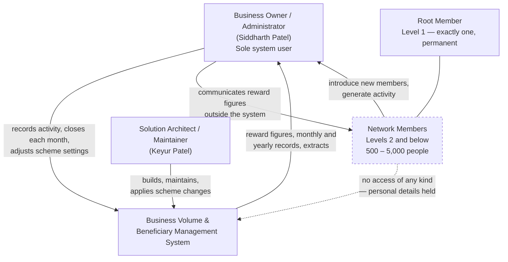
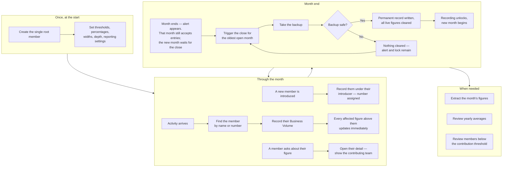
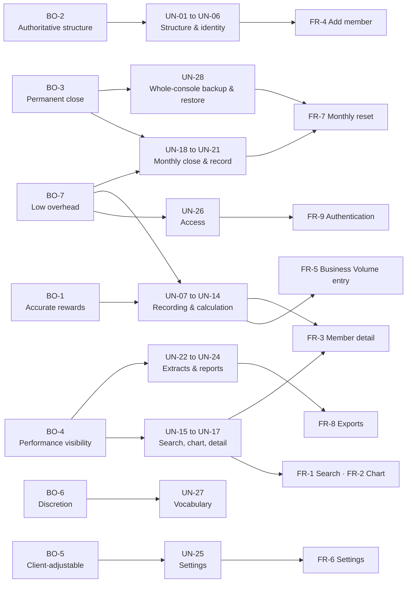

# User Needs Document
## Distributor Business Volume & Beneficiary Management System

| | |
|---|---|
| **Client** | Siddharth Patel |
| **Prepared by** | Keyur Patel — Business Analysis & Solution Architecture |
| **Document type** | User Needs Document (business review) |
| **Version** | 1.1 |
| **Date** | 3 August 2026 · amended 7 August 2026 (CR-1, CR-2, CR-3 — see §6 and §10.2 RQ-11) |
| **Status** | For client review — not yet approved |
| **Companion document** | [Client Requirements Validation Document](client-requirements-validation.md) |
| **Source material** | [requirement-draft.md](../draft/requirement-draft.md), [requirement-spec.md](../draft/requirement-spec.md), [open-questions-checklist.md](../draft/open-questions-checklist.md) |

---

### How to read this document

This document does not restate the requirements. It explains **why each requirement exists**, what business
outcome depends on it, and how we will know it has been met. It is written for business review, before any
technical design begins.

Three markers are used throughout:

| Marker | Meaning |
|---|---|
| 🟢 **Confirmed** | Agreed with the client and recorded in the source documents. Safe to build on. |
| 🟡 **Assumption** | Inferred by us, not stated by the client. Each one names what breaks if it is wrong. |
| 🔴 **Risk** | An identified business exposure with likelihood, impact and a proposed mitigation. |

Nothing in this document has been assumed silently. Where information is missing it appears in
[§10 Open Questions](#10-open-questions) rather than being filled in with a guess.

---

## 1. Executive Summary

The client operates a referral-based distribution network. Every member of that network is introduced by an
existing member, which produces a branching structure many levels deep. Each month the client records a
figure of business activity against individual members, and from those figures calculates what every member
in the network has earned — not only on their own activity, but on the activity of everyone beneath them.

Today that calculation is performed by hand. It is a multiplication of percentages across a structure that
may hold several thousand people, repeated every month, with each figure depending on figures calculated
one level below it. Manual working at this scale is slow, is difficult to check, and produces results the
client cannot easily explain to the member who is asking about them.

This system replaces that manual working. It holds the network structure, accepts the client's monthly
figures, performs the full calculation instantly and consistently, and produces the monthly and yearly
records the client needs. It is used by one person — the client — and by nobody else.

The proposed system is deliberately narrow. It does not manage stock, it does not move money, and members
have no access to it. Its single job is to turn recorded activity into a defensible reward figure for every
member of the network, every month, and to keep a permanent record that the client can return to a year
later and still trust.

**Commercially, the value is threefold:** the client's time is returned to them, the risk of an arithmetic
error propagating unnoticed through the network is removed, and the client gains a written record of what
was awarded and why — which is what allows a disputed figure to be settled in minutes rather than argued.

---

## 2. Business Objective

### 2.1 The problem being solved

| Problem | Consequence today |
|---|---|
| The reward calculation is recursive — each member's figure depends on figures below them being finished first. | Manual working must proceed level by level from the bottom. One error near the base of the structure silently corrupts every figure above it. |
| The network is large and uneven. Some branches are deep, others are shallow. | The client cannot see, at a glance, where activity is concentrated or where it has stalled. |
| Figures are recorded, calculated and archived in separate places. | There is no single record of what a given month actually looked like once that month has passed. |
| Yearly comparisons rely on assembling twelve months of separate working. | Producing a yearly view is a project in itself, so it is done rarely or not at all. |
| The client wishes to keep the language of the business discreet and non-commercial. | Existing tools built for distribution networks use vocabulary the client will not use. |

### 2.2 Business objectives

| ID | Objective | Why it matters to the business |
|---|---|---|
| **BO-1** | Produce an accurate and defensible reward figure for every member, every month, without manual working. | The core value of the system. An indefensible figure damages the client's relationship with the member it concerns. |
| **BO-2** | Hold one authoritative record of who introduced whom, that cannot drift or be quietly rewritten. | Every reward figure is derived from the structure. If the structure is uncertain, every figure is uncertain. |
| **BO-3** | Close each month deliberately, with a permanent record of what that month contained — correctable afterward if wrong, not frozen. | Once a month is closed the live figures are cleared. The record is the only evidence the month happened. **Revised 4 August 2026:** the client confirmed a wrong figure must stay correctable even after close (see [RQ-7](#rq-7--correcting-a-mis-recorded-figure)); "unalterable" was our own earlier framing, not the client's requirement. |
| **BO-4** | Give the client visibility of performance across a year, at both member and network level. | Lets the client identify who is contributing, who has stalled, and where the structure needs attention. |
| **BO-5** | Keep every scheme parameter adjustable by the client, without a developer. | The scheme is expected to evolve. Waiting on a developer to change a threshold makes the business rigid. |
| **BO-6** | Present the entire system in discreet, non-commercial language. | A stated and non-negotiable requirement of the client. |
| **BO-7** | Keep the system operable by one non-technical person with minimal effort. | There is exactly one user. Any operational burden falls entirely on them. |

### 2.3 Stakeholder relationships

> 🟡 **Assumption A-1.** No third party — accountant, auditor, co-owner or administrator — consumes the
> extracts produced by this system. The source documents never mention one. **If wrong:** extract formats,
> and possibly a second read-only login, would need revisiting.

---

## 3. Product Vision

**For** the owner of a referral-based distribution network,
**who** currently calculates every member's monthly reward by hand across a structure of thousands of people,
**this system** is a private administrative dashboard
**that** holds the network, accepts a single figure against a single member, and instantly produces the
correct reward figure for every person that entry affects — together with a permanent monthly record and the
yearly views built from it.
**Unlike** the general-purpose network-marketing platforms available today, it uses only the client's own
vocabulary, exposes nothing to members, moves no money, and treats every threshold and percentage in the
scheme as something the client can change themselves.

### 3.1 The ideal outcome

Twelve months after go-live, the client should be able to say:

1. "I record the month's figures as they come in, and the numbers are right the moment I press save."
2. "When a member questions their figure, I can show them exactly which people below them contributed what."
3. "I have not done a percentage calculation by hand since we launched."
4. "I can open any month from the last three years and it shows me exactly what it showed me at the time."
5. "When I changed the scheme in March, I changed it myself, in two minutes, without calling anyone."
6. "Nobody outside this office has ever seen this system, and nothing in it reads like a trading document."

---

## 4. Target Users

### 4.1 P-1 — Business Owner / Administrator 🟢 *Primary*

| Attribute | Detail |
|---|---|
| **Persona name** | Siddharth — The Network Principal |
| **Description** | Owner of the distribution network and the only person with access to the system. Holds the entire scheme in their head today. Runs the network as a personal business, not through a team. |
| **Goals** | Record activity quickly and without ceremony. Trust the resulting figures without re-checking them. Close each month cleanly. Understand who in the network is performing and who is not. Keep total control of the scheme's parameters. |
| **Responsibilities** | Onboarding every new member. Recording all activity figures. Triggering and completing the monthly close. Taking and safeguarding the monthly backup. Adjusting thresholds, percentages and reporting settings. Communicating reward figures to members, outside the system. |
| **Technical skill** | **Low to moderate.** Comfortable with a browser and with spreadsheet files. Not a technical user. Will not read documentation. Every recovery path must be self-evident from the screen. |
| **Environment** | A single desktop or laptop computer, in an office or at home. Extracts open in a spreadsheet application. |
| **Usage frequency** | **Daily to weekly** for recording activity and answering member questions; **monthly** for the close, the backup and reporting; **occasional** for scheme settings. |
| **What failure looks like for them** | A figure they cannot explain to a member. A month that cannot be closed. A number that changed since the last time they looked at it. |

### 4.2 P-2 — Network Member / Beneficiary 🟢 *Secondary — no system access*

| Attribute | Detail |
|---|---|
| **Persona name** | The Member |
| **Description** | A person in the network, introduced by an existing member. Between 500 and 5,000 of them. Never logs in, never sees a screen, and may not know the system exists — but their name, contact number and address are held in it, and their reward is determined by it. |
| **Goals** | To be assessed accurately and consistently. To have their own activity and their team's activity properly reflected. To have a reward figure that can be explained if they ask. To have their personal details treated with care. |
| **Responsibilities** | Generating activity. Introducing further members beneath them. Their conduct shapes the structure, but they perform no action inside the system. |
| **Technical skill** | **Not applicable** — no interaction with the system. |
| **Environment** | **Not applicable.** All contact is through the client, outside the system. |
| **Usage frequency** | **Never.** Confirmed: members have no access of any kind. |
| **Why they still matter** | Their needs are met indirectly, through the client. Two obligations follow from them holding no access: figures must be explainable by the client on their behalf, and their personal details must be handled responsibly by a system they cannot see into. Retention is now confirmed permanent — see [RQ-8](#rq-8--personal-data-handling), resolved 3 August 2026. |

### 4.3 P-3 — Solution Architect / Maintainer 🟢 *Secondary*

| Attribute | Detail |
|---|---|
| **Persona name** | The Maintainer |
| **Description** | Designs, builds and supports the system. Called on when something is unclear, when the scheme changes beyond what settings allow, or when a figure is disputed. |
| **Goals** | A specification with no ambiguity left in it. A system that can be explained back to the client. The ability to reconstruct any past month and prove what it contained. |
| **Responsibilities** | Delivery, correctness of the calculation, safeguarding of the client's records, and future changes. |
| **Technical skill** | **High.** |
| **Environment** | Development environment; access to the live system for support only. |
| **Usage frequency** | **Intensive** during build; **rare and reactive** thereafter. |

---

## 5. User Goals

What the primary user is actually trying to achieve, ranked by how often it arises.

| ID | Goal | Frequency |
|---|---|---|
| **UG-1** | Record a figure against one member and move on, with confidence the rest updates itself. | Daily |
| **UG-2** | Find a specific member instantly, by name or by number. | Daily |
| **UG-3** | Answer a member's question about their figure, with the contributing detail to hand. | Weekly |
| **UG-4** | See the shape of a branch — who sits under whom, and how the structure is filling out. | Weekly |
| **UG-5** | Onboard a new member under their introducer, in under a minute. | Weekly |
| **UG-6** | Close the month cleanly, with a safe copy taken before anything is cleared. | Monthly |
| **UG-7** | Extract the month's figures into a spreadsheet. | Monthly |
| **UG-8** | Review who has and has not contributed across the year. | Yearly, or on demand |
| **UG-9** | Adjust the scheme — a threshold, a percentage, a qualifying count — without help. | Occasionally |
| **UG-10** | Be certain that nobody else can see any of this. | Continuous |

### 5.1 End-to-end user journey

---

## 6. User Needs

Each need below states **what the user requires**, **why** — the business reason the requirement exists, not
a restatement of it — and how we will know it has been met.

Priority scale: **Must** — the system fails its purpose without it. **Should** — significant business value,
but the system functions without it. **Could** — desirable, deferrable.

**UN-29, UN-30 and UN-31 were added on 7 August 2026**, from three change requests the client raised after
reviewing the approved specification: searching by phone number, recording a purchase reported after the
month has turned, and seeing the whole structure at once. **UN-15 and UN-19 were amended on the same date** —
UN-19 materially, because the change to how recording behaves at a month end **reverses the client's own
earlier answer to [RQ-11](#rq-11--the-operational-cost-of-the-recording-lock)**. Both amendments carry a note
saying so.

---

### UN-01 — A single, trustworthy record of who introduced whom

| | |
|---|---|
| **Need statement** | The client needs one authoritative structure showing every member and the person who introduced them, held permanently and identically for everyone. |
| **Reason** | Every reward figure in the system is derived from position in the structure. A structure held partly in the system and partly in the client's memory would produce figures that cannot be defended. The structure is the foundation, not a feature. |
| **Business value** | Removes the single largest source of dispute. Makes every figure traceable to a stated relationship. |
| **Priority** | 🟢 **Must** |
| **Success criteria** | Every member except the root resolves to exactly one introducer. The structure can be traced from any member to the root without ambiguity. |
| **Acceptance criteria** | Exactly one member exists at the top level and no second one can ever be created. Every other member has an introducer recorded at the moment they are added. No member can be positioned beneath their own team. |
| **Related requirements** | FR-4 — Add member |
| **Business rules** | Rule 1, Rule 30, Rule 37 |
| **Dependencies** | None. Everything else depends on this. |

---

### UN-02 — A permanent member number that reveals nothing

| | |
|---|---|
| **Need statement** | Every member needs a six-digit number that identifies them for life and gives away nothing about when they joined or how large the network is. |
| **Reason** | The number is how the client finds people, links them together and labels them on extracts, so it must never change. It is also visible to anyone who sees an extract — a sequential number would disclose the size of the network and each member's seniority, which the client's discretion requirement makes undesirable. |
| **Business value** | Reliable identification for the life of the relationship; commercial discretion preserved. |
| **Priority** | 🟢 **Must** |
| **Success criteria** | No two members ever hold the same number. A number, once given, is never reissued. Two members added consecutively receive unrelated numbers. |
| **Acceptance criteria** | Numbers fall in the range **100001**–999999 (confirmed 4 August 2026), are chosen at random from those still free, and are retained by a member even after they are made inactive. |
| **Related requirements** | FR-4 — Add member |
| **Business rules** | Rule 2, Rule 35 |
| **Dependencies** | UN-01 |

---

### UN-03 — One record per real person, and a way back for those who return

| | |
|---|---|
| **Need statement** | The client needs certainty that each real person appears exactly once, and that someone who left and returns resumes their original record rather than starting a new one. |
| **Reason** | A duplicated person is the most damaging error possible here: their activity splits across two records, both of their positions roll upward separately, and every figure above them inflates. Recognising a returning member by their contact number is the cheapest possible guard against this, and it converts a likely error into a helpful prompt. |
| **Business value** | Protects the integrity of every figure above the duplicated person. Preserves relationship history across a break. |
| **Priority** | 🟢 **Must** |
| **Success criteria** | A contact number identifies exactly one member across the whole system, active or not. |
| **Acceptance criteria** | Adding a member on a contact number already in use is refused with a clear message. Where the number belongs to an inactive member, the system names that person and offers to bring them back with their original number, position and history intact. |
| **Related requirements** | FR-4 — Add member |
| **Business rules** | Rule 34 |
| **Dependencies** | UN-02 |

---

### UN-04 — Position that cannot be rewritten after the fact

| | |
|---|---|
| **Need statement** | The client needs a member's introducer to be permanent from the moment they are added. |
| **Reason** | Moving a member changes the figures of everyone above both their old and their new position, and therefore changes what those people were previously told they had earned. The client has chosen to remove that possibility entirely rather than manage its consequences — which also means the structure can never tangle, because a position that is never changed can never form a loop. |
| **Business value** | Past figures stay true. A whole class of dispute cannot arise. The structure is guaranteed sound by design rather than by checking. |
| **Priority** | 🟢 **Must** |
| **Success criteria** | No route through the system changes an existing member's introducer. |
| **Acceptance criteria** | Any attempt to move a member is refused outright, with the reason shown. There is no override. |
| **Related requirements** | FR-4 — Add member |
| **Business rules** | Rule 37 (this reverses the earlier position recorded in Rule 28) |
| **Dependencies** | UN-01 |

---

### UN-05 — History that survives a member leaving

| | |
|---|---|
| **Need statement** | The client needs to stop a member appearing in current activity without erasing them from what has already happened. |
| **Reason** | Removing a person entirely would silently change every past record they appeared in. The client would open last year's figures and find they no longer match what was seen at the time, with nothing to explain the difference. Deactivation separates "no longer active" from "never existed", which are two very different statements. |
| **Business value** | Past records remain reproducible. The client's own history stays credible. |
| **Priority** | 🟢 **Must** |
| **Success criteria** | No route through the system permanently removes a member. |
| **Acceptance criteria** | A member can be marked inactive. Their number, position and every past record are retained indefinitely, and their details remain editable. **Confirmed 4 August 2026:** the inactive flag has **no effect on any calculation** — their own Business Volume, and their downline's rollup, behave exactly as if they were active. It is a display flag only, shown in a distinct colour on the hierarchy chart, in member lists, and in every extract row, so the client can see at a glance who is inactive. |
| **Related requirements** | FR-4 — Add member |
| **Business rules** | Rule 28 |
| **Dependencies** | UN-02 · [RQ-3](#rq-3--deactivating-the-root-member) confirmed 3 August 2026 · [RQ-2](#rq-2--how-inactive-members-behave-in-the-structure) confirmed 4 August 2026 — zero calculation effect, display only |

---

### UN-06 — Structural guidance that advises rather than obstructs

| | |
|---|---|
| **Need statement** | The client needs the intended shape of the structure — nine at the second level, six at the third, three at the fourth, and a maximum depth — recorded as guidance, not enforced as a barrier. |
| **Reason** | The client's own worked examples do not respect these figures: one shows a second-level member with six people beneath them, another shows seven. They describe the intended shape of a healthy network, not a limit. A real person arriving at the door must never be turned away because of a number in a settings screen. |
| **Business value** | The client keeps a visible target shape without ever being blocked from recording reality. |
| **Priority** | 🟢 **Must** |
| **Success criteria** | No member is ever refused because of a width or depth setting. |
| **Acceptance criteria** | Exceeding a level width or the maximum depth produces a clear warning that can be accepted; the member is then added. |
| **Related requirements** | FR-4 — Add member, FR-6 — Settings |
| **Business rules** | Rule 1, Rule 32 |
| **Dependencies** | UN-01 |

---

### UN-07 — Activity recording with nothing in the way

| | |
|---|---|
| **Need statement** | The client needs to find a member and record a single figure against them, with no second field, no mode to choose and no conversion to think about. |
| **Reason** | This is the action performed most often, and the client performs it while doing something else. Every extra decision on this screen is a chance to record the wrong thing. The client removed the alternative currency entry route specifically to make this screen unambiguous, and converts to currency by hand, outside the system, when they need to. |
| **Business value** | Fast, low-error recording of the system's most frequent action. |
| **Priority** | 🟢 **Must** |
| **Success criteria** | An experienced user can record a figure against a known member in under fifteen seconds. |
| **Acceptance criteria** | The screen searches by name or number, accepts one Business Volume figure with up to two decimal places, and shows no currency field anywhere. |
| **Related requirements** | FR-5 — Business Volume entry |
| **Business rules** | Rule 15, Rule 16 |
| **Dependencies** | UN-02, UN-15 · **Confirmed 4 August 2026:** the client asked for every entry's date to be editable — literally a second field on this screen — resolved by defaulting the date to today and surfacing it only through the edit action, so this screen's single-field speed is unaffected. [RQ-21](#rq-21--can-an-entrys-date-move-it-across-a-month-boundary) confirmed: the date stays within its own month, for now. |

---

### UN-08 — Figures that reconcile against a calculator

| | |
|---|---|
| **Need statement** | The client needs totals that agree with what they would get working the same sum by hand. |
| **Reason** | The client's confidence in this system will be established, or lost, in the first month, by checking a handful of figures manually. Rounding at each intermediate step produces totals that are close but not equal — and a figure that is nearly right is worse than one that is obviously wrong, because it looks like a system fault rather than a rounding convention. |
| **Business value** | Establishes and sustains trust in every figure the system produces. |
| **Priority** | 🟢 **Must** |
| **Success criteria** | Every displayed total equals the sum of its displayed parts, checked by hand. |
| **Acceptance criteria** | Two decimal places are held throughout recording and calculation. Rounding occurs only where a figure is displayed, never at an intermediate step. |
| **Related requirements** | FR-5 — Business Volume entry |
| **Business rules** | Rule 22 |
| **Dependencies** | UN-07 |

---

### UN-09 — Team volume that is complete and counted once

| | |
|---|---|
| **Need statement** | The client needs each member's team figure to include their own activity and the entire structure beneath them, with nothing double-counted and nothing missed. |
| **Reason** | This figure decides which band a member falls into, and therefore every reward in their chain. The client's own examples establish that it is built one level at a time — each member adds their own figure to the already-finished figures of the people directly beneath them. Because each of those figures is itself already complete, the whole depth is covered without ever walking the structure twice. |
| **Business value** | The foundation of every band assignment and every reward figure in the system. |
| **Priority** | 🟢 **Must** |
| **Success criteria** | Recalculating the client's five worked examples reproduces their stated totals exactly. |
| **Acceptance criteria** | A member's Total Business Volume equals their own Business Volume plus the Total Business Volume of each direct member beneath them. A member's own figure is always included, without exception. |
| **Related requirements** | FR-3 — Member detail |
| **Business rules** | Rule 5, Rule 6 |
| **Dependencies** | UN-01, UN-07 |

---

### UN-10 — A band that reflects the whole team, not the individual

| | |
|---|---|
| **Need statement** | The client needs each member's percentage band determined by their team figure, not by what they personally recorded. |
| **Reason** | The scheme rewards building a structure, not personal activity alone. Someone who has introduced a large and active team has done the thing the scheme exists to encourage, even if their own recorded figure is modest. Basing the band on the team figure is what makes that true. |
| **Business value** | Aligns the reward scheme with the behaviour the business wants. |
| **Priority** | 🟢 **Must** |
| **Success criteria** | A member's band always matches their team figure against the current threshold table. |
| **Acceptance criteria** | The band is the highest one whose threshold is at or below the member's Total Business Volume. A member below the lowest threshold is on 0%. |
| **Related requirements** | FR-6 — Settings |
| **Business rules** | Rule 3, Rule 7 |
| **Dependencies** | UN-09 · [RQ-1](#rq-1--protecting-the-threshold-table-from-an-invalid-edit) resolved 3 August 2026 as a client-accepted risk — no software validation will guard this |

---

### UN-11 — A differential reward that is always fair in both directions

| | |
|---|---|
| **Need statement** | The client needs each member rewarded on the gap between their own band and the band of each person directly beneath them, applied to that person's team figure. |
| **Reason** | This is the mechanism of the scheme. Rewarding the gap rather than the whole figure means the reward is naturally self-limiting: as a team member grows and rises through the bands, the gap closes and the introducer's reward on them falls to nothing. That is what prevents the scheme from paying the same activity repeatedly all the way to the top, and it is why members below a direct team member never appear as separate terms — they are already inside that member's team figure. |
| **Business value** | A scheme whose total cost is bounded by its own structure rather than by an external cap. |
| **Priority** | 🟢 **Must** |
| **Success criteria** | All five of the client's worked examples reproduce exactly. No member ever produces a negative reward term. |
| **Acceptance criteria** | Only members directly beneath contribute a term. The percentage is applied to that member's team figure. A member earns nothing on their own recorded activity. Where bands are equal the term is zero. |
| **Related requirements** | FR-3 — Member detail |
| **Business rules** | Rule 8, Rule 9, Rule 11 |
| **Dependencies** | UN-09, UN-10 · [RQ-1](#rq-1--protecting-the-threshold-table-from-an-invalid-edit) resolved 3 August 2026 as a client-accepted risk — Rule 9's negative-reward guarantee stands on the client's own discipline, not on a system check |

---

### UN-12 — Recognition for members who build at the top of the scheme

| | |
|---|---|
| **Need statement** | The client needs a separate royalty reward for members who have brought three or more people directly beneath them all the way to the highest band. |
| **Reason** | Once a team member reaches the top band, the differential mechanism (UN-11) stops rewarding their introducer entirely — the gap is zero. Without a second mechanism, the person who built the most successful structure in the network would earn nothing from it. Royalty exists precisely to fill that gap, which is why the two never overlap: wherever royalty applies, the differential is already zero. |
| **Business value** | Keeps the strongest builders in the network engaged at the point where the primary mechanism stops rewarding them. |
| **Priority** | 🟢 **Must** |
| **Success criteria** | The client's Scenario 4 and Scenario 5 totals reproduce exactly. |
| **Acceptance criteria** | Only members directly beneath are counted and rewarded. Qualification requires at least the configured number of them (default three) in the top band. The reward is the configured rate (default 1%) of each qualifying member's team figure. Each member in the chain is assessed independently against their own direct team, so the same underlying volume may attract royalty at several levels — confirmed and understood by the client. |
| **Related requirements** | FR-3 — Member detail, FR-6 — Settings |
| **Business rules** | Rule 10, Rule 11, Rule 25 |
| **Dependencies** | UN-10, UN-11 |

---

### UN-13 — Rewards held entirely apart from volume

| | |
|---|---|
| **Need statement** | The client needs rewards kept in their own record, never added to any member's volume figure. |
| **Reason** | If a reward were added back into volume, it would raise the earner's own band, then flow into every team figure above them, then raise their bands, then generate further rewards — the scheme would compound against itself and the client would lose any ability to predict what a month costs. Keeping the two apart is what makes the scheme's total cost knowable. |
| **Business value** | The scheme remains predictable and controllable. |
| **Priority** | 🟢 **Must** |
| **Success criteria** | Recording a reward changes no member's Business Volume, Total Business Volume or band. |
| **Acceptance criteria** | Rewards are the sum of the differential and royalty amounts, held separately. They never enter any team figure, never affect a band, and never carry into the following period. |
| **Related requirements** | FR-3 — Member detail |
| **Business rules** | Rule 12, Rule 13 |
| **Dependencies** | UN-11, UN-12 |

---

### UN-14 — Numbers that are already correct when looked at

| | |
|---|---|
| **Need statement** | The client needs every affected figure to be correct the instant an entry is saved, with no action to trigger it. |
| **Reason** | The client described their working pattern as: record the figure, then look at the screen. A system requiring a separate recalculation step introduces a state in which the displayed number is stale — and a client who cannot tell stale from current will stop trusting the screen entirely. At the stated network size of 500 to 5,000 members this is comfortably achievable. |
| **Business value** | The screen is always authoritative. No user discipline required to keep it so. |
| **Priority** | 🟢 **Must** |
| **Success criteria** | After any entry, every affected figure up to the root reflects it, with no further action. |
| **Acceptance criteria** | No recalculation control exists anywhere in the system. Recalculation is immediate on save. |
| **Related requirements** | FR-5 — Business Volume entry |
| **Business rules** | Rule 26 |
| **Dependencies** | UN-09, UN-11, UN-12 · **Confirmed 4 August 2026:** approximately 1,000 entries a month, explicitly variable — the performance targets in the companion document's §11.1 already hold regardless of volume |

---

### UN-15 — Finding a person immediately

| | |
|---|---|
| **Need statement** | The client needs to reach any member from the home screen by typing their name, their number, or their phone number. |
| **Reason** | Search is the entry point to almost everything else — recording activity, answering a query, checking a structure. If finding a person is slow, every task built on it is slow. |
| **Business value** | Reduces the time cost of the most common starting action. |
| **Priority** | 🟢 **Must** |
| **Success criteria** | Any member can be reached from the home screen in one step. |
| **Acceptance criteria** | Search accepts a name, a six-digit number, or a phone number. Selecting a result opens that member's detail with the people directly beneath them shown. |
| **Related requirements** | FR-1 — Home / Search |
| **Business rules** | Rule 2, Rule 44 |
| **Dependencies** | UN-02 |
| **Amended** | 7 August 2026 (CR-1) — phone number added as a third way of searching. See UN-29. |

---

### UN-16 — Seeing the shape of a branch

| | |
|---|---|
| **Need statement** | The client needs a visual chart of the people working beneath a chosen member, showing name, number and that member's own Business Volume — and nothing more. |
| **Reason** | The client wants to see the *structure*, not to read figures off it. Adding further fields turns a shape into a table and defeats the purpose. The client re-confirmed their own recorded figure rather than the team figure after we recommended otherwise. |
| **Business value** | Immediate visual sense of how a branch is developing. |
| **Priority** | 🟢 **Should** |
| **Success criteria** | The client can see the shape of any branch and identify individuals within it. |
| **Acceptance criteria** | Each node shows exactly three items: name, number, and own Business Volume. |
| **Related requirements** | FR-2 — Hierarchy chart |
| **Business rules** | — (Confirmed decision, checklist Question 11) |
| **Dependencies** | UN-01, UN-15 |
| **⚠️ Consequence the client should hold in mind** | Because the band is set by the team figure, a node may show a small own figure while that member sits in a high band. The chart alone will not explain why anyone is in the band they are in. Confirmed and accepted. |

---

### UN-17 — A single screen that explains a member

| | |
|---|---|
| **Need statement** | The client needs one screen showing a member's contact details, their reward detail, the people directly beneath them with their figures, their team total, and how many direct people they have. |
| **Reason** | This screen exists for the conversation that begins "why is my figure what it is?". It has to carry both the answer and the contributing detail behind it, or the client is back to assembling the explanation by hand — which is the very work this system removes. |
| **Business value** | Turns a reward dispute from an exercise into a two-minute conversation. |
| **Priority** | 🟢 **Must** |
| **Success criteria** | The client can explain any member's reward figure from this screen alone. |
| **Acceptance criteria** | Shows name, contact number, address, reward detail, the direct team with their figures, the team total, and the count of direct people. |
| **Related requirements** | FR-3 — Member detail |
| **Business rules** | Rule 6, Rule 12 |
| **Dependencies** | UN-09, UN-11, UN-12, UN-13 · [RQ-13](#rq-13--what-reward-detail-means-on-the-member-screen) confirmed 3 August 2026 |

---

### UN-18 — A month that means one thing

| | |
|---|---|
| **Need statement** | The client needs a period to be a calendar month, unambiguously, regardless of the day the close is actually performed. |
| **Reason** | Every report the client wants is grouped by month. If a period were instead the interval between two closes, periods would be uneven, comparisons between them would be meaningless, and the client's own records would stop lining up with the system's. |
| **Business value** | Reports that match the calendar, and therefore match how the client already thinks. |
| **Priority** | 🟢 **Must** |
| **Success criteria** | Every figure belongs to exactly one calendar month, decided the same way every time. |
| **Acceptance criteria** | A period runs from the 1st to the last day of the month. A close performed on 5 September closes August. The confirmation screen names the month being closed, explicitly. |
| **Related requirements** | FR-7 — Monthly reset |
| **Business rules** | Rule 21 |
| **Dependencies** | None |

---

### UN-19 — Impossible to lose a month by forgetting

| | |
|---|---|
| **Need statement** | The client needs the system to prevent an unclosed month from being skipped, rather than relying on them to remember. |
| **Reason** | This is the single most consequential decision in the whole specification, and it follows directly from the client's choice that a close clears everything. Once figures are cleared, the permanent record is the only evidence a month happened — so a month that is never closed produces **no record of that month at all, permanently**. The alert exists for that reason alone. |
| **Business value** | Makes the total loss of a month's data structurally impossible. |
| **Priority** | 🟢 **Must** |
| **Success criteria** | No month can pass unrecorded. |
| **Acceptance criteria** | Once a month ends, an alert appears as an undismissable banner on every screen and as a notification entry, naming the month. It clears only on a completed close. Recording of figures **dated in that month** continues throughout; recording into the **current** month waits until it is closed. Where several months are open, all are listed and only the oldest can be closed; each keeps its own backup and its own record. |
| **Related requirements** | FR-5 — Business Volume entry, FR-7 — Monthly reset |
| **Business rules** | Rule 20, Rule 36 (amended) |
| **Dependencies** | UN-18, UN-21, UN-30 |
| **Amended** | 7 August 2026 (CR-2) — the undismissable alert now carries this need on its own. It was previously reinforced by a total recording lock, which the client asked to be narrowed; [RQ-11](#rq-11--the-operational-cost-of-the-recording-lock)'s answer of 3 August 2026 is reversed. What still pushes the client to close is the alert, plus the fact that the new month cannot be recorded into until they do. |

---

### UN-20 — A close that cannot destroy anything

| | |
|---|---|
| **Need statement** | The client needs a safe copy of the month taken and confirmed before anything is cleared, with the close abandoned entirely if that copy is not secured. |
| **Reason** | The client made this a hard condition themselves, and their choice to clear everything is what makes it essential. A close that proceeds on a failed backup destroys a month's record with nothing to recover it from. The gate is the whole safety mechanism, so it must be a genuine gate, not a prompt. |
| **Business value** | Eliminates the only route by which a month's record can be permanently lost. |
| **Priority** | 🟢 **Must** |
| **Success criteria** | No close ever proceeds without a confirmed backup. |
| **Acceptance criteria** | The close prompts for a backup. A failed or cancelled backup abandons the close with nothing cleared and the alert still in place. The backup file is both downloaded to the client's computer and retained permanently in the system, where any past month can be retrieved again. Nothing is ever deleted automatically. |
| **Related requirements** | FR-7 — Monthly reset |
| **Business rules** | Rule 18, Rule 31 |
| **Dependencies** | UN-19 · [RQ-5](#rq-5--what-the-backup-file-must-contain) and [RQ-6](#rq-6--what-counts-as-a-successful-backup) both confirmed 3 August 2026 |

---

### UN-21 — A permanent record of every month

| | |
|---|---|
| **Need statement** | Before anything is cleared, the client needs a record of the closing month captured for every member — and, the client has since confirmed, one that can still be corrected afterward, not one that is frozen the moment it is written. |
| **Reason** | The client chose that a close clears everything — activity figures, team figures and rewards alike. That decision only works if the record is written first, because after the close the live system holds no trace that the month occurred. Every yearly figure the client wants is assembled from these records; they are not a convenience, they are the entire history of the business. **Revised 4 August 2026:** we originally recommended that these records become unalterable once written, on the reasoning that a close should mean something. The client has explicitly rejected that — a wrong figure discovered after a month closes must still be correctable, in the month it actually belongs to, not just in the current one. This is the same principle already applied to members (Rule 28 — deactivate rather than delete, edit freely) extended to monthly records: **never silently lost, but never frozen either.** |
| **Business value** | The client's history stays reproducible and independent of the live figures, and stays *correct* — a wrong figure does not have to live in the record forever just because the month it belongs to has closed. |
| **Priority** | 🟢 **Must** |
| **Success criteria** | Any past month can be reproduced exactly as it stood at the moment of closing, or — if since corrected — exactly as it stands after the correction, with the correction itself traceable. |
| **Acceptance criteria** | The record captures, per member: Business Volume, Total Business Volume, band percentage, Rewards, royalty earned, and active/inactive status. It is written before anything is cleared. **It can be corrected afterward** ([RQ-7](#rq-7--correcting-a-mis-recorded-figure), confirmed 4 August 2026): editing an entry in a closed month shows an explicit warning naming that month, recalculates the affected chain, and rewrites the record in place — captured in the recording log already agreed under [RQ-9](#rq-9--no-record-of-what-changed). All yearly reporting reads from these records only, so a correction is reflected the next time anything is extracted. |
| **Related requirements** | FR-7 — Monthly reset, FR-8 — Exports |
| **Business rules** | Rule 38 · [RQ-7](#rq-7--correcting-a-mis-recorded-figure), client decision 4 August 2026 — Rule 38 itself never claimed the record was unalterable; that was this document's own gloss on it, and the gloss was wrong |
| **Dependencies** | UN-20 · [RQ-4](#rq-4--where-a-past-month-extract-comes-from) confirmed 3 August 2026 · [RQ-20](#rq-20--what-happens-to-the-retained-backup-when-a-closed-month-is-corrected) confirmed 4 August 2026 — the original backup is untouched, a new version is created per correction · **Open:** see [RQ-14](#rq-14--viewing-a-past-month-on-screen) |

---

### UN-22 — The month's figures in a spreadsheet

| | |
|---|---|
| **Need statement** | The client needs the month's figures as a spreadsheet, carrying their four standard columns and any others they choose. |
| **Reason** | The client already works in spreadsheets and will continue to. The extract is how the system's output reaches the rest of their working life — for their own filing, and for producing the figures they communicate to members. Fixing the column list would guarantee a request for a different one within weeks. |
| **Business value** | The system's output becomes usable outside it, without re-keying. |
| **Priority** | 🟢 **Must** |
| **Success criteria** | Any month's figures can be extracted with the columns the client wants. |
| **Acceptance criteria** | Name, number, contact number and Business Volume are included by default. All other fields are available to add: email, address, introducer number, introducer name, level, count of direct people, Total Business Volume, band percentage, Rewards, royalty earned, joining date, and active/inactive status. Every extract carries the member's basic details, contact number, volume and Business Volume regardless of selection. |
| **Related requirements** | FR-8 — Exports |
| **Business rules** | Rule 19, Rule 33 |
| **Dependencies** | UN-21 · [INC-5](#inc-5--the-two-column-lists-do-not-match) resolved 3 August 2026 · **Open:** see [RQ-4](#rq-4--where-a-past-month-extract-comes-from) |

---

### UN-23 — A yearly average that does not punish a late joiner

| | |
|---|---|
| **Need statement** | The client needs each member's yearly average calculated over the months that actually have a record, with that month count shown alongside. |
| **Reason** | Dividing by a fixed twelve would make a member who joined in October and performed strongly look like the weakest person in the network — the same figures, the opposite conclusion. Since this average decides who appears on the low-contribution report, the wrong method actively misdirects the client's attention toward the wrong people. Showing the month count keeps that judgement in the client's hands. |
| **Business value** | The client's attention goes to genuine underperformance, not to arithmetic artefacts. |
| **Priority** | 🟢 **Must** |
| **Success criteria** | A member's average reflects only the period they were actually present. |
| **Acceptance criteria** | The average is the sum across months holding a record, divided by the count of those months. The count is displayed next to every average. The yearly extract carries the average of both the team figure and the member's own figure. The yearly cycle defaults to 1 January – 31 December and is adjustable. |
| **Related requirements** | FR-8 — Exports |
| **Business rules** | Rule 23 |
| **Dependencies** | UN-21 · [RQ-16](#rq-16--carried-forward-a-month-that-elapses-with-no-entries) confirmed 3 August 2026 — an empty month produces no record |

---

### UN-24 — Seeing who is not contributing personally

| | |
|---|---|
| **Need statement** | The client needs a report listing members whose yearly average of their **own** recorded activity falls below a threshold they set. |
| **Reason** | The client asked for this specifically against personal activity rather than the team figure, after we recommended otherwise. The reason is sound: a member can sit in a high band entirely on the strength of a team they built years ago while personally contributing nothing now. Filtering on the team figure would hide exactly the people the client wants to see. |
| **Business value** | Surfaces personal disengagement that the team figure conceals. |
| **Priority** | 🟢 **Should** |
| **Success criteria** | The report lists precisely those members whose personal contribution is below the threshold. |
| **Acceptance criteria** | The filter is the yearly average of the member's own Business Volume, not their Total Business Volume. The threshold defaults to 100 and is adjustable. |
| **Related requirements** | FR-8 — Exports |
| **Business rules** | Rule 24 |
| **Dependencies** | UN-23 |

---

### UN-25 — Changing the scheme without asking anyone

| | |
|---|---|
| **Need statement** | The client needs every parameter of the scheme adjustable by themselves, including adding and removing band rows. |
| **Reason** | The client stated from the outset that thresholds would move, and gave concrete examples. A scheme parameter that requires a developer to change is a scheme parameter the client will hesitate to change — which turns a business decision into a technical project and slows the business down. |
| **Business value** | The scheme can follow the business rather than constraining it. |
| **Priority** | 🟢 **Must** |
| **Success criteria** | Every parameter in the settings inventory can be changed by the client, unaided. |
| **Acceptance criteria** | Thresholds and percentages are editable. Band rows can be added and removed; seven rows may become eight or five. The top band — the one that triggers royalty — is always whichever row holds the highest percentage, recalculated automatically. Depth, level widths, the royalty qualifying count and rate, the yearly cycle, the low-contribution threshold, the reference unit value and the default extract columns are all adjustable. |
| **Related requirements** | FR-6 — Settings |
| **Business rules** | Rule 4, Rule 14, Rule 27 |
| **Dependencies** | UN-10 · [RQ-1](#rq-1--protecting-the-threshold-table-from-an-invalid-edit) resolved 3 August 2026 as a client-accepted risk (no monotonicity check will be built) · [RQ-12](#rq-12--what-the-reference-unit-value-applies-to) confirmed 3 August 2026 |

---

### UN-26 — Sole and protected access

| | |
|---|---|
| **Need statement** | The client needs one login, theirs alone, protected against being guessed. |
| **Reason** | Nothing in the described operation requires anyone else to have access, and the simplest access model is the one least likely to leak. But that single login guards the name, contact number and address of every member in the network — several thousand people who have no visibility into the system at all and cannot protect themselves. The protection has to be proportionate to what sits behind it. |
| **Business value** | The client's commercial information and their members' personal details are protected by a single well-defended door. |
| **Priority** | 🟢 **Must** |
| **Success criteria** | Only the client can reach any part of the system. |
| **Acceptance criteria** | One administrator account exists; no other accounts and no roles. Members never log in. Access is protected by a six-digit PIN, a complex password, **or both at once — confirmed 4 August 2026, not exclusive.** If both are set, either one authenticates. **Limiting of failed attempts, with lockout, is mandatory regardless of how many credentials are set** — a six-digit PIN is one million combinations and is guessed quickly if attempts are unlimited. |
| **Related requirements** | FR-9 — Authentication |
| **Business rules** | Rule 29 |
| **Dependencies** | None · [RQ-10](#rq-10--continuity-of-the-single-account) confirmed 3 August 2026 — recovery codes issued at setup · **Strengthened 4 August 2026:** a PIN and a password can both be set, giving a second self-managed credential alongside the recovery codes |

---

### UN-27 — Language that reveals nothing about the business

| | |
|---|---|
| **Need statement** | The client needs every visible word in the system drawn from a restricted vocabulary, with commercial terminology excluded entirely. |
| **Reason** | The client stated this early and repeated it. It is not a presentational preference — it is a condition of the system being acceptable at all, and it applies to places that are easy to overlook: error messages, tooltips, column headings, and the filenames of extracts, which leave the system and travel. |
| **Business value** | The client's discretion requirement is met in full, including in material that leaves the office. |
| **Priority** | 🟢 **Must** |
| **Success criteria** | No excluded term appears in any visible string, including extract filenames. |
| **Acceptance criteria** | The permitted vocabulary is *member, Business Volume, Rewards, royalty, volume, slab, level, leg*. The client's excluded terms do not appear in any screen label, button, column heading, extract filename, error message or tooltip. |
| **Related requirements** | All |
| **Business rules** | §1.2 of the specification |
| **Dependencies** | None |

---

### UN-28 — The whole console, safe and movable

| | |
|---|---|
| **Need statement** | The client needs the entire console — every member, entry, monthly record and setting, not just one month — backed up on its own schedule, and able to be restored onto a different computer entirely, so a lost, damaged or replaced machine does not put the business's whole record at risk. |
| **Reason** | UN-20 already protects a single month at the moment it closes, but nothing protects the console *between* closes, and nothing today lets it move to a new machine at all. This is a new, wider requirement, raised directly by the client: they want to install the software on another desktop or laptop and have it come up in exactly the state the old one was in — new client requirement, confirmed 7 August 2026. |
| **Business value** | The business's entire record survives the loss of any single machine, and the client is never tied to one physical computer. |
| **Priority** | 🟢 **Must** |
| **Success criteria** | A fresh install, given only a backup file, comes up in exactly the state the original machine held at the moment that backup was taken — settings, structure, records and login alike. |
| **Acceptance criteria** | A full backup can be scheduled off/daily/weekly/monthly, or taken on demand at any time. The most recent backups are kept — a client-adjustable count, default 10 — with older ones pruned automatically. Restoring always states plainly what will be replaced and requires a deliberate confirmation; the console takes one more backup of its own current state immediately beforehand, so a restore is itself never a one-way door. A brand-new install, with no console set up yet, offers restoring from a backup file as an explicit alternative to first-time setup. |
| **Related requirements** | FR-7 — Monthly reset (extends the same backup-and-restore machinery to the whole console, not one month) |
| **Business rules** | New — see RQ-23 and M8.6/M8.7 in the companion validation document |
| **Dependencies** | UN-20 · confirmed 7 August 2026, does not alter UN-20's month-close mechanism |

---

### UN-29 — Finding a member by the number they are calling from

| | |
|---|---|
| **Need statement** | The client needs to find a member by typing their phone number, as well as by name or member number. |
| **Reason** | When a member telephones or walks in, the phone number is often the handle the client already has in front of them — and because a phone number belongs to exactly one member (Rule 34), it identifies that person without ambiguity in a way a name cannot. A name has to be spelled, may be shared, and may be remembered wrongly. Raised directly by the client on 7 August 2026: *"phone number is unique to member so it is easy to search member by mobile number."* |
| **Business value** | Removes the most common moment of friction in the client's day — identifying who they are talking to before recording anything against them. |
| **Priority** | 🟢 **Must** |
| **Success criteria** | Any member can be found from their phone number alone, in one step, wherever a member is searched for in the console. |
| **Acceptance criteria** | Search accepts a phone number written however the client happens to type it — with or without spaces, dashes or a country code. A partial number of four digits or more is enough to find them; shorter than that, only names and member numbers are matched, so a two- or three-digit query does not return half the network. Search results show each member's phone number alongside their name and number, so the client can confirm they have the right person before selecting. The same behaviour applies in every place a member is searched for, not only the home screen. |
| **Related requirements** | FR-1 — Home / Search |
| **Business rules** | Rule 34 (uniqueness, which is what makes this safe), Rule 44 (new) |
| **Dependencies** | UN-15, UN-03 · new client requirement, confirmed 7 August 2026 (CR-1) |
| **Note the client should hold in mind** | Phone numbers will now appear on the home screen's results, which is where the client works most of the day. This is personal data. It is visible only to the client's own single login — the same login that already sees it on the member screen and in every extract — and nothing about it leaves the machine. |

---

### UN-30 — Recording a purchase reported after the month has turned

| | |
|---|---|
| **Need statement** | The client needs to record activity that took place on the last days of a month, when it is reported to them a few days later, after that month has already ended. |
| **Reason** | A member who buys on the 30th or 31st commonly reports it two or three days into the next month. Under the original rule the client could record nothing at all until they had closed the month — so that figure could not be entered when it arrived, and the month could not be closed accurately without it. The rule and the reality worked against each other. Raised directly by the client on 7 August 2026, with the condition stated in their own terms: the previous month stays open to entry until it is closed, and the current month waits until it is. |
| **Business value** | A late-reported figure lands in the month it actually belongs to, so the month closes accurate and nothing has to be corrected afterwards. |
| **Priority** | 🟢 **Must** |
| **Success criteria** | A figure dated in a month that has ended but not been closed can be recorded at any time before that close, and it counts towards that month. |
| **Acceptance criteria** | While a month is waiting to be closed, figures dated within it can still be recorded, and they update that month's totals and rewards immediately. Figures dated in the current month are refused until that older month is closed, and the refusal says plainly which month is in the way. Every recording screen names the month it is recording into, so it is never ambiguous. Once the older month is closed, the current month opens for recording straight away. There is no time limit on this — the grace lasts exactly as long as the month stays unclosed. |
| **Related requirements** | FR-5 — Business Volume entry, FR-7 — Monthly reset |
| **Business rules** | Rule 36 (amended) |
| **Dependencies** | UN-07, UN-18, UN-19 · new client requirement, confirmed 7 August 2026 (CR-2) |
| **⚠️ What this changes** | This **reverses** the answer the client gave to [RQ-11](#rq-11--the-operational-cost-of-the-recording-lock) on 3 August 2026, when the hard stop was confirmed with no grace period. The stop is not removed — it is narrowed to the current month only. UN-19's protection against losing a month is unaffected, because the undismissable alert stays exactly as it is, and the new month still cannot be recorded into until the old one is closed. |

---

### UN-31 — Seeing the whole structure at once

| | |
|---|---|
| **Need statement** | The client needs to see the entire structure, every branch open at the same time, without the console they work in becoming slow. |
| **Reason** | The structure chart deliberately opens one branch at a time (UN-16), which is right for daily use but cannot show the shape of the whole network — how wide it has grown, where it is deep and where it is thin. That is a different question, asked occasionally rather than daily, and it deserves its own answer rather than compromising the everyday one. The client was explicit that the main console must not be slowed down to provide it. |
| **Business value** | An occasional whole-network view, for planning and for conversations about the shape of the business, at no cost to the screen the client uses every day. |
| **Priority** | 🟢 **Should** |
| **Success criteria** | The client can see the whole structure expanded, and the console they were working in behaves exactly as it did before. |
| **Acceptance criteria** | A "view full hierarchy" action on the structure screen opens the whole structure, from the top member, in a **separate window**, with every branch already open. Each node shows the same three items as the structure chart — name, number and own Business Volume — and nothing more. The window states when it was drawn, so a printed copy always says what it is a picture of. It can be zoomed out far enough to take a large network in at once, fitted to the width, searched, and printed. It does not update once it is open: it is a picture of a moment, and it says so. Closing it discards it. If the structure is large, the client is told exactly how many members are about to be drawn and can decide not to. |
| **Related requirements** | FR-2 — Hierarchy chart, FR-10 — Full hierarchy view |
| **Business rules** | Rule 45 (new) |
| **Dependencies** | UN-16 · new client requirement, confirmed 7 August 2026 (CR-3) |
| **⚠️ Consequence the client should hold in mind** | The chart is drawn top-down, like the structure screen, and the client chose that over a narrower list-style layout after being shown the trade-off. A top-down chart gets **wider** with every additional person at the bottom of the network, not taller — so on a very large network it becomes extremely wide, needs a lot of zooming out, and prints across many pages. This is understood and accepted; the zoom, fit-width and search controls exist to make it workable. |

---

### 6.1 Needs by priority

| Priority | Count | Needs |
|---|---|---|
| 🟢 **Must** | 26 | UN-01 to UN-15, UN-17 to UN-23, UN-25 to UN-30 |
| 🟢 **Should** | 3 | UN-16, UN-24, UN-31 |
| **Could** | 0 | — |

---

## 7. Constraints

### 7.1 Business constraints

| ID | Constraint | Source |
|---|---|---|
| **BC-1** | Exactly one member exists at the top level, permanently. It can never grow. | Client, draft L11 |
| **BC-2** | A member's introducer is fixed at the moment they are added and can never be changed. | Rule 37 |
| **BC-3** | A member is never permanently removed. Deactivation is the only removal. | Rule 28 |
| **BC-4** | No commercial vocabulary anywhere the client or anyone else can see it. | Client, draft L45 |
| **BC-5** | No currency figure appears on any screen, report or extract. Conversion is performed by the client, by hand, outside the system. | Rule 14, Rule 16 |
| **BC-6** | The monthly close is manual. The system prompts and blocks, but never closes a month on the client's behalf. | Rule 17 |
| **BC-7** | The system moves no money and holds no financial instrument. It produces figures only. | Throughout |
| **BC-8** | Royalty stacks at every qualifying level with no cap. The client has confirmed this with the cost consequence understood. | Rule 25 |

### 7.2 Technical constraints

| ID | Constraint | Source |
|---|---|---|
| **TC-1** | Every figure must be correct immediately on save, with no recalculation control anywhere. | Rule 26 |
| **TC-2** | Two decimal places throughout; rounding only at the point of display. | Rule 22 |
| **TC-3** | All extracts in spreadsheet format. | Rule 19, draft L43 |
| **TC-4** | Expected network size: 500 to 5,000 members. | Rule 26 |
| **TC-5** | One account, no roles, no member access. | Rule 29 |
| **TC-6** | Member numbers are random and never reissued, in the range **100001**–999999 (confirmed 4 August 2026). | Rule 35 |
| 🟢 **TC-7** | **Confirmed by the client, 3 August 2026 — no longer an assumption.** A standalone desktop application, fully offline: no network, no server, no internet dependency of any kind. Not browser-based. | [§11.14 of the companion document](client-requirements-validation.md#11-non-functional-requirements-identified) |

### 7.3 Operational constraints

| ID | Constraint | Source |
|---|---|---|
| **OC-1** | One user operates the entire system. There is no cover and no second pair of hands. | Rule 29 |
| **OC-2** | Recording is fully locked from the moment a month ends until that month is closed. | Rule 36 |
| **OC-3** | Where several months are open, only the oldest can be closed; the rest wait behind it. | Rule 20 |
| **OC-4** | The close cannot proceed without a confirmed backup. | Rule 18 |
| **OC-5** | Backups and monthly records are retained permanently. Nothing is deleted automatically. | Rule 31, Rule 38 |
| 🔴 **OC-6** | The client's availability at each month end is a hard dependency of the business continuing to record activity. | Derived from OC-1 + OC-2 |

### 7.4 Compliance constraints

| ID | Constraint | Status |
|---|---|---|
| **CC-1** | The system holds personal data — name, contact number and address — for several thousand people who have no access to it and no visibility of it. India's Digital Personal Data Protection Act 2023 governs personal data of this kind. | 🟢 **Resolved 3 August 2026** for retention — permanent, since past records depend on it. The client will take their own advice on notification and on handling a correction or removal request. See [RQ-8](#rq-8--personal-data-handling). **Follow-through, 4 August 2026:** the client's process is now concrete — consent is asked of every member at onboarding, and confirmed as a mandatory checkbox and date at the Add Member screen — see [RQ-22](#rq-22--should-consent-be-captured-in-the-system-or-only-obtained-outside-it). |
| **CC-2** | No retention limit is defined for member personal data. The stated retention position is "permanent, nothing auto-deleted", which is a data-protection position as much as a technical one. | 🔴 **Needs a client decision.** |
| **CC-3** | No route exists for a member to have their details corrected or erased, because members have no access and no such requirement was stated. | 🔴 **Needs a client decision.** |
| 🟡 **CC-4** | Assumed the client bears no external audit, tax or regulatory reporting obligation arising from these figures. Never discussed. **If wrong:** an audit trail becomes mandatory rather than advisable. | Assumption |

> These entries record what the source documents do and do not cover. They are a prompt for a client decision,
> not a legal opinion, and the client should take their own advice on their obligations.

---

## 8. Assumptions 🟡

Every item below was inferred by us and is **not** stated by the client. Each names what breaks if it is wrong.

| ID | Assumption | If it is wrong |
|---|---|---|
| **A-1** | 🟢 **Confirmed by the client, 4 August 2026 (blanket confirmation).** No third party consumes the extracts. | Resolved. |
| **A-2** | 🟢 **No longer an assumption — confirmed by the client, 3 August 2026.** There is no existing member or activity data to bring in — the system starts empty, with the root created first. | Resolved. See §11.16 of the [companion document](client-requirements-validation.md#11-non-functional-requirements-identified). |
| **A-3** | 🟢 **Reinforced by the client's hosting decision, 3 August 2026.** A single offline desktop application makes this close to guaranteed rather than merely assumed — there is one installation on one machine. | Concurrent-entry behaviour is very unlikely to be needed, though the software should still fail safely if the same install is somehow opened twice. |
| **A-4** | 🟢 **Confirmed by the client, 4 August 2026 (blanket confirmation).** English is the only language required. | Resolved. |
| **A-5** | 🟢 **No longer an assumption — confirmed by the client, 3 August 2026.** The system is a desktop application, not a phone or tablet, and uses no browser. | Resolved. See §11.14–§11.15 of the [companion document](client-requirements-validation.md#11-non-functional-requirements-identified). |
| **A-6** | 🟢 **No longer an assumption — a client undertaking, confirmed 3 August 2026.** The client has told us directly the threshold table will always rise — a higher threshold will always carry a higher percentage — and declined the software validation we recommended. | Nothing in the system checks this. If the table is ever edited to break monotonicity, the guarantee that a reward can never be negative fails silently. See [RQ-1](#rq-1--protecting-the-threshold-table-from-an-invalid-edit). |
| **A-7** | 🟢 **Confirmed by the client, 4 August 2026 (blanket confirmation).** Members are told about their rewards outside the system, by the client. | Resolved. |
| **A-8** | 🟢 **No longer an assumption — confirmed by the client, 3 August 2026.** The reference unit value (1 = 500) is applied to final Rewards. | Resolved. See [RQ-12](#rq-12--what-the-reference-unit-value-applies-to). |
| **A-9** | 🟢 **No longer an assumption — resolved 4 August 2026, and the opposite of what was assumed.** The client explicitly wants a mis-recorded figure correctable even after the month has closed, not just within it. | Resolved. The correction capability is in scope — see [RQ-7](#rq-7--correcting-a-mis-recorded-figure) and [UN-21](#un-21--a-permanent-record-of-every-month), rewritten to match. |
| **A-10** | 🟢 **Confirmed by the client, 4 August 2026 (blanket confirmation).** Activity figures are recorded steadily through the month rather than in one large batch at month end. | Resolved. |

---

## 9. Risks 🔴

| ID | Risk | Likelihood | Impact | Mitigation |
|---|---|---|---|---|
| **R-1** | **A month's record is lost entirely.** The close clears everything, so a close that proceeds on a failed backup, or a month never closed, leaves no evidence the month occurred. | Low | **Critical** | 🟢 **Resolved 3 August 2026** — the retained in-system copy is the gate for a successful backup. [RQ-6](#rq-6--what-counts-as-a-successful-backup) confirmed. |
| **R-2** | **An edited threshold table produces negative rewards.** The guarantee that rewards cannot go negative depends on the table always rising — which nothing currently enforces. | **Medium** | **High** | 🔶 **Accepted by the client, 3 August 2026 — not mitigated in software.** The client has declined the validation we recommended and confirmed they will keep the table monotonic themselves. This risk stands as a knowing exception. See [RQ-1](#rq-1--protecting-the-threshold-table-from-an-invalid-edit). |
| **R-3** | **A wrong figure cannot be traced.** With one shared account, immediate recalculation and no record of who changed what, a mis-recorded figure is undetectable after the fact and unexplainable. | **Medium** | **High** | 🟢 **Resolved 3 August 2026** — a minimal recording log will be built. See [RQ-9](#rq-9--no-record-of-what-was-changed). |
| **R-4** | **The business stops recording.** If the client is unavailable — travel, illness — nothing can be recorded until they return and close the month. | **Low** *(was Medium)* | **Low–Medium** *(was High)* | ✅ **Mitigated 7 August 2026 (CR-2).** Recording no longer stops when a month ends: figures dated in the ended month can still be entered throughout, which is exactly the case this risk described. What remains is narrower — the **new** month waits until the old one is closed, so a long absence defers new-month recording and those figures are entered afterwards, dated correctly. Originally resolved 3 August 2026 as an accepted hard stop; see [RQ-11](#rq-11--the-operational-cost-of-the-recording-lock) and UN-30. |
| **R-5** | **Total loss of access.** One account, one credential, no recovery route specified. Lost credentials lock the client out of their own system permanently. | Low | **Critical** | 🟢 **Resolved 3 August 2026** — recovery codes issued at setup. See [RQ-10](#rq-10--continuity-of-the-single-account). **Strengthened 4 August 2026** — a PIN and a complex password can both be set, either one authenticating. |
| **R-6** | **Personal data exposure.** Several thousand people's names, contact numbers and addresses sit behind one PIN, with no retention policy and no consent record. | Low | **High** | 🟢 **Resolved 3 August 2026** — retention stays permanent; mandatory failed-attempt lockout already agreed. See [RQ-8](#rq-8--personal-data-handling). **Follow-through 4 August 2026** — the client now confirms consent is asked of every member at onboarding; whether the system records that consent is a separate, narrower question — see [R-14](#9-risks-) and [RQ-22](#rq-22--should-consent-be-captured-in-the-system-or-only-obtained-outside-it). |
| **R-7** | ~~**Deactivation produces wrong figures.** How an inactive member's own volume, and the team beneath them, behave in the rollup is undefined.~~ 🟢 **Resolved 4 August 2026** — inactive status has no calculation effect at all; it is a display-only flag. [RQ-2](#rq-2--how-inactive-members-behave-in-the-structure) confirmed. | **High** | **High** | Closed. No further action. |
| **R-8** | **Royalty cost grows faster than expected.** Royalty stacks at every qualifying level with no cap, so total cost rises with the depth of the network, not just its size. Confirmed by the client, but the effect compounds as the network matures. | **Medium** | **Medium** | Already understood and accepted. Recommend the client reviews total royalty as a figure each month once live. |
| **R-9** | **Trust is lost in the first month.** The client will verify early figures by hand. Any disagreement, however small and however explicable, undermines confidence in everything. | **Medium** | **High** | Reconcile all five worked examples as formal acceptance tests before handover, in front of the client. |
| **R-10** | ~~**A period is lost to a documentation inconsistency.** Several superseded statements remain live in the source documents; building from the wrong one produces a system that contradicts an agreed decision.~~ 🟢 **Resolved, 3 August 2026** — all five inconsistencies in [§10.1](#101-inconsistencies-found-between-the-existing-documents) closed. | Low | Low | Closed. No further action. |
| **R-11** | ~~**Scope grows through the extract column list.** All fields are offered on extracts, including some not currently captured anywhere.~~ 🟢 **Resolved 3 August 2026** — [INC-5](#inc-5--the-two-column-lists-do-not-match) closed and joining date ([RQ-15](#rq-15--joining-date-is-offered-but-never-captured)) is now captured automatically. | Low | Low | Closed. No further action. |
| **R-12** | ~~**Single-machine backup independence.** Both backup copies called for in Rule 31 could physically sit on the same machine.~~ 🟢 **Resolved 4 August 2026** — the downloaded copy goes to a genuinely separate medium, confirmed. See [RQ-19](#rq-19--backup-independence-on-a-single-machine). | **Low–Medium** | **Critical** | Closed. No further action. |
| **R-13** | ~~**Historical-correction provenance is undefined.**~~ 🟢 **Resolved 4 August 2026** — the original backup is never touched; a new, dated version is created per correction and the latest version is used going forward. Date edits stay within their own month, for now. See [RQ-20](#rq-20--what-happens-to-the-retained-backup-when-a-closed-month-is-corrected) and [RQ-21](#rq-21--can-an-entrys-date-move-it-across-a-month-boundary). | **Low–Medium** | **High** | Closed. No further action. |
| **R-14** | ~~**Consent has no evidence trail, if not captured in the system.**~~ 🟢 **Resolved 4 August 2026** — a mandatory checkbox and date at the point a member is added. [RQ-22](#rq-22--should-consent-be-captured-in-the-system-or-only-obtained-outside-it) confirmed. | Low | **Medium–High** | Closed. No further action. |

---

## 10. Open Questions

The source documents record all 22 original client questions as answered and state that no blockers remain.
That position holds for the questions that were asked. This section covers what a full cross-reading found
in addition: **five inconsistencies between the existing documents**, and **twenty-two matters no question
ever put to the client**, raised across seven rounds of review. **All twenty-seven are now resolved.** None
was assumed away at any point.

### 10.1 Inconsistencies found between the existing documents

**All five resolved by the client on 3 August 2026.** Four confirmed directly; the fifth required no client
decision and was corrected at source.

#### INC-1 — Member transfers: the two documents disagree

| | |
|---|---|
| **The inconsistency** | The specification states that a member's introducer is fixed at creation and can never change, and that any move is refused outright with no override. The client checklist's Question 16 confirmation box still reads *"Moving is allowed, and already-closed months stay frozen"*, marked confirmed. The correction appears only in a footnote to the summary table and in a later "Additional requirements" section. |
| **Where** | [requirement-spec.md — Rule 37](../draft/requirement-spec.md) vs [open-questions-checklist.md — Question 16](../draft/open-questions-checklist.md) |
| **Why it matters** | These are two directly opposed statements about a rule the client actively reversed. A reader who goes to Question 16 for the answer gets the superseded one. |
| **Recommendation** | Restate the Question 16 confirmation box to read that transfers are prohibited, retaining the original text struck through, as done elsewhere in both documents. |
| **Resolution** | 🟢 **Confirmed by the client, 3 August 2026** — transfers are prohibited. |

#### INC-2 — Loop prevention describes an action that can no longer occur

| | |
|---|---|
| **The inconsistency** | Both documents carry a rule blocking any move that would place a member beneath their own team. Since transfers are now prohibited entirely, no such move can be attempted. The specification acknowledges this and keeps the check as a safeguard; the checklist still presents it to the client as a live behaviour. |
| **Where** | [requirement-spec.md — Rule 30](../draft/requirement-spec.md), [open-questions-checklist.md — Question 18](../draft/open-questions-checklist.md) |
| **Why it matters** | Minor, but it asks the client to confirm behaviour for an action they have already abolished. |
| **Recommendation** | Reword to state that the structure is guaranteed sound by design because positions never change, and that the check is retained as a safeguard only. |
| **Resolution** | 🟢 **Confirmed by the client, 3 August 2026.** |

#### INC-3 — The late-entry window is still described in both documents

| | |
|---|---|
| **The inconsistency** | Both documents state that figures recorded between the 1st and the moment of the close count into the month being closed. The recording lock makes this unreachable — there is no window in which such a figure could be recorded. The specification strikes the statement in one place but leaves it standing in its record of the original answer; the checklist leaves it in the body of the suggestion. |
| **Where** | [requirement-spec.md — Q-B6 answer](../draft/requirement-spec.md), [open-questions-checklist.md — Question 6](../draft/open-questions-checklist.md) |
| **Why it matters** | It describes a behaviour that will not exist. If built, it would contradict the lock. |
| **Recommendation** | Mark it superseded in both places, consistently with how the same change was handled at Rule 21. |
| **Resolution** | 🟢 **Confirmed by the client, 3 August 2026** — no late-recording window exists. |

#### INC-4 — A superseded answer is left unmarked

| | |
|---|---|
| **The inconsistency** | The specification's answer to the member-lifecycle question, and the corresponding change-log entry, both still record *"moves permitted with closed months frozen"* without any supersession marker, although Rule 37 has since reversed it. |
| **Where** | [requirement-spec.md — Q-I7 and the associated change-log entry](../draft/requirement-spec.md) |
| **Why it matters** | The document's own convention is to mark superseded text rather than delete it. Two places were missed. |
| **Recommendation** | Apply the same supersession marker used at Rule 28. |
| **Resolution** | 🟢 **Resolved directly — no client decision required.** This was never a question of intent; Rule 37 had already settled it, and only the paper trail was inconsistent. The same strikethrough-plus-supersession marker used at Rule 28 has been applied to the Q-I7 answer and its change-log entry in requirement-spec.md. |

#### INC-5 — The two column lists do not match

| | |
|---|---|
| **The inconsistency** | The specification's list of available extract columns includes *active/inactive status*. The list the client actually read and ticked, in the checklist, does not. |
| **Where** | [requirement-spec.md — Rule 33](../draft/requirement-spec.md) vs [open-questions-checklist.md — Question 20](../draft/open-questions-checklist.md) |
| **Why it matters** | The client has agreed to a shorter list than the one that will be built. Trivial to fix now; a change request later. |
| **Recommendation** | Confirm the full list with the client, including active/inactive status. Included in this document's checklist. |
| **Resolution** | 🟢 **Confirmed by the client, 3 August 2026** — include active/inactive status. |

### 10.2 New questions requiring a client answer

Presented in the same format as the original checklist: what we need to know, why it matters, and what we
recommend. Most need only a tick.

---

#### RQ-1 — Protecting the threshold table from an invalid edit

**What we need to know.** The client can edit every threshold and every percentage, and can add and remove
rows. Should the system refuse to save a table in which the percentages do not rise as the thresholds rise?

**Why it matters.** The specification states that a reward can never be negative, and calls this *"a structural
guarantee, not a check"* — meaning no error handling is planned for it anywhere. That guarantee holds only
while a higher threshold always carries a higher percentage. Nothing currently stops the client from saving a
table where, say, the 5,000 row carries 10% and the 7,000 row carries 8%. The moment such a table is saved,
a member above can sit in a lower band than a member below, and the system will calculate a negative reward
that nothing is designed to catch. This is the only place in the specification where a stated guarantee can
be broken from the settings screen.

**Our recommendation.** The settings screen refuses to save a table where the percentage does not rise with
the threshold, and explains which two rows are in conflict. This costs almost nothing to build now.

🔶 **Not applicable — client decision, 3 August 2026.** The client has told us the negative-reward scenario
will never arise in practice, and declined the build-time validation recommended above. To be precise: **no
software safeguard will be built for this.** If a threshold-table edit ever did break monotonicity, the
system would calculate a negative reward silently — nothing would catch it. This is a knowingly accepted
risk, not a removed one.

---

#### RQ-2 — How inactive members behave in the structure

**What we need to know.** When a member is marked inactive, three things are undefined:

1. Does their own Business Volume still count toward their introducer's team figure?
2. Do the people beneath them still roll up through them, or does that branch stop contributing?
3. Can a member with active people beneath them be made inactive at all?

**Why it matters.** The rule says an inactive member "stops appearing in new periods", which does not answer
any of the three. Each answer produces materially different figures for everyone above them — in a deep
branch, for dozens of people. Whatever is built will otherwise be our guess, not the client's decision.

**Our recommendation.** An inactive member's own figure stops contributing, but the people beneath them
continue to roll up through their position, so an active team is never penalised for their introducer
becoming inactive. A member with active people beneath them can still be made inactive. **This is a
recommendation only — please confirm or correct it.**

🔷 **Different from our recommendation — client decision, 4 August 2026, and stricter than what we proposed.**
Inactive status has **no effect on any calculation at all.** Own Business Volume still counts fully, the
downline still rolls up exactly as before, and a member with an active downline can trivially be made
inactive since nothing computational changes. It is purely a display flag — a distinct colour on the
hierarchy chart, in member lists, and in every extract row. See UN-05, updated to match.

---

#### RQ-3 — Deactivating the root member

**What we need to know.** Should the system prevent the single top-level member from being made inactive?

**Why it matters.** Any member can be made inactive, and the top-level member is created once during initial
setup with that route then closed permanently. If the top-level member were made inactive, there would be no
active top and no way to create one.

**Our recommendation.** Refuse to make the top-level member inactive, with the reason shown.

🟢 **Confirmed by the client, 3 August 2026.**

---

#### RQ-4 — Where a past-month extract comes from

**What we need to know.** After a month is closed, all live figures are zero. Should the monthly extract be
produced from that month's permanent record?

**Why it matters.** The rules state that *yearly* reporting reads from the permanent records, but say nothing
about the monthly extract. Taken literally, an extract for a month already closed would return zeros for
everybody.

**Our recommendation.** The monthly extract reads from the permanent record for any closed month, and from
live figures only for the month currently in progress. The client can extract any past month at any time.

🟢 **Confirmed by the client, 3 August 2026.**

---

#### RQ-5 — What the backup file must contain

**What we need to know.** Two things are unstated: whether the backup spreadsheet carries the same fields as
the permanent record, and whether it also captures the threshold table that was in force that month.

**Why it matters.** The client made the backup a hard condition of closing, which says it is meant to stand
on its own. But without the threshold table that applied at the time, a past month cannot be re-derived from
the backup — the same figures would produce different bands under a later table, so the backup would not
actually prove what was awarded.

**Our recommendation.** The backup carries every field of the permanent record, plus the threshold table,
royalty rate and qualifying count in force for that month.

🟢 **Confirmed by the client, 3 August 2026.**

---

#### RQ-6 — What counts as a "successful" backup

**What we need to know.** The close is abandoned unless the backup was *successfully generated*. What should
the system treat as success?

**Why it matters.** A file arriving safely in a folder on the client's computer is not something the system
can reliably observe — a browser can report a download as started and it can still fail. If the gate depends
on something unobservable, the gate is weaker than it looks, and it is the client's only protection.

**Our recommendation.** The gate is the copy retained inside the system, which can be verified with
certainty. The copy downloaded to the client's computer is a convenience on top of it. The close proceeds
only once the retained copy is confirmed written.

🟢 **Confirmed by the client, 3 August 2026.**

---

#### RQ-7 — Correcting a mis-recorded figure

**What we need to know.** If a figure is recorded against the wrong member, or with a wrong value, how is it
put right? Can an entry be edited or reversed after it is saved?

**Why it matters.** No requirement covers this, and it will happen. It is made harder by two decisions
already taken: everything recalculates instantly, so the error propagates immediately; and recording locks
the moment the month ends, so an error noticed on the 2nd of the following month may be uncorrectable in the
month it belongs to.

**Our recommendation.** A recorded entry can be edited or reversed at any time while its month is still open,
with everything recalculating as normal. Once a month is closed, its figures are permanent and any correction
is made in the current month. Please confirm this is acceptable, because it means a late-discovered error is
corrected in the wrong month rather than in the right one.

🔷 **Different from our recommendation — client decision, 4 August 2026, and broader than what we proposed.**
An entry is editable at any time, including in an **already-closed** month — not just the current open one.
Editing a closed-month entry shows an explicit warning naming that month, recalculates the affected chain,
and rewrites that month's permanent record in place; the client can export a fresh, corrected snapshot on
demand. This reverses the "permanent once closed" position UN-21 previously described — UN-21 is rewritten to
match. It also opens a question it doesn't itself answer: see
[RQ-20](#rq-20--what-happens-to-the-retained-backup-when-a-closed-month-is-corrected).

---

#### RQ-8 — Personal data handling

**What we need to know.** Three decisions the source documents never touch:

1. How long are a member's personal details kept after they become inactive? The stated position is permanent.
2. Are members told that their name, contact number and address are held in this system?
3. If a member asks for their details to be corrected or removed, what happens?

**Why it matters.** The system holds personal details for several thousand people who have no access to it
and no visibility of it. India's Digital Personal Data Protection Act 2023 applies to personal data of this
kind. This is a client decision with legal weight, not something we will assume on the client's behalf.

**Our recommendation.** Retention stays permanent, since past records depend on it, but the client should
take their own advice on notification and on handling a correction or removal request. We can build a
correction route cheaply if it is wanted; a removal route conflicts with the no-deletion rule and needs
discussion.

🟢 **Confirmed by the client, 3 August 2026.**

---

#### RQ-9 — No record of what was changed

**What we need to know.** Should the system keep a log of every figure recorded and every change made — what
changed, when, and from what to what?

**Why it matters.** The specification lists this as not covered. With one login, instant recalculation and no
log, a figure that turns out wrong cannot be traced: there is no way to see when it was recorded, what it was
before, or whether it was ever changed. This is also the only thing that would let a disputed figure be
settled by evidence rather than by memory.

**Our recommendation.** Keep a simple log — date and time, member affected, value before, value after, and
which action caused it. It is inexpensive to build alongside the recording screen and expensive to add later,
because it cannot reconstruct a history it was not present for.

🟢 **Confirmed by the client, 3 August 2026.**

---

#### RQ-10 — Continuity of the single account

**What we need to know.** If the client forgets the PIN or password, or the account is locked by failed
attempts, how do they get back in?

**Why it matters.** There is one account and no other route into the system. Without a recovery path, a
forgotten credential means permanent loss of access to the client's own records. The mandatory lockout,
which is right, makes this more likely rather than less.

**Our recommendation.** Define a recovery route before build — the practical options are a recovery contact
address, a set of one-time recovery codes issued at setup, or a documented manual reset performed by us on
request. Each has different trade-offs; we recommend recovery codes issued at setup and kept by the client
somewhere safe.

🟢 **Confirmed by the client, 3 August 2026 — recovery codes issued at setup.**

---

#### RQ-11 — The operational cost of the recording lock

**What we need to know.** Recording is blocked from the first moment of a new month until the previous one is
closed. Is a hard stop, with no grace period, definitely what the client wants?

**Why it matters.** The client asked for this deliberately, and it is the right protection given that a close
clears everything. But the consequence is that if the client is travelling or unwell over a month end,
nothing can be recorded at all until they return — the business stops being recorded, not just the reporting.
We want this confirmed as understood rather than discovered in month three.

**Our recommendation.** Keep the hard stop as agreed. If the client prefers, a short grace period — figures
recorded in the first few days still allowed, and counted into the new month — would soften it without
weakening the protection, since the month being closed is already fully determined.

🟢 **Confirmed by the client, 3 August 2026 — the hard stop is kept, no grace period.**

⚠️ **Reversed by the client, 7 August 2026 (CR-2).** The client returned to this with the practical case the
recommendation above anticipated: a member who buys on the last day of a month commonly reports it two or
three days later, and under the hard stop that figure could not be recorded at all. The client's own
condition, in substance: *while the previous month is unclosed I can add entries for the previous month, but
I cannot add current-month entries; to add current-month entries the previous month must be closed.*

**What was decided.** The stop is **narrowed, not removed**. A month that has ended but is not closed keeps
accepting figures dated within it, for as long as it stays unclosed. The current month is refused until that
older month is closed, and the refusal names it. This is *not* the "short grace period" our recommendation
offered — that version would have counted late figures **into the new month**, which would have put them in
the wrong month. Here a figure always counts into the month its own date falls in.

**No clock.** There is no day limit, no configurable grace window and no countdown. A configurable
"grace days" setting was offered and declined. See Rule 36 as amended, and UN-30.

---

#### RQ-12 — What the reference unit value applies to

**What we need to know.** The settings screen keeps the figure "1 = 500 Rs" for the client's own reference.
Does it apply to Rewards specifically, or to any of the three figures?

**Why it matters.** Only to the label on that setting. The figure is used by the client by hand, outside the
system, and plays no part in any calculation — but a mislabelled setting is a small thing that causes a
misunderstanding later.

**Our recommendation.** Label it as the value of one Reward, since that is what the client applies it to.

🟢 **Confirmed by the client, 3 August 2026.**

---

#### RQ-13 — What "reward detail" means on the member screen

**What we need to know.** The member detail screen is specified to show *"all Rewards detail"*. What does
that consist of — a line for each person directly beneath them showing their contribution, a separate royalty
breakdown, or just the totals?

**Why it matters.** This screen exists so the client can answer a member's question about their figure. If it
shows totals only, the client has to reconstruct the explanation by hand — which is the work this system is
meant to remove.

**Our recommendation.** Show one line per person directly beneath them — their name, number, team figure,
their band, the client's band, the difference, and the resulting amount — then the royalty lines, then the
total. That is the explanation the client needs, laid out as they would say it aloud.

🟢 **Confirmed by the client, 3 August 2026.**

---

#### RQ-14 — Viewing a past month on screen

**What we need to know.** Should the client be able to look at a past month on screen, or is a spreadsheet
extract sufficient?

**Why it matters.** Permanent monthly records exist, but only extracts are specified as a way to reach them.
If the client expects to open last March on screen and compare it against this March, that is a capability
nobody has asked for and nobody has scoped.

**Our recommendation.** Extracts only for now, with an on-screen historical view kept as a future addition.
The records will hold everything needed to add it later without rework.

🟢 **Confirmed by the client, 3 August 2026 — extracts only for now, with an on-screen historical view as a
future addition.**

---

#### RQ-15 — Joining date is offered but never captured

**What we need to know.** Joining date is offered as an extract column, but is not among the details captured
when a member is added. Should it be recorded automatically on the day they are added, or entered by the
client?

**Why it matters.** If it is captured automatically, a member added late — after they actually joined — will
carry the wrong date on every extract from then on.

**Our recommendation.** Record it automatically on the day the member is added, but leave it editable, so a
member entered late can be corrected.

🟢 **Confirmed by the client, 3 August 2026.**

---

#### RQ-16 — Carried forward: a month that elapses with no entries

Already raised in the source documents and still open. Because recording locks while a close is outstanding,
a whole calendar month can pass with nothing recorded in it. Should that month produce a record of zeros?

**Why it matters.** The yearly average divides by the number of months that hold a record. A month of zeros
would drag every member's average down and could push people onto the low-contribution report who do not
belong there.

**Our recommendation.** A month with no entries produces no record and is excluded from the average.

🟢 **Confirmed by the client, 3 August 2026.**

---

#### RQ-19 — Backup independence on a single machine

**What we need to know.** Now that hosting is confirmed as a single offline desktop application with no
network or cloud component (see the companion document's §11.14), are the two backup copies described in
Rule 31 — one downloaded, one retained inside the system — meant to sit on the same machine, or should the
downloaded copy go to a physically separate medium (a USB drive, an external disk, or another computer)?

**Why it matters.** Rule 31's own reasoning for keeping two copies was explicit: a lost or overwritten
download would defeat the gate the client deliberately asked for. That reasoning assumed some genuine
independence between the two copies. If both now live on the same single offline machine with nothing
external, a single hardware failure, theft, or loss destroys both at once — and because monitoring is not
required, nothing would notice until the record was actually needed.

**Our recommendation.** The downloaded copy should be saved to a location physically separate from the
installation — an external drive, a USB stick, or another machine — not simply another folder on the same
disk. The software should prompt for a location outside the main install each time a backup is taken, and
periodically remind the client to keep that off-machine copy current.

🟢 **Confirmed by the client, 4 August 2026 — agreed with our recommendation.**

---

#### RQ-20 — What happens to the retained backup when a closed month is corrected?

**What we need to know.** [RQ-7](#rq-7--correcting-a-mis-recorded-figure) confirms a closed month's permanent
record can be rewritten. The retained backup taken at the *original* close is, per
[RQ-6](#rq-6--what-counts-as-a-successful-backup), what proves what was actually awarded that month. When a
correction happens, does that backup stay exactly as it was — an untouched historical artefact — get replaced
by a fresh one, or does the client need both kept, dated, side by side?

**Why it matters.** The whole reason the backup gate exists is so there is always something to point to as
proof. If the retained backup silently drifts out of step with a corrected record, that proof becomes
misleading rather than absent — worse than having no backup at all, because nobody would know to distrust it.

**Our recommendation.** Keep the original retained backup untouched as the historical record. Treat every
correction as a new, separately dated event: the corrected permanent record is what future reporting reads
from, and the change itself is captured in the recording log already agreed under
[RQ-9](#rq-9--no-record-of-what-changed). Both an original reference point and a current, correct figure are
preserved this way, without pretending the correction never happened.

🟢 **Confirmed by the client, 4 August 2026 — agreed, made more concrete.** The original backup is never
touched; correcting a closed month creates a new, separate backup **version** instead, retained alongside the
original. Going forward, the software uses the latest version.

---

#### RQ-21 — Can an entry's date move it across a month boundary?

**What we need to know.** The client has asked for an entry's date to be editable. Two different capabilities
both fit that description: (a) the date is confined to the month the entry was recorded in, for ordering and
display only, with no effect on which month's total it contributes to; or (b) changing the date can move the
entry into a **different month entirely**, including one already closed, reassigning which month's total and
rewards it counts toward.

**Why it matters.** (a) is cosmetic and low-risk. (b) is a materially bigger capability — one field, changed
carelessly, could touch two permanent records at once and would deepen
[RQ-20](#rq-20--what-happens-to-the-retained-backup-when-a-closed-month-is-corrected)'s question, since a
retained backup could be invalidated by an edit nobody realised touched that month at all. Given RQ-7 has
just confirmed closed months are editable in principle, (b) is not obviously off the table, but nothing said
today settles it either way.

**Our recommendation.** Start with (a): the date defaults to today and stays editable only within the month
the entry already belongs to. If the client later wants to move an entry between months entirely, build that
as its own explicit action — with its own warning naming both months — rather than folding it silently into
an ordinary date field.

🟢 **Confirmed by the client, 4 August 2026 — agreed with our recommendation.** Start with option (a); moving
an entry between months entirely is deferred as a possible future addition, not built now.

---

#### RQ-22 — Should consent be captured in the system, or only obtained outside it?

**What we need to know.** The client has confirmed that every member is asked for consent to capture their
personal details (phone number, address, name) when they are onboarded ([RQ-8](#rq-8--personal-data-handling)).
Should the software itself record that this consent was given — a checkbox and a date, stored with the
member — or does this stay entirely a process the client manages outside the system?

**Why it matters.** Nothing in the member-adding screen today has a field for consent. If it is ever needed
as evidence — to a member who asks, or under the Digital Personal Data Protection Act 2023 generally — a
process with nothing recorded inside the system leaves nothing to point to. Cheap to add now, expensive to
reconstruct later, the same shape of trade-off as the recording log at [RQ-9](#rq-9--no-record-of-what-changed).

**Our recommendation.** A mandatory checkbox at the point a member is added — "the member has consented to
their name, contact number and address being recorded in this system" — with the date captured automatically.
Refuse to save the member until it is ticked.

🟢 **Confirmed by the client, 4 August 2026 — agreed with our recommendation.** A mandatory checkbox at the
Add Member screen, as described.

---

### 10.3 Carried forward from the source documents

| Item | Status | Impact of leaving it open |
|---|---|---|
| Number of activity entries per month | 🟢 Confirmed 4 August 2026 — approximately 1,000, explicitly variable | Sizing only; performance targets already volume-independent |
| Six-digit PIN or complex password | 🟢 Confirmed 4 August 2026 — both, not either/or; either credential logs in | Strengthens R-5 — see UN-26 |
| Member number range: 100000 or 100001 | 🟢 Confirmed 4 August 2026 — **100001** | TC-6 updated |
| Whether an empty month produces a record of zeros | 🟢 Resolved — see [RQ-16](#rq-16--carried-forward-a-month-that-elapses-with-no-entries), confirmed 3 August 2026: no record, excluded from the average | Settled. |

---

## 11. Requirement Traceability Matrix

### 11.1 Objective → Need → Requirement → Rule

| Business Objective | User Need | Functional Requirement | Business Rule |
|---|---|---|---|
| **BO-1** Accurate, defensible rewards | UN-09 Team volume rollup | FR-3 | Rule 5, Rule 6 |
| **BO-1** | UN-10 Band from team figure | FR-6 | Rule 3, Rule 7 |
| **BO-1** | UN-11 Differential reward | FR-3 | Rule 8, Rule 9, Rule 11 |
| **BO-1** | UN-12 Royalty | FR-3, FR-6 | Rule 10, Rule 11, Rule 25 |
| **BO-1** | UN-13 Separate reward record | FR-3 | Rule 12, Rule 13 |
| **BO-1** | UN-08 Reconcilable precision | FR-5 | Rule 22 |
| **BO-1** | UN-14 Immediate correctness | FR-5 | Rule 26 |
| **BO-1** | UN-07 Frictionless recording | FR-5 | Rule 15, Rule 16 |
| **BO-2** Authoritative structure | UN-01 Single structure | FR-4 | Rule 1, Rule 30, Rule 37 |
| **BO-2** | UN-02 Permanent member number | FR-4 | Rule 2, Rule 35 |
| **BO-2** | UN-03 One record per person | FR-4 | Rule 34 |
| **BO-2** | UN-04 Fixed position | FR-4 | Rule 37 |
| **BO-2** | UN-05 History survives departure | FR-4 | Rule 28 |
| **BO-2** | UN-06 Advisory structure limits | FR-4, FR-6 | Rule 1, Rule 32 |
| **BO-3** Deliberate, permanent close | UN-18 A month means one thing | FR-7 | Rule 21 |
| **BO-3** | UN-19 Cannot skip a month | FR-5, FR-7 | Rule 20, Rule 36 (amended) |
| **BO-3** | UN-30 Record a late-reported purchase | FR-5, FR-7 | Rule 36 (amended) |
| **BO-3** | UN-20 Close cannot destroy | FR-7 | Rule 18, Rule 31 |
| **BO-3** | UN-21 Permanent monthly record | FR-7, FR-8 | Rule 38 |
| **BO-3** | UN-28 Whole console, safe and movable | FR-7 | New — RQ-23, M8.6/M8.7 |
| **BO-4** Performance visibility | UN-15 Find a person | FR-1 | Rule 2, Rule 44 |
| **BO-4** | UN-29 Find a member by phone | FR-1 | Rule 34, Rule 44 |
| **BO-4** | UN-16 See the structure | FR-2 | Checklist Q11 |
| **BO-4** | UN-31 See the whole structure at once | FR-2, FR-10 | Rule 45 |
| **BO-4** | UN-17 Explain a member | FR-3 | Rule 6, Rule 12 |
| **BO-4** | UN-22 Monthly extract | FR-8 | Rule 19, Rule 33 |
| **BO-4** | UN-23 Fair yearly average | FR-8 | Rule 23 |
| **BO-4** | UN-24 Low-contribution report | FR-8 | Rule 24 |
| **BO-5** Client-adjustable scheme | UN-25 Change the scheme | FR-6 | Rule 4, Rule 14, Rule 27 |
| **BO-6** Discretion | UN-27 Restricted vocabulary | All | §1.2 |
| **BO-7** Low operating overhead | UN-14 Immediate correctness | FR-5 | Rule 26 |
| **BO-7** | UN-19 Cannot skip a month | FR-7 | Rule 20, Rule 36 |
| **BO-7** | UN-26 Sole protected access | FR-9 | Rule 29 |

**Coverage check.** Every business objective traces to at least one need; every need traces to at least one
functional requirement; every functional requirement (FR-1 to FR-9) appears at least once. No orphan rows.

### 11.2 Traceability map

---

## 12. What happens next

1. The client reviews this document alongside the
   [Client Requirements Validation Document](client-requirements-validation.md).
2. ~~The client resolves the five inconsistencies in [§10.1](#101-inconsistencies-found-between-the-existing-documents)~~
   **Done — all five resolved 3 August 2026.** ~~The client answers the remaining questions in
   [§10.2](#102-new-questions-requiring-a-client-answer)~~ **Done — all twenty-two resolved, the last,
   [RQ-22](#rq-22--should-consent-be-captured-in-the-system-or-only-obtained-outside-it) (consent capture),
   on 4 August 2026.**
3. The client completes the confirmation checklist and approval section in the companion document.
4. On approval, architecture and design begin.

Our assessment of readiness is set out in full in the companion document's closing Executive Summary. In
short: the calculation model is complete and verified, and every question raised across this review — the
member lifecycle, figure correction, the backup mechanics, and consent capture — is now resolved. Nothing
remains that would change the shape of any module. This document is ready to move to step 3.

---

*Prepared by Keyur Patel · 3 August 2026 · Version 1.0 · For client review*
