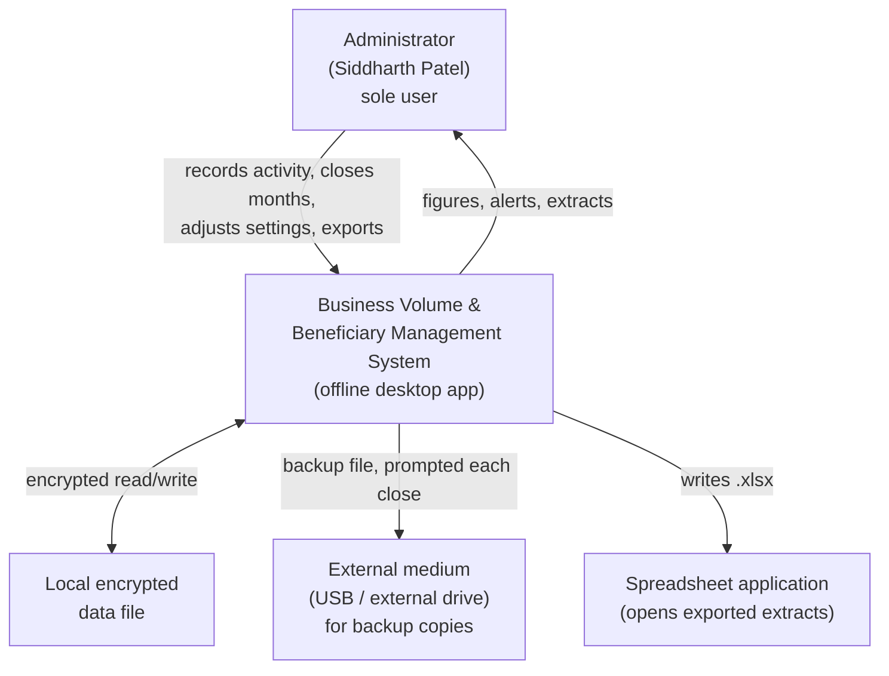
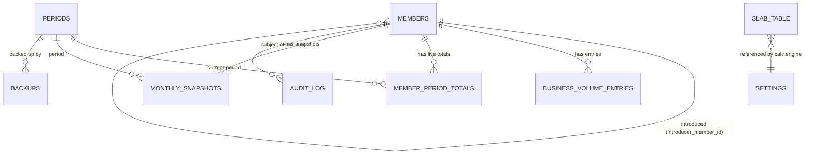
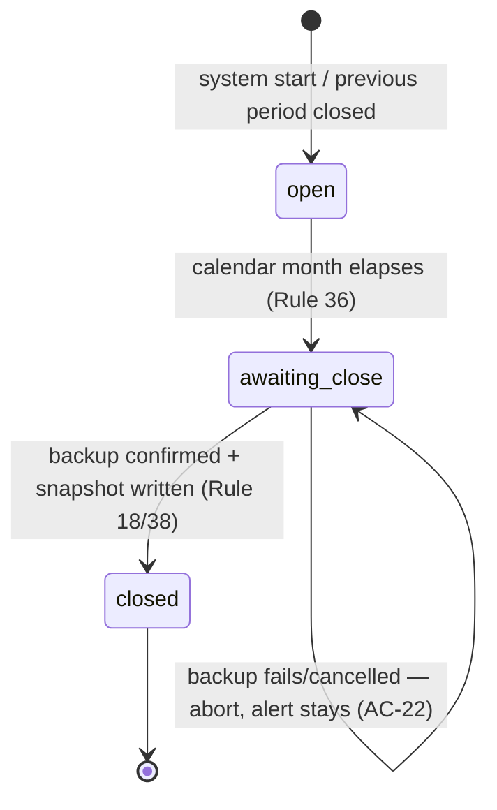
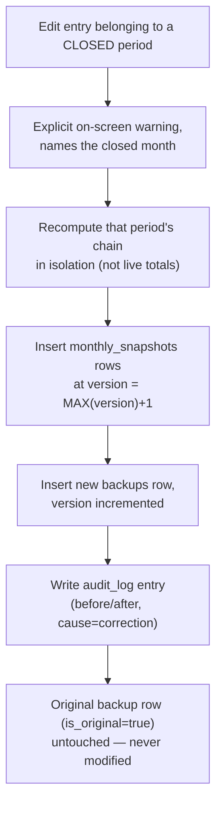

# System Architecture Document
## Distributor Business Volume & Beneficiary Management System

| | |
|---|---|
| **Document type** | System Architecture Document (SAD) |
| **Version** | 1.0 |
| **Status** | Draft — ready for build |
| **Author** | Keyur Patel — Solution Architect / Developer |
| **Client** | Siddharth Patel |
| **Companion documents** | [requirement-spec.md](../draft/requirement-spec.md) · [user-needs-document.md](../business/user-needs-document.md) · [client-requirements-validation.md](../business/client-requirements-validation.md) |

### How to read this document

The three companion documents are the authority on **what** the system must do — every business rule
(Rule 1–38), every user need (UN-01–27), every acceptance criterion (AC-1–36) lives there and is cited here
by number, not re-derived. This document is the authority on **how** the system is built to satisfy them:
technology choices, data structures, algorithms, module boundaries, security posture, and — for every
decision that could reasonably have gone another way — the rationale for why it didn't.

Nothing in this document should contradict a business rule. Where this document makes a technical choice
the business documents left open (e.g. how encryption keys are derived), that choice is recorded here as an
**Architecture Decision Record (ADR)** with its own rationale, so it carries the same weight as a client
decision even though no client sign-off was needed for it.

This is a **greenfield project**. No code exists yet. This document is written before the first line of code,
as the design a solo developer needs in hand before starting — not a retrospective description of a build.

---

## Table of Contents

1. [Executive Summary](#1-executive-summary)
2. [Architectural Goals & Drivers](#2-architectural-goals--drivers)
3. [Constraints](#3-constraints)
4. [Architecture Decision Records](#4-architecture-decision-records)
5. [System Context](#5-system-context)
6. [Container & Component Architecture](#6-container--component-architecture)
7. [Module Design (M1–M9)](#7-module-design-m1m9)
8. [Data Architecture](#8-data-architecture)
9. [Calculation Engine Deep-Dive](#9-calculation-engine-deep-dive)
10. [State Machines](#10-state-machines)
11. [Security Architecture](#11-security-architecture)
12. [Non-Functional Requirements Satisfaction Matrix](#12-non-functional-requirements-satisfaction-matrix)
13. [Business Rule → Implementation Traceability](#13-business-rule--implementation-traceability)
14. [Error Handling, Validation & Audit Logging](#14-error-handling-validation--audit-logging)
15. [Backup, Retention & Disaster Recovery](#15-backup-retention--disaster-recovery)
16. [Testing & Verification Strategy](#16-testing--verification-strategy)
17. [Deployment & Packaging](#17-deployment--packaging)
18. [Project & Folder Structure](#18-project--folder-structure)
19. [Technical Risk Register](#19-technical-risk-register)
20. [Glossary](#20-glossary)
21. [Appendix A — Full Schema DDL](#21-appendix-a--full-schema-ddl)
22. [Appendix B — Settings Inventory](#22-appendix-b--settings-inventory)
23. [Appendix C — Command (IPC) Surface](#23-appendix-c--command-ipc-surface)

---

## 1. Executive Summary

The system is a **single-process, fully offline desktop application** used by one administrator to manage a
referral hierarchy of 500–5,000 members (designed to scale to 25,000), record a monthly Business Volume
figure against individual members, and instantly compute every member's Total Business Volume, slab, and
Rewards (differential + royalty) by walking the affected chain from that member up to the root of the tree.
Each calendar month is closed manually, gated on a confirmed backup, and permanently recorded before every
live figure is zeroed for the next month.

It is built as a **Tauri v2 application**: a React + TypeScript UI running in an OS-native WebView, talking
over a typed command boundary to a Rust application core, which is the only thing that ever touches an
**SQLCipher-encrypted SQLite database** file on disk. There is no server, no client-server split, and no
network code anywhere in the system — the offline requirement (NFR §11.14) is enforced by the absence of
networking capability in the application's configuration, not by a promise not to use it.

The architecture's three defining pressures, in order, are: **the data is recursive and must recompute
instantly** (Rule 26 — differential/slab/royalty depend on the whole subtree beneath a member), **the data
is sensitive and the only user has no formal security training** (§11.3 — thousands of people's PII behind
one credential), and **a month, once closed, destroys its own evidence unless backed up first** (Rule 18/38
— the backup gate is the single most safety-critical piece of logic in the system). Every major design
decision in this document traces back to one of those three pressures.

---

## 2. Architectural Goals & Drivers

Not every requirement shapes architecture — most (e.g. "search by name or number") are ordinary CRUD/UI work
that any reasonable design satisfies. The requirements below are the ones that actually constrain the shape
of the system; they're listed here so later sections can be read against *why* the architecture looks the
way it does, not just *what* it does.

| Driver | Source | Architectural consequence |
|---|---|---|
| **Fully offline, single machine, single user** | NFR §11.14, §11.15, TC-7 | No client-server split, no API layer, no auth-as-a-service, no cloud DB. One process owns the one encrypted file. |
| **Recursive calculation must be instant on every entry** | Rule 26, UN-14, §11.1 (2s target) | Chain-upward incremental recalculation (not full-tree, not batched) is not an optimisation — it's the only design that meets the target at 25,000 members. |
| **PII for thousands of people who have no visibility into the system** | §11.3, RQ-8, CC-1–CC-4 | Encryption at rest, minimal trust surface for the UI layer, no PII in exportable filenames. |
| **A month, once closed, destroys its own live evidence** | Rule 38, UN-19, UN-20, R-1 | The backup gate is architected as a genuine transactional precondition, not a UI prompt — nothing is cleared unless the retained backup write is confirmed. |
| **Every threshold, percentage and rule parameter must be client-editable** | Rule 4/27, UN-25, §11.6 | No business constant is hardcoded; the slab table, royalty settings, and widths are all data, not code. |
| **A wrong figure must be correctable even after a month closes** | RQ-7, M2.4/M5.9, UN-21 | Monthly records are append-only + versioned, never overwritten in place — correction is a new version, not a mutation. |
| **Restricted, non-commercial vocabulary everywhere visible** | §1.2, UN-27, AC-36 | A vocabulary constraint is a UI/content concern, not a structural one — noted here so it isn't missed, addressed at the presentation layer, not the architecture layer. |
| **The client has no formal IT support** | P-1 persona, "will not read documentation" | Favours a small, low-friction installer and a design that fails safely (warns, doesn't silently corrupt) over a design that's merely powerful. |

---

## 3. Constraints

Pulled from the requirement documents' own constraint sections (BC-1–8, TC-1–7, OC-1–6, CC-1–4 in
`user-needs-document.md` §7); restated here only where they bind an architectural choice.

- **BC-7 / OS-4** — the system moves no money and holds no financial instrument. There is no payment
  integration surface to design for, now or later.
- **TC-7** — standalone desktop application, fully offline, confirmed 3 August 2026. Not browser-based.
- **TC-4 / §11.5** — expected 500–5,000 members, design target 25,000 members / 200,000 entries per year.
- **OC-1** — one user, no cover, no second pair of hands. There is no multi-user concurrency problem to solve.
- **A-3 / BA-3** — one computer, one session at a time (client-confirmed, not merely assumed). Concurrent
  access from two processes against the same encrypted file is not a scenario the architecture needs to
  arbitrate — SQLite's own file-locking is sufficient protection against the pathological case of the same
  install being opened twice.
- **CC-1 / CC-2** — the system holds PII (name, phone, address) with no retention limit (permanent, by
  client decision) and no automated data-subject-request tooling — correction of a member's own record is
  supported (M1.4, ordinary edit); erasure is not, and conflicts with the no-hard-delete rule (Rule 28) by
  design.
- **No integration surface** — OS-11, confirmed never discussed. The system is architected as a closed box;
  no import/export API, no plugin surface, no scripting surface is built.

---

## 4. Architecture Decision Records

Each ADR below follows: **Context** (the forces at play) → **Options considered** → **Decision** →
**Rationale** → **Consequences** (including what's given up).

### ADR-001 — Single-process offline desktop application (no client-server split)

**Context.** The system is confirmed as a standalone desktop application for one user with no network
dependency of any kind (§11.14, TC-7).

**Options considered.**
1. Traditional web app (browser + local server process).
2. Client-server desktop app talking to a local API server process.
3. Single process, no internal network boundary at all.

**Decision.** Option 3 — one process, no HTTP/IPC-over-socket boundary anywhere, not even a local one.

**Rationale.** A server process (even a local one bound to `localhost`) introduces a network stack, a port,
a listener, and an attack surface that the "no network dependency of any kind" requirement doesn't need and
that the security requirement (§11.3, PII at rest) actively argues against. Tauri's IPC between the WebView
and the Rust core is an in-process message-passing boundary, not a network boundary — it satisfies the need
for a clean UI/logic separation without any of the risk a local server would add.

**Consequences.** No API layer to design, version, or secure. No listening port to firewall or explain to
the client. The trade-off: this design cannot later be extended into a client-server model (e.g. a future
member-facing web view) without real rework — accepted, because OS-1/OS-6 confirm member access is
permanently out of scope, not deferred.

---

### ADR-002 — Tauri v2 over Electron, .NET, and Python

**Context.** The client asked, when presented with implementation choices, for whichever stack the architect
recommends, prioritising **security of PII**, a **modern UI**, and **cross-platform** (Windows + macOS)
support, for a system one person will build and maintain alone.

**Options considered and trade-offs.**

| | Tauri v2 | Electron | .NET (WPF/MAUI) | Python (PySide/Qt) |
|---|---|---|---|---|
| PII attack surface | WebView has **no** direct DB/FS access; only allowlisted Rust commands | Renderer typically has broader Node access even "sandboxed" | Native, no WebView surface at all, but ties the whole UI to C#/XAML | Native, but weaker packaging story raises tampering/AV-false-positive risk |
| UI modernity | Full React/TS ecosystem, any component library | Full React/TS ecosystem, any component library | Native controls (WPF) or MAUI's more limited cross-platform widget set | Qt widgets — functional, dated by default without significant styling work |
| Cross-platform (Win + macOS) | Native bundler for both from one codebase | Native bundler for both from one codebase | WPF is Windows-only; MAUI is cross-platform but younger/less mature on desktop | PyInstaller cross-builds but packaging is fragile per-OS |
| Install footprint | ~10–20MB (no bundled Chromium/Node runtime) | ~150–200MB (bundles Chromium + Node) | Small (native), but larger with .NET runtime bundled | Small code, but PyInstaller bundles often balloon to 50–100MB+ |
| Solo maintainability | Thin Rust shell + all-TS UI; one language for 90% of the surface | All-TS, but heavier runtime to reason about | C#/XAML — a full second-language commitment for a TS-comfortable dev | Python throughout, but weakest UI/export tooling of the four |

**Decision.** Tauri v2, React + TypeScript frontend, Rust application core.

**Rationale.** Tauri wins on the client's explicitly stated top priority — PII security — because its
security model is structural, not conventional: the WebView cannot reach the filesystem or the database at
all except through commands the Rust side explicitly exposes. That is a materially smaller trust boundary
than Electron's renderer process for a system whose entire value is "several thousand people's PII behind
one credential." It ties with Electron on UI modernity and cross-platform support, and wins decisively on
install footprint (relevant for a low-technical single user installing on their own machine — P-1) and on
keeping the maintenance surface mostly in one language (TypeScript) despite the Rust core.

**Consequences.** The developer needs enough Rust to write the application core (calculation engine, DB
access, auth, export) — not a large surface, but a real one, and a second language regardless of choice
here (Rust instead of C#). Tauri v2's plugin ecosystem is younger than Electron's; anything not covered by a
plugin gets written directly in Rust, which is more work up front but keeps the trusted surface small and
auditable — consistent with the security driver.

---

### ADR-003 — SQLite + SQLCipher over embedded Postgres, LiteDB, or SQLite + OS-level encryption

**Context.** The database must hold PII permanently, at rest, on a single machine with no network, and be
queryable with recursive tree operations at up to 25,000 members / 200,000 entries per year.

**Options considered.**
1. **SQLite + SQLCipher** (encrypted at the storage-engine level).
2. **SQLite, unencrypted, relying on OS-level full-disk encryption** (BitLocker/FileVault).
3. **Embedded Postgres** (e.g. via a bundled server process).
4. **LiteDB** (a .NET-native embedded document DB) — ruled out immediately by ADR-002 (not .NET).

**Decision.** SQLite + SQLCipher, application-managed key (see ADR-008), not OS-level encryption.

**Rationale.** OS-level full-disk encryption protects the file only while the disk itself is at rest (device
powered off/locked at the OS level) — it does nothing once the OS is unlocked, which is most of the time the
machine is in use, and it does nothing for a copied-out backup file sitting on a USB drive (which the
architecture explicitly requires, per RQ-19). Application-level encryption via SQLCipher protects the data
file itself regardless of OS session state and travels correctly with the file if it's copied anywhere,
including the mandatory off-machine backup copy. Embedded Postgres would add an entire server process, a
port, and an operational surface (start/stop, crash recovery) that this single-user, no-network system gets
no benefit from — SQLite already handles the scale target (200,000 rows/year is trivial for SQLite) and its
transactional guarantees are exactly what the backup-gated close (ADR-006) needs.

**Consequences.** The encryption key must be derived and managed by the application (ADR-008) rather than
delegated to the OS — this is more design work but is the only option that protects the data file
*wherever it ends up*, which is the actual threat model here (a stolen laptop, a copied backup file, not
just an unlocked screen).

---

### ADR-004 — Fixed-point integer arithmetic over floating point or SQL DECIMAL

**Context.** Rule 22 requires two-decimal precision throughout, with rounding only at display, and UN-08
requires that displayed totals reconcile *exactly* against a hand calculation — the client's trust in the
system is established or lost on this point in the first month (R-9).

**Options considered.**
1. IEEE-754 floating point (`f64`) throughout.
2. SQLite's native `NUMERIC`/`REAL` affinity with careful rounding.
3. Fixed-point integers — every figure stored and computed as an integer scaled ×100 (hundredths).

**Decision.** Option 3 — all Business Volume, Total Business Volume, differential, royalty, and Rewards
figures are `i64` integers representing hundredths of a unit, end to end through storage and calculation.
Conversion to a two-decimal display string happens only at the UI boundary.

**Rationale.** Floating point cannot exactly represent most decimal fractions (0.1 has no exact binary
representation), and summing hundreds of differential/royalty terms across a deep hierarchy will
accumulate visible drift — exactly the "nearly right, which is worse than obviously wrong" failure mode
UN-08 names directly. Fixed-point integer arithmetic is exact under addition, subtraction and the
percentage multiplications this system performs, and every summation reconciles bit-for-bit against a
calculator, which is the actual acceptance bar (AC-16).

**Consequences.** Every arithmetic operation involving a percentage (differential, royalty) must be written
as integer multiply-then-divide with an explicit rounding rule (round-half-up, applied once, at the point a
term is finalised — never on an intermediate sum), rather than relying on a language's native decimal type.
This is a small, well-isolated piece of careful code (the calculation engine, ADR-005) rather than a
pervasive one, so the cost is contained.

---

### ADR-005 — Chain-upward incremental recalculation over full-tree or batched recomputation

**Context.** Rule 26 requires every affected figure to be correct immediately on save, with no manual
recalculate control, at a design target of 25,000 members and no defined ceiling on entries per month
(§11.1 — the 2-second target is stated independent of volume).

**Options considered.**
1. **Full-tree recompute** on every entry — walk the entire hierarchy bottom-up from scratch each time.
2. **Batched/deferred recomputation** — queue changes, recompute on a timer or on next screen view.
3. **Chain-upward incremental recomputation** — on a save against member `X`, walk only the direct path from
   `X` to the root, recomputing each ancestor's aggregate from its (already-correct) children.

**Decision.** Option 3.

**Rationale.** Option 1 is correct but wasteful — recomputing 25,000 members on every single entry when only
a few dozen (the depth × width of one chain) actually changed would blow well past the 2-second target as
the network grows, and grows worse precisely as the system succeeds (more members). Option 2 directly
violates Rule 26 and UN-14 ("numbers that are already correct when looked at" — no state where the screen is
known-stale). Option 3 is both correct (proven in §9 below) and asymptotically appropriate: the work per
entry is bounded by tree depth × average level width, not by total member count, so performance is flat as
the network scales from 500 to 25,000 members — this is what makes the confirmed 2-second target achievable
without qualification.

**Consequences.** The calculation engine must be written carefully to re-scan **all** of an ancestor's
direct children when recomputing that ancestor's differential/royalty terms (not just the child that
changed) — because the ancestor's own slab may have shifted, which changes every term against every child,
not only the one that triggered the walk. This is documented in full in §9; getting this detail wrong would
silently under- or over-count Rewards for siblings of the entry that changed.

---

### ADR-006 — Append-only entries + versioned snapshots over mutable/overwritten monthly records

**Context.** RQ-7 confirms an entry may be edited or reversed at any time, including in an already-closed
month, and RQ-20 confirms the *original* backup for a corrected month must never be touched — a new,
separately dated backup version is created instead, both retained permanently.

**Options considered.**
1. Overwrite the permanent monthly record in place on correction; keep one backup per month.
2. Append-only entries, versioned snapshots (each correction produces a new version, prior versions
   retained), versioned backups (same pattern).

**Decision.** Option 2, applied uniformly to `monthly_snapshots` and `backups` (see §8).

**Rationale.** Option 1 is what was originally recommended and the client explicitly rejected it (RQ-7,
RQ-20) — a corrected record must not erase the historical record of what was originally awarded, because
that original figure may already have been communicated to a member (BO-3, R-9). Versioning is the only
model that satisfies "corrected" and "provably what it originally said" simultaneously.

**Consequences.** Every table holding a permanent record carries a `version` column and reporting logic must
consistently read `MAX(version)` per (member, period) rather than assuming one row per period — this is a
small, consistent discipline applied everywhere the snapshot tables are read (§8, §13).

---

### ADR-007 — Rust-side Excel generation over frontend-side generation

**Context.** Three Excel extracts must be produced (Rule 19/23/24/33), plus backup files (Rule 31), all
written to a filesystem the WebView has no direct access to (ADR-002's security boundary).

**Options considered.**
1. Generate `.xlsx` in the TypeScript/React frontend (e.g. via `exceljs` in the WebView), then pass bytes to
   Rust to write to disk.
2. Generate `.xlsx` entirely in Rust (`rust_xlsxwriter`), triggered by a command, never touching the WebView.

**Decision.** Option 2.

**Rationale.** Keeping file generation entirely in the trusted Rust layer means the WebView never handles
raw file content or file paths at all — it only ever asks "export this" and receives a success/failure
result. This is a direct continuation of ADR-002's security boundary rather than a new decision: once the
principle is "the WebView never touches the filesystem directly," generating the file in the untrusted layer
and handing bytes across would undermine it.

**Consequences.** The Rust core owns an additional dependency (`rust_xlsxwriter`) and all column-formatting,
styling (inactive-row colouring, M4.5/M6.5) and vocabulary-safe filename generation logic lives there rather
than in more UI-natural TypeScript — an acceptable trade because it's a bounded, well-isolated piece of the
core, not a pervasive one.

---

### ADR-008 — PIN/password + Argon2id + local recovery codes, no biometric or cloud auth

**Context.** One administrator account, protected by a six-digit PIN and/or a complex password (Rule 29,
M8.5, both may be set, either logs in), with mandatory failed-attempt lockout, and a defined recovery path
for a forgotten credential (RQ-10 — recovery codes issued at setup).

**Options considered.**
1. Cloud-backed auth (OAuth/SSO) — **ruled out immediately**: contradicts the no-network, no-internet-
   dependency requirement (§11.14) outright.
2. OS-native biometric unlock (Windows Hello / Touch ID) as the sole mechanism.
3. Local credential (PIN and/or password) with Argon2id hashing, local failed-attempt lockout, and one-time
   local recovery codes generated at setup.

**Decision.** Option 3.

**Rationale.** Option 1 is architecturally impossible under this system's own hosting constraint. Option 2
is attractive but not viable as the *sole* mechanism — biometric APIs vary meaningfully between Windows and
macOS (this is a cross-platform target, ADR-011), and the client has already specified PIN/password
explicitly (Rule 29) with no biometric ever discussed; introducing it would be scope the client didn't ask
for. Option 3 directly implements what's confirmed: PIN and/or password (Argon2id is the current
recommended password-hashing algorithm, memory-hard against offline brute force of a stolen encrypted DB
file), failed-attempt lockout with backoff (mandatory per Rule 29 regardless of credential type), and
one-time recovery codes generated once at first-run setup, shown exactly once, hashed at rest like the
credential itself.

**Consequences.** Recovery codes are the *only* recovery path — there is no "forgot password" email flow
(no network to send one) and no vendor support backdoor. If the client loses both their credential and their
recovery codes, the encrypted database is permanently unrecoverable by design (this is the correct trade-off
for a system whose whole point is that nobody but the client can ever get in — see the threat model in §11).
This must be communicated to the client plainly at setup time, not buried in a settings screen.

---

### ADR-009 — No software validation on slab-table monotonicity (accepted risk, not an oversight)

**Context.** Rule 9's guarantee that a differential can never be negative depends structurally on the slab
table's percentages always rising as thresholds rise. RQ-1 offered the client a cheap, recommended
safeguard (refuse to save a table that breaks this); the client explicitly declined it (3 August 2026),
accepting the residual risk directly.

**Decision.** No monotonicity check is built into the settings screen, now or ever, without the client
re-raising it.

**Rationale.** This is a client decision, not a technical one, but it is recorded here as an architecture
decision because a future developer (including future-you) might reasonably assume this validation was
simply forgotten and "fix" it unprompted. It was not forgotten — see R-2 in `client-requirements-validation.md`.
Adding it later without being asked would be scope the client explicitly turned down.

**Consequences.** If the slab table is ever edited to break monotonicity, the calculation engine will
compute and silently store a negative differential — nothing catches it, by design. Rule 9's "structural
guarantee" language in the spec is therefore accurate only as long as the client keeps the table monotonic
by their own discipline. This is the single place in the entire system where a stated business guarantee is
not defended in code.

---

### ADR-010 — Settings-driven rule engine, no hardcoded business constants

**Context.** Every numeric parameter in the scheme (slab thresholds/percentages, royalty rate and qualifying
count, level widths, hierarchy depth, yearly cycle, low-contribution threshold, reference unit value) must
be editable by the client without a developer (Rule 4/14/27, UN-25, §11.6).

**Decision.** All such parameters live in the `settings` and `slab_table` tables (§8), read by the
calculation engine and reporting modules at the point of use — never compiled into the binary as constants,
not even as defaults-with-override. Defaults are seed data inserted at first-run setup, not fallback values
checked at runtime.

**Rationale.** Treating defaults as "seed data, then just data" rather than "constant, with an override"
avoids an entire class of bug where a code path accidentally reads the compiled default instead of the
client's current setting. It also means the slab table's row-count flexibility (Rule 27 — rows may be added
or removed) falls out naturally from it being a real table rather than a fixed-width struct.

**Consequences.** Every module that touches a business parameter takes a `Settings` snapshot (or queries the
relevant table) rather than referencing a constant — a small discipline enforced by code review against
oneself, since there's no second developer to catch a lapse.

---

### ADR-011 — Cross-platform bundling (Windows + macOS) via Tauri's native bundler, no auto-update

**Context.** The client's environment is unspecified beyond "a desktop or laptop computer" (P-1); asked
directly, cross-platform (Windows + macOS) was chosen over Windows-only.

**Decision.** Tauri's native bundler targets both `.msi`/`.exe` (Windows) and `.dmg`/`.app` (macOS) from one
codebase. No auto-update mechanism is built.

**Rationale.** Tauri bundles both natively without a second toolchain. Auto-update is explicitly not built
because it would require exactly the network capability the offline requirement (§11.14) forbids — the
update path is a new installer, run manually by the client, the same way the original install happened.

**Consequences.** Version upgrades are a manual, deliberate action by the client (or the maintainer, in
person or via a delivered installer file) — there is no silent background update, which is consistent with
"nobody outside this office has ever seen this system" (product vision, §3.1) but means the maintainer is
responsible for telling the client when an update exists, since the system will never tell them itself.

---

### ADR-012 — Whole-console backup generalizes the `backups` table rather than introducing a second one

**Context.** A new client requirement (confirmed 7 August 2026, [RQ-23](../business/client-requirements-validation.md#rq-23--protecting-the-whole-console-not-just-one-month)
in the validation document) asks for the entire console — not one month — backed up on a configurable
schedule (off/daily/weekly/monthly) or on demand, and restorable on a different machine entirely, including a
brand-new install with nothing set up yet. This sits alongside the month-close backup (ADR-006, §15.1–15.4),
which must keep working exactly as designed — a corrected closed month's versioned backup chain is unrelated
to whether the console as a whole is also being backed up on a schedule.

**Options considered.**
1. A second table (e.g. `console_backups`) parallel to `backups`, with its own checksum/versioning logic
   duplicated from ADR-006.
2. Generalize the existing `backups` table: make `period_id` nullable, add a `kind` column
   (`period_close` / `scheduled` / `manual` / `pre_restore_safety`) and a `schedule_kind` column
   (`daily`/`weekly`/`monthly`, set only when `kind = scheduled`).
3. Export a bespoke archive format (e.g. a zip of CSVs) distinct from the raw encrypted file.

**Decision.** Option 2. Every kind of whole-console backup is a verified copy of the single SQLCipher file
(ADR-003) — the same artifact a month-close backup already is, just not scoped to one period — so it reuses
the same `backups` table, the same checksum-and-verify write path, and the same `is_original`/`version`
columns where they're meaningful. Option 3 is rejected outright: the file already contains everything
(members, entries, snapshots, settings, slab table, audit log, and the `auth` credential row), so a bespoke
export format would need to reconstruct that same completeness while adding real work and a second format to
maintain, for no benefit — a raw file copy is both the simplest and the most complete option available.

**Rationale.** A `kind = period_close` row is exactly today's row, unchanged. A `kind = scheduled|manual`
row is the same file-copy-and-verify mechanism, just with `period_id NULL`. A `kind = pre_restore_safety` row
(new, §15.5) is written automatically immediately before any restore overwrites the live file — cheap
insurance that makes a restore itself one step back from irreversible. One table, one write path, one
restore path, regardless of why the backup was taken.

**Consequences.** Every query that currently assumes `backups.period_id` is non-null (e.g. `list_backups` in
M6) must filter on `kind = 'period_close'` explicitly rather than relying on the column being populated.
Restoring from *any* kind of backup uses the same underlying mechanism as the existing unauthenticated
`restore_from_backup` (M8, §7) — this generalizes rather than replaces it; see §7 M7/M8 and §15.5.

---

## 5. System Context



There is no other system in this diagram because there is no other system in scope — no network peer, no
cloud service, no member-facing surface (OS-1), no integration (OS-11). The external medium is drawn
explicitly because it is a real, required actor in the backup workflow (RQ-19), not because it's a "system"
in the conventional sense.

---

## 6. Container & Component Architecture

```
┌───────────────────────────────────────────────────┐
│  Presentation container — React + TypeScript        │
│  (runs inside the OS-native WebView)                 │
│                                                       │
│  Screens: Home/Search · Member Detail · Add/Edit     │
│  Member · BV Entry · Hierarchy Chart · Settings ·    │
│  Monthly Close · Reports/Exports · Auth/Lock         │
│                                                       │
│  shadcn/ui + Tailwind CSS component library           │
│  No direct filesystem, DB, or network access —        │
│  every action is a typed call across the IPC line     │
└───────────────────────┬───────────────────────────────┘
                         │  Tauri IPC — typed commands only,
                         │  allowlisted per §11.2 (capabilities)
┌───────────────────────▼───────────────────────────────┐
│  Application container — Rust                        │
│                                                       │
│  ┌─────────────┐ ┌─────────────┐ ┌──────────────┐   │
│  │ Auth &       │ │ Member &     │ │ BV Entry     │   │
│  │ Session (M8) │ │ Structure    │ │ (M2)         │   │
│  │              │ │ (M1)         │ │              │   │
│  └─────────────┘ └─────────────┘ └──────────────┘   │
│  ┌─────────────┐ ┌─────────────┐ ┌──────────────┐   │
│  │ Calculation  │ │ Search &     │ │ Monthly      │   │
│  │ Engine (M3)  │ │ Chart (M4)   │ │ Close (M5)   │   │
│  └─────────────┘ └─────────────┘ └──────────────┘   │
│  ┌─────────────┐ ┌─────────────┐ ┌──────────────┐   │
│  │ Reporting &  │ │ Settings     │ │ Audit &      │   │
│  │ Exports (M6) │ │ (M7)         │ │ Logging (M9) │   │
│  └─────────────┘ └─────────────┘ └──────────────┘   │
│                                                       │
│  Shared: encryption/key management, error types,     │
│  fixed-point arithmetic helpers, date/period helpers  │
└───────────────────────┬───────────────────────────────┘
                         │  rusqlite (SQLCipher build)
┌───────────────────────▼───────────────────────────────┐
│  Data container — one encrypted SQLite file            │
│  (app data directory, OS-appropriate location)          │
│  + retained backup versions (same directory tree)       │
└─────────────────────────────────────────────────────────┘
                         │  file dialog (user-directed)
┌───────────────────────▼───────────────────────────────┐
│  External medium — user-chosen, physically separate     │
│  from the install disk (RQ-19)                            │
└─────────────────────────────────────────────────────────┘
```

**Why the security boundary sits here.** The single most important line in this diagram is the one between
the Presentation container and the Application container. Everything PII-related — the encrypted file, the
derived encryption key, raw member records — lives strictly below that line. The WebView (an attack surface
by nature — it renders arbitrary HTML/CSS/JS, even if none of it is remote content here) is handed only
structured, already-validated data across a typed command interface, and can never reach the filesystem,
the database, or the key material directly. This is ADR-002's rationale made concrete: it's the actual
mechanism by which Tauri's smaller attack surface claim is realised in this specific system, not just a
property of the framework in the abstract.

---

## 7. Module Design (M1–M9)

Module numbering follows `client-requirements-validation.md` §6 (M1–M8); **M9 (Audit & Technical Logging)**
is an architecture-introduced cross-cutting module — the business documents describe its *requirements*
(RQ-9, §11.11) but never number it as a module, so it's named here for completeness since every other module
writes to it.

### M1 — Member & Structure Management

**Responsibilities.** Root creation (once, at setup), add/edit/deactivate/reactivate member, all structural
validation (V1.1–V1.9).

**Key design points.**
- `level` is cached on the member row at creation and never recomputed — safe only because Rule 37 makes a
  member's introducer permanent (ADR-consequence: if that rule ever changed, this cache would need to
  become derived instead).
- Reactivation (Rule 34) is a single transaction: flip `is_active`, do **not** touch `member_id`, `level`,
  or `introducer_member_id` — history is preserved by construction because nothing about the row's identity
  changes.
- Consent capture (M1.7/RQ-22) is a required field on the add-member command, not a follow-up step — the
  command itself is refused (V1.9) if the checkbox/date pair is absent.

**Commands** (see Appendix C for full signatures): `create_root_member`, `add_member`, `edit_member`,
`deactivate_member`, `reactivate_member`, `search_members`.

### M2 — Business Volume Entry

**Responsibilities.** Record BV against a member; edit/reverse an existing entry, in any period, open or
closed (M2.4); decide **which months may be recorded into** while any month is outstanding (Rule 36, as
amended 7 Aug 2026 by CR-2 — an ended-but-unclosed month keeps accepting entries; the *current* month is
refused until that month closes).

**Key design points.**
- An entry's `period_month` is fixed at creation from its date and does not move across a month boundary on
  edit (RQ-21, option (a)) — the date field is editable only within the month the entry already belongs to.
- Zero and negative figures are refused outright (RQ-17/V2.4) — a member simply has no entry in a month
  they weren't active in, rather than an explicit zero row.
- Editing an entry that belongs to a **closed** period does not touch `member_period_totals` (which only
  ever represents the current open period) — it triggers an isolated recalculation of that historical
  period's chain and a new `monthly_snapshots` version (§9, §10).

**Commands**: `record_entry`, `edit_entry`, `get_period_lock_status`.

> **Revised 6 August 2026.** `reverse_entry` has been removed. No requirement document ever described a
> reversal that was functionally distinct from an edit — RQ-7 treats "edited or reversed" as the same
> action — and the approved prototype implements only editing. `edit_entry`, append-only and fully
> audited, is the complete correction mechanism for both open and closed periods.

### M3 — Calculation Engine

**Responsibilities.** The bottom-up rollup, slab lookup, differential, royalty, and Rewards computation.
Full algorithmic detail in §9 — this section covers only its module boundary.

**Key design points.** Deliberately written as a **pure function set with no I/O** — it takes a slice of the
affected chain's current state plus the current settings/slab table, and returns the recomputed figures for
every node on that chain. The calling code (M2's `record_entry`, M5's correction path) is responsible for
loading the chain, invoking the engine, and persisting the result inside one database transaction. This
separation is what makes the engine unit-testable against the five worked scenarios without touching a
database at all (§16).

**Commands**: `preview_settings_impact`.

No command *triggers* a calculation. That remains deliberate: there is no "recalculate" button anywhere in
the product (Rule 26), so there is no command surface that could become one — the engine runs only as an
internal consequence of a write in M2, M5 or M7.

> **Revised 6 August 2026.** This section previously stated that M3 exposed no commands at all. That held
> while the only thing anyone could want from the engine was to *run* it. The settings pre-save warning
> (RQ-18/V7.6) asks a different question — what the engine *would* produce under candidate settings,
> without committing — and only the Rust side can answer it. Hence one read-only command,
> `preview_settings_impact`, which persists nothing: it swaps the candidate settings in, recomputes, and
> restores them in a `finally` block so a panic can never leave live settings holding uncommitted values.
> Because slab and royalty settings never feed `rollupTBV`, the preview reuses the live Total Business
> Volume and re-runs only the rewards computation. Full contract in `04-api-specification.md` (API-33).

### M4 — Search & Structure Visualisation

**Responsibilities.** Home search (name, ID **or phone** — Rule 44, added 7 Aug 2026 by CR-1), member detail
(contact details, reward breakdown per RQ-13, direct team, team total, leg count), hierarchy chart
(name/ID/own-BV only, per Q11/UN-16), **the full hierarchy window** (Rule 45/FR-10, added 7 Aug 2026 by
CR-3), inactive-member colour coding (M4.5).

**Key design points.** The reward-detail breakdown (RQ-13) is generated by re-running the differential/
royalty computation for display purposes — one line per direct child (name, number, their team figure,
their band, this member's band, the difference, the resulting amount), then royalty lines, then the total.
This is the same shape of computation as M3 but read-only and presentation-oriented, so it's implemented as
a thin formatting layer over M3's output rather than a second calculation path.

**Commands**: `search_members` (shared with M1), `get_member_detail`, `get_direct_children_chart` (with
`full_tree: false` for the one-depth chart and `full_tree: true` for the full hierarchy window — no separate
command exists for the full view).

**The full hierarchy window (Rule 45/FR-10).** A separate top-level `WebviewWindow`, not a route in the main
app. It fetches the whole subtree once, renders once, and thereafter holds no connection to the console — no
refresh, no polling, no handle on live state. This isolation is the client's binding constraint on CR-3, not
an optimisation: the main window's DOM, layout and paint budget are untouched by however large the draw is.
Node positions come from a **single post-order layout pass** (subtree width accumulation), with the connector
geometry emitted as one pre-computed path during that same pass — never measured back out of the rendered DOM
as the main Structure screen does. Opening is gated above 60 descendants by a confirmation naming the exact
member count. Accepted scale limit: TR-7.

### M5 — Monthly Close & Permanent Record

**Responsibilities.** Alert lifecycle and **entry eligibility** (Rule 20/36 — publishing which periods are
recordable, and releasing the current month on close), the gated close flow (Rule 18), permanent snapshot
writing (Rule 38), correction of a closed month (M2.4/M5.9), backup versioning (M5.10), on-demand manual
backup of the in-progress month (M5.8).

Since CR-2 (7 Aug 2026) this module no longer gates M2 wholesale — it gates only *which month* M2 may write
into. M2 is never fully unavailable.

**Key design points.** The close is one database transaction with an external side-effect (the backup file
write) sequenced *before* the transaction commits — detailed in §10 (state machine) and §15 (backup design).
This module owns the only place in the system where "nothing happens unless a precondition is verifiably
true" is safety-critical rather than merely good practice.

**Commands**: `get_outstanding_periods`, `begin_close`, `confirm_backup_and_close`, `manual_backup_current_period`.

### M6 — Reporting & Extracts

**Responsibilities.** Three extracts (monthly, yearly average, low-contribution), re-download of any past
backup, inactive-row colouring on export (M6.5).

**Key design points.** Reads exclusively from `monthly_snapshots` (latest version per member/period) for any
period that has been closed, and from `member_period_totals` only for the period currently in progress
(RQ-4) — this branch is the entire implementation of "extracts self-update after a correction" (V6.4),
since a correction simply writes a new snapshot version and the extract query already reads the latest one.

**Commands**: `export_monthly`, `export_yearly_average`, `export_low_contribution`, `list_backups`,
`redownload_backup`.

### M7 — Settings & Configuration

**Responsibilities.** All client-adjustable parameters (Appendix B), slab row add/remove (Rule 27), mid-
period setting changes with a warning (RQ-18/V7.6).

**Key design points.** A settings change that affects the current open period triggers a full recalculation
of that period only (not closed periods, which are immutable except via the explicit M2.4 correction path)
— this is a deliberate, narrower recalculation trigger than M2's per-entry chain walk, since a threshold
change can affect every member in the tree, not just one chain.

**Commands**: `get_settings`, `update_settings`, `add_slab_row`, `remove_slab_row`, `update_slab_row`,
`get_console_backup_settings`, `update_console_backup_settings`.

> **Revised 7 August 2026.** The last two commands are new ([RQ-23](../business/client-requirements-validation.md#rq-23--protecting-the-whole-console-not-just-one-month),
> M7.7): the schedule (off/daily/weekly/monthly) and retention count (default 10) for the whole-console
> backup introduced by ADR-012. M7 owns the *setting*; M8 owns actually taking and restoring one — the same
> division already in place between M7 (configures the scheme) and M3/M5 (act on it).

### M8 — Access & Alerts

**Responsibilities.** Setup wizard (first-run PIN/password + recovery codes), login, failed-attempt
lockout, inactivity session lock, outstanding-month banner/notification.

**Key design points.** The encryption key (ADR-008) is derived at successful login and held only in Rust
process memory for the session's lifetime — the inactivity lock (§11.3) drops it from memory, requiring
re-derivation (i.e. re-entry of the credential) to resume, rather than merely hiding the UI.

**Commands**: `setup_first_run`, `login`, `lock_session`, `unlock_session`, `use_recovery_code`,
`get_outstanding_alert`, `check_data_readable`, `list_restore_points`, `restore_from_backup`,
`run_console_backup_now`, `restore_from_backup_file`.

> **Added 7 August 2026 — whole-console backup and cross-device restore.** [RQ-23](../business/client-requirements-validation.md#rq-23--protecting-the-whole-console-not-just-one-month)
> (M8.6/M8.7) extends this module's existing backup/restore mechanics (ADR-012) beyond one month:
>
> - **`run_console_backup_now`** — authenticated. Takes an immediate whole-console backup
>   (`kind = manual`). The same function also runs the scheduled check: on every successful `login`, the
>   session checks whether a backup is due per `settings.console_backup_schedule` and, if so, calls this
>   internally (`kind = scheduled`, `schedule_kind` recorded) before returning control to the UI. There is no
>   background service (§2, driver row 1) — this login-time check is the only point the schedule can fire
>   from, and a missed day simply catches up at the next login. After writing, retention is enforced:
>   `kind IN ('scheduled', 'manual')` rows beyond `settings.console_backup_retention_count` (oldest first) are
>   deleted; `kind = 'period_close'` rows are never touched by this (Rule 31 permanence is unaffected).
> - **`restore_from_backup_file`** — **unauthenticated**, new. Takes a file path the frontend obtained from a
>   native file-open dialog (not a path the WebView constructs itself — consistent with §11.3's capability
>   model), verifies its checksum, writes one `kind = pre_restore_safety` backup of the *current* live file,
>   then replaces it. This single command backs three surfaces: a plain "Restore from a backup file instead"
>   link on the ordinary first-run setup screen (no console exists yet — nothing to authenticate against —
>   see the revised §17 note below), the same screen the db-error recovery path uses, reworded rather than
>   duplicated for the voluntary case (heading/sub-copy and back-link change; the internal restore-points list
>   is skipped since a brand-new machine has none of its own yet), and the authenticated Settings "Restore"
>   card's "Restore from a file…" action (the frontend still requires the session's own checklist-confirm
>   modal before calling it there — the command itself doesn't distinguish who's calling).
> - **`list_restore_points`/`restore_from_backup`** are widened, not replaced: both now read every `kind` in
>   `backups`, not only `period_close`, so the recovery screen's db-error path and the new Settings "Restore"
>   card list from one merged, labelled set ("Weekly console backup — 3 Aug 2026" alongside "March 2026 —
>   closed month") — the voluntary first-run path does not use this list at all (see above).
> - Every restore path — `restore_from_backup` or `restore_from_backup_file` — drops any authenticated
>   session immediately afterward and routes to `login`: the restored file may carry a different credential
>   (ADR-008's key is derived from whatever is now on disk), so re-authentication is mandatory, not optional.

> **Added 6 August 2026 — data recovery at launch.** Nothing in the source documents said what should
> happen if the encrypted database cannot be opened at startup. Left undefined, the operator would see
> whatever the underlying database error produced, which for persona P-1 is indistinguishable from the
> application being broken for good. The last three commands back a full-screen recovery state shown in
> place of sign-in: a pre-flight readability check, the list of retained backups (labelled by the month
> each holds), and the restore itself.
>
> These three are **unauthenticated of necessity, not convenience** — the screen exists precisely because
> the database could not be opened, and the credential hashes live inside that database, so there is
> nothing available to authenticate against. This is the only addition to §11.3's unauthenticated set
> since it was written. What it exposes is bounded: the first two reveal only that backups exist and which
> months they cover; `restore_from_backup` is the sole destructive unauthenticated command, but it
> destroys no backup (every version is retained, Rule 31), reveals nothing, and the restored database
> still requires the credential to open. It must verify the backup's stored checksum before overwriting —
> restoring a corrupt file over a corrupt file helps nobody. Physical device access is already out of
> scope in §11.5's threat model, which is the boundary this sits inside.

### M9 — Audit & Technical Logging *(architecture-introduced, cross-cutting)*

**Responsibilities.** The client-visible recording log (RQ-9 — date/time, member affected, value before,
value after, cause) and the separate, never-client-visible technical/diagnostic log (§11.11).

**Key design points.** Every write path in M1, M2, M5 and M7 that changes a previously-saved value calls into
this module as part of the same transaction that makes the change — an audit entry that failed to write
would leave the system in a state where a change happened with no record of it, which is precisely the R-3
risk the log exists to close. The technical log is a separate rotating file, written independently, and
never surfaced in any UI screen the client can reach.

**Commands**: `get_audit_log` (filtered by member or date range, read-only).

---

## 8. Data Architecture

### 8.1 Conventions

- **Precision** (ADR-004): every volume/reward figure is an `INTEGER` column storing the value ×100
  (hundredths). A stored value of `123456` means `1234.56`. Conversion to display format happens only in the
  presentation layer.
- **Identifiers**: member IDs are 6-digit integers in `100001–999999` (Rule 35), generated by rejection
  sampling against currently-used IDs, never reused once assigned.
- **Timestamps**: stored as ISO-8601 UTC text; displayed in Indian date format (§11.9) at the UI boundary.
- **No hard deletes** anywhere in the schema (Rule 28) — every table that represents a real-world entity is
  append-only or soft-deleted (`is_active` flag), never `DELETE`d.

### 8.2 Entity-Relationship Diagram



### 8.3 Table reference

**`members`**
| Column | Type | Notes |
|---|---|---|
| `id` | INTEGER PK | 6-digit, random, 100001–999999, never reissued (Rule 35) |
| `name` | TEXT NOT NULL | |
| `phone` | TEXT NOT NULL UNIQUE | Unique across active **and** inactive (Rule 34) |
| `email` | TEXT NULL | Optional, validated format if present (V1.4) |
| `address` | TEXT NOT NULL | |
| `introducer_member_id` | INTEGER NULL, FK → members.id | NULL only for the one root (Rule 1/30) |
| `level` | INTEGER NOT NULL | Cached at creation; safe because Rule 37 makes it permanent |
| `is_active` | BOOLEAN NOT NULL DEFAULT true | Display-only flag (RQ-2) — zero calculation effect |
| `joining_date` | TEXT NOT NULL | Auto-captured at creation, editable (RQ-15) |
| `consent_given` | BOOLEAN NOT NULL | Mandatory at creation (M1.7/RQ-22) |
| `consent_date` | TEXT NOT NULL | Auto-captured |
| `created_at` | TEXT NOT NULL | |

**`business_volume_entries`**
| Column | Type | Notes |
|---|---|---|
| `id` | INTEGER PK | |
| `member_id` | INTEGER NOT NULL, FK → members.id | |
| `amount` | INTEGER NOT NULL | ×100; `CHECK (amount > 0)` — zero/negative refused (RQ-17) |
| `entry_date` | TEXT NOT NULL | Defaults to today (M2.5); editable only within `period_month` (RQ-21a) |
| `period_month` | TEXT NOT NULL | `YYYY-MM`, fixed at creation from `entry_date` |
| `created_at` | TEXT NOT NULL | |
| `updated_at` | TEXT NOT NULL | |

**`slab_table`**
| Column | Type | Notes |
|---|---|---|
| `id` | INTEGER PK | |
| `threshold` | INTEGER NOT NULL | ×100; addable/removable rows (Rule 27) |
| `percentage` | INTEGER NOT NULL | Whole-number percent (0–100) |
| `sort_order` | INTEGER NOT NULL | Determines lookup order |

**`member_period_totals`** *(live cache, current open period only)*
| Column | Type | Notes |
|---|---|---|
| `member_id` | INTEGER NOT NULL, FK → members.id | |
| `period_id` | INTEGER NOT NULL, FK → periods.id | |
| `business_volume` | INTEGER NOT NULL | `SUM(entries)` for this member/period |
| `total_business_volume` | INTEGER NOT NULL | Rule 6 rollup |
| `slab_pct` | INTEGER NOT NULL | Rule 3/7 |
| `differential` | INTEGER NOT NULL | Rule 8 |
| `royalty` | INTEGER NOT NULL | Rule 10 |
| `rewards` | INTEGER NOT NULL | Rule 12 |
| PK | `(member_id, period_id)` | |

**`periods`**
| Column | Type | Notes |
|---|---|---|
| `id` | INTEGER PK | |
| `period_month` | TEXT NOT NULL UNIQUE | `YYYY-MM` |
| `status` | TEXT NOT NULL | `open` / `awaiting_close` / `closed` (§10). Renamed from `ended_locked` on 7 Aug 2026 (CR-2) — the period is ended and *still accepting entries* |
| `ended_at` | TEXT NULL | Set when the calendar month elapses |
| `closed_at` | TEXT NULL | Set when the close transaction commits |

**`monthly_snapshots`** *(permanent record, Rule 38/UN-21)*
| Column | Type | Notes |
|---|---|---|
| `id` | INTEGER PK | |
| `member_id` | INTEGER NOT NULL, FK → members.id | |
| `period_id` | INTEGER NOT NULL, FK → periods.id | |
| `version` | INTEGER NOT NULL | Starts at 1, incremented per correction (RQ-20) |
| `business_volume` | INTEGER NOT NULL | |
| `total_business_volume` | INTEGER NOT NULL | |
| `slab_pct` | INTEGER NOT NULL | |
| `differential` | INTEGER NOT NULL | |
| `royalty` | INTEGER NOT NULL | |
| `rewards` | INTEGER NOT NULL | |
| `is_active_status` | BOOLEAN NOT NULL | Snapshot of the member's active flag at close time |
| `created_at` | TEXT NOT NULL | |
| Unique | `(member_id, period_id, version)` | Reporting reads `MAX(version)` per `(member_id, period_id)` |

**`backups`**
| Column | Type | Notes |
|---|---|---|
| `id` | INTEGER PK | |
| `period_id` | INTEGER NULL, FK → periods.id | NULL for every kind except `period_close` (ADR-012) |
| `kind` | TEXT NOT NULL | `period_close` / `scheduled` / `manual` / `pre_restore_safety` (ADR-012) |
| `schedule_kind` | TEXT NULL | `daily`/`weekly`/`monthly`; set only when `kind = 'scheduled'` |
| `version` | INTEGER NOT NULL | Matches the snapshot version it proves, for `period_close` rows (RQ-20); `1` for every other kind |
| `internal_retained_path` | TEXT NOT NULL | The actual gate for `period_close` (RQ-6); the retained copy for every other kind |
| `external_medium_path` | TEXT NULL | User-chosen, physically separate (RQ-19) |
| `checksum` | TEXT NOT NULL | Integrity verification |
| `is_original` | BOOLEAN NOT NULL | `true` for version 1 of a `period_close` row; never modified thereafter |
| `created_at` | TEXT NOT NULL | |

**`settings`** *(key/value)*
| Column | Type | Notes |
|---|---|---|
| `key` | TEXT PK | e.g. `royalty_min_children`, `royalty_rate`, `hierarchy_depth`, `level_widths` (JSON), `reference_unit_value`, `yearly_cycle_start`, `yearly_cycle_end`, `low_contribution_threshold`, `default_export_columns` (JSON), `console_backup_schedule`, `console_backup_retention_count`, `console_backup_folder` |
| `value` | TEXT NOT NULL | Serialised; typed at the application boundary |

**`auth`** *(single row)*
| Column | Type | Notes |
|---|---|---|
| `pin_hash` | TEXT NULL | Argon2id; either this or `password_hash` (or both) set (Rule 29/M8.5) |
| `password_hash` | TEXT NULL | Argon2id |
| `failed_attempts` | INTEGER NOT NULL DEFAULT 0 | |
| `locked_until` | TEXT NULL | |
| `recovery_codes` | TEXT NOT NULL | JSON array of hashed, one-time-use codes (RQ-10) |
| `session_timeout_minutes` | INTEGER NOT NULL | Inactivity lock threshold (§11.3) |

**`audit_log`**
| Column | Type | Notes |
|---|---|---|
| `id` | INTEGER PK | |
| `entity_type` | TEXT NOT NULL | `member` / `entry` / `setting` / `period` |
| `entity_id` | INTEGER NOT NULL | |
| `field` | TEXT NOT NULL | |
| `old_value` | TEXT NULL | |
| `new_value` | TEXT NULL | |
| `changed_at` | TEXT NOT NULL | |
| `cause` | TEXT NOT NULL | Free-text/enum: `entry`, `edit`, `reversal`, `correction`, `settings_change` |

Full `CREATE TABLE` DDL is in [Appendix A](#21-appendix-a--full-schema-ddl).

---

## 9. Calculation Engine Deep-Dive

### 9.1 Algorithm

On a Business Volume write (create/edit/reverse) against member `X` in the currently open period:

```
1. business_volume(X) ← SUM(business_volume_entries WHERE member_id = X AND period = current)

2. chain ← path from X to root, X first, root last   // e.g. [X, parent(X), grandparent(X), ..., root]

3. for each N in chain, in order (X first):
   a. total_business_volume(N) ← business_volume(N)
                                  + Σ total_business_volume(c) for every direct child c of N
      // children off the chain already hold correct cached figures from prior writes —
      // only the one child that sits on the chain has just changed.

   b. slab_pct(N) ← highest slab_table.percentage where slab_table.threshold <= total_business_volume(N)
                     (0% if below the lowest threshold)                                    [Rule 3, 7]

   c. differential(N) ← Σ over EVERY direct child c of N:
                             (slab_pct(N) − slab_pct(c)) × total_business_volume(c)         [Rule 8]
      // ALL direct children are re-scanned here, not only the one on the chain — see 9.2.

   d. qualifying ← direct children of N whose slab_pct == top_slab_pct (highest row in slab_table)
      if count(qualifying) >= settings.royalty_min_children:
          royalty(N) ← Σ settings.royalty_rate × total_business_volume(c) for c in qualifying [Rule 10]
      else:
          royalty(N) ← 0

   e. rewards(N) ← differential(N) + royalty(N)                                             [Rule 12]

   f. persist total_business_volume(N), slab_pct(N), differential(N), royalty(N), rewards(N)
      to member_period_totals — never to business_volume, which changes only via entries.    [Rule 13]

4. All of steps 3a–3f run inside one database transaction — either the whole chain updates
   consistently or none of it does.
```

### 9.2 Why differential re-scans all of a node's children, not just the changed one

This is the detail most likely to be implemented wrong, so it's called out explicitly. When `X`'s Business
Volume changes, `X`'s own `total_business_volume` changes, which may change `X`'s `slab_pct`. When we move up
to `parent(X)`, `parent(X)`'s `total_business_volume` also changes (because it sums `X`'s new figure), which
may change `parent(X)`'s `slab_pct` too. But `differential(parent(X))` is a sum over **every** direct child
of `parent(X)`, and the term for each child is `(slab_pct(parent(X)) − slab_pct(child)) × total_business_volume(child)`.
If `parent(X)`'s own `slab_pct` just changed, **every one of those terms changed**, including the ones for
`parent(X)`'s other children who were never touched by this write. Re-scanning only the one child on the
chain would silently leave every sibling's differential term stale. This is bounded work — the number of
direct children at any level is the configured level width (default 9/6/3, advisory but typically small,
Rule 1) — so re-scanning is cheap even though it touches more rows than the single changed path.

### 9.3 Worked trace — Scenario 3 (multi-depth rollup)

Reproducing `requirement-spec.md` §5.3 against this algorithm, to demonstrate correctness end to end. Member
`A` has six direct children `B`–`G`, each with Total Business Volume 1,250 (6% slab); `D` additionally has
three children `p1`–`p3` already folded into D's 1,250. A write lands on `p1`.

1. `chain = [p1, D, A]` (root reached at `A` for this illustration).
2. At `p1`: recompute its own total_business_volume/slab from its own entries (leaf, no children) — assume
   unchanged for this trace.
3. At `D`: `total_business_volume(D) = business_volume(D) + Σ TBV(children of D, incl. p1..p3) = 1,250`
   (matches the spec's stated figure) → `slab_pct(D) = 6%`. `differential(D)` re-scans **all** of D's
   children (`p1`, `p2`, `p3`), not just `p1`.
4. At `A`: `total_business_volume(A) = business_volume(A) + Σ TBV(B..G) = 500 + 6×1,250 = 8,000` → `12%`.
   `differential(A)` re-scans **all six** of A's direct children `B`–`G`, each contributing
   `(12% − 6%) × 1,250 = 75`, total `450` — matching the spec's confirmed total exactly. Royalty: no direct
   child of A is on the top slab (14%), so `royalty(A) = 0`. `rewards(A) = 450`. ✅ Matches AC-3.

This same trace pattern, run against all five of the client's worked scenarios, is the primary unit test
suite (§16) — before any UI is built on top of the engine.

### 9.4 Complexity and the 2-second target

Each write touches `O(depth × average_width)` rows — bounded by tree depth (typically 4–5 levels, Rule 1's
advisory widths) times the number of direct children re-scanned per ancestor. At the design-target scale
(25,000 members, level widths in the single digits to low teens), this is on the order of a few dozen row
reads/writes per entry — independent of total member count. This is what makes the confirmed §11.1 target
(recalculation within 2 seconds) hold flat as the network grows from 500 to 25,000 members, and is the
direct payoff of ADR-005's decision against full-tree recomputation.

---

## 10. State Machines

### 10.1 Period lifecycle



**Renamed 7 Aug 2026 (CR-2): `ended_locked` → `awaiting_close`.** The old name described a total entry lock
that Rule 36 no longer imposes; leaving it would have made the schema state the opposite of the behaviour.
Documentation-only — no implementation exists yet.

**Entry eligibility by state (Rule 36 as amended):**

| State | Accepts new entries? |
|---|---|
| `awaiting_close` | ✅ Yes, for as long as it stays unclosed — this is the point of the amendment |
| `open` (the current month) | ✅ Only when **no** earlier period is `awaiting_close`; otherwise refused, naming it |
| `closed` | ❌ Never via `record_entry` — corrections only, through `edit_entry` (Rule 39) |

A period row for the current month exists as `open` from the start of the calendar month whether or not it
can yet be written to; its writability is a function of what sits behind it, not of its own state. Multiple
periods can sit at `awaiting_close` simultaneously (Rule 20's outstanding-months queue) and **each of them
accepts entries**; only the oldest is closable at a time, and each closes through its own instance of this
same state machine — closing one does not touch the others' state. `member_period_totals` may therefore hold
rows for more than one not-yet-closed period; a recalculation must stay confined to the period its triggering
entry belongs to. More than one live period at once is expected to be rare — it requires a month to be left
unclosed past the end of the next one.

### 10.2 Member lifecycle

```mermaid
stateDiagram-v2
    [*] --> active: created (root: setup only, once; others: add_member)
    active --> inactive: deactivate (display flag only — RQ-2)
    inactive --> active: reactivate (contact-number match — Rule 34)
    active --> [*]: never (no hard delete — Rule 28)
    inactive --> [*]: never (no hard delete — Rule 28)
```



Note what's *not* in this diagram: there is no "moved" or "transferred" state, because Rule 37 makes a
member's `introducer_member_id` immutable from creation — the loop-prevention check in M1 (V1.8) is retained
as a safeguard but, per Rule 30's own note, can structurally never fire in normal operation once transfers
are prohibited.

### 10.3 Correction/versioning flow (a closed period's entry is edited)



---

## 11. Security Architecture

### 11.1 Encryption at rest

SQLCipher-encrypted database file (ADR-003). The encryption key is derived via **Argon2id** from the
administrator's PIN and/or password at login (ADR-008), held only in Rust process memory for the session,
and never persisted to disk in any form. Backup files (both internal-retained and external-medium copies)
inherit the same encryption — a backup is a copy of encrypted data, not a plaintext export, since it must
survive being carried on an external medium (RQ-19) that could itself be lost or stolen.

### 11.2 Authentication & session

PIN and/or complex password (either authenticates if both are set — Rule 29/M8.5), Argon2id hashing,
mandatory failed-attempt lockout with exponential backoff regardless of which credential type is configured,
one-time recovery codes generated and shown once at first-run setup (RQ-10). An inactivity timer (configurable,
§11.3) locks the session and drops the derived key from memory, requiring re-authentication to resume — this
is a stronger boundary than merely hiding the UI, since the data is genuinely inaccessible without the key
regardless of what a WebView-level attack might otherwise expose.

### 11.3 Application boundary (Tauri capability allowlist)

Per ADR-002/§6, the WebView is granted **no** general filesystem, shell, or network capability. Every
capability is a specific, named command (Appendix C) exposed by the Rust core — member CRUD, entry CRUD,
export, backup, settings. No network capability is declared in the Tauri configuration at all, which is a
structural (not merely policy) enforcement of the offline requirement (§11.14): there is no code path by
which the application could make a network call even if compromised.

### 11.4 PII handling in exports

Export filenames and all visible strings are drawn from the restricted vocabulary (§1.2/UN-27) and never
embed PII in the *filename* itself (§11.3) — e.g. a monthly extract filename identifies the period, not any
member. Extract *contents* naturally carry PII (name, phone, address) since that's the report's purpose;
this is accepted because extracts are handled by the client under the same retention/consent basis as the
live system (RQ-8, RQ-22).

### 11.5 Threat model — what this design defends against, and what it explicitly doesn't

| Threat | Defended? | How |
|---|---|---|
| Theft of the encrypted DB file or a backup copy, machine off/locked | Yes | SQLCipher encryption; key never stored, only derivable from the credential |
| Brute-forcing the PIN/password against a stolen encrypted file | Yes, materially slowed | Argon2id is memory-hard; combined with the file needing extraction first, this is far more costly than an unsalted/fast hash |
| Online brute-force against the running application | Yes | Mandatory failed-attempt lockout (Rule 29) |
| A compromised/malicious dependency trying to exfiltrate PII over the network | Yes, structurally | No network capability exists in the built application at all — there is nowhere for exfiltrated data to go |
| Device stolen or accessed while **unlocked and mid-session** | **No** — out of scope | The inactivity timer bounds this window but does not eliminate it; physical security of the unlocked device is the client's responsibility, consistent with OC-1 (one user, no formal IT support) |
| Loss of both the credential and the recovery codes | **No** — accepted by design (ADR-008) | The database becomes permanently unrecoverable; this is the direct cost of "nobody but the client can ever get in" with no vendor backdoor |
| A future attempt to add member-facing or networked access | N/A — structurally prevented | ADR-001's single-process, no-server design does not have a socket to attach such access to without a genuine architecture change |

---

## 12. Non-Functional Requirements Satisfaction Matrix

| NFR (§11.x) | Requirement | Architectural satisfaction |
|---|---|---|
| 11.1 Performance | Any screen <2s, recalculation <2s, extracts <30s | ADR-005 chain-upward recalculation (§9.4); SQLite indexed lookups for search/screens; extract generation is a bounded scan over `monthly_snapshots`/`member_period_totals`, not the whole tree per row |
| 11.2 Availability | ~100% given offline model | ADR-001 — no server/network dependency to fail; availability = the local OS being up |
| 11.3 Security | Lockout mandatory; encryption at rest; no in-transit concern (no network); session lock; no PII in filenames | §11 of this document in full |
| 11.4 Auditability | Recording log (RQ-9) | M9 / `audit_log` table (§7, §8) |
| 11.5 Scalability | Design to 25,000 members / 200,000 entries/year | ADR-005's O(depth×width) write cost; SQLite comfortably handles this row volume |
| 11.6 Maintainability | Every scheme parameter client-editable | ADR-010 — settings-driven, no hardcoded business constants |
| 11.7 Compliance | DPDP Act 2023; permanent retention, consent evidence | `consent_given`/`consent_date` on `members` (M1.7); no auto-deletion anywhere (Rule 28) |
| 11.8 Accessibility | Standard good practice, no formal conformance | shadcn/ui baseline (ADR-002 consequence) — keyboard operable, contrast-compliant components by default |
| 11.9 Localisation | English only, Indian date format, no currency | UI-layer formatting concern; no currency field exists anywhere in the schema (§8) |
| 11.10 Reporting | 3 extracts, spreadsheet format | M6, ADR-007 (Rust-side `.xlsx` generation) |
| 11.11 Logging | Technical log distinct from audit log, never client-visible | M9 — separate rotating file, no UI surface |
| 11.12 Monitoring | Declined by client — not built | Deliberately absent; noted here so it is not mistaken for an oversight |
| 11.13 Backup & recovery | On-demand manual backup; two physically independent copies; versioned on correction; whole-console scheduled/on-demand backup, restorable on any machine | §15 (§15.1–15.4 month-close, §15.5 whole-console), ADR-006, ADR-012, `backups` table (§8) |
| 11.14 Hosting & deployment | Standalone offline desktop, no network | ADR-001, ADR-011 |
| 11.15 Browser/device support | No browser, no phone/tablet | Tauri native desktop app (ADR-002) — no web deployment target exists |
| 11.16 Data migration | None — starts empty | No import tooling built; `members`/related tables start empty at first run |

---

## 13. Business Rule → Implementation Traceability

Every rule in `requirement-spec.md` §4–§7, mapped to where it is implemented. Rules not listed in a given
row's "Superseded/retained" note are implemented as originally stated.

| Rule | Statement (summary) | Implemented in |
|---|---|---|
| 1 | One root, permanent; level widths advisory | `members.introducer_member_id` nullable only once (M1); widths in `settings.level_widths`, warn-only in M1 validation |
| 2 | Unique 6-digit ID, primary lookup | `members.id`; M4 search |
| 3 | Slab = highest threshold ≤ TBV | §9.1 step 3b |
| 4 | Every threshold/percentage editable | M7, `slab_table` |
| 5 | Bottom-up post-order calculation | §9.1 (chain walk, X first) |
| 6 | Total Business Volume formula | §9.1 step 3a |
| 7 | Slab driven by TBV, never BV | §9.1 step 3b |
| 8 | Differential formula | §9.1 step 3c, §9.2 |
| 9 | Differential never negative | Structural consequence of 3a/3b (ADR-009 notes the one gap) |
| 10 | Royalty qualification | §9.1 step 3d |
| 11 | Royalty/differential never double-pay | Structural consequence (§9.1) |
| 12 | Rewards = Differential + Royalty | §9.1 step 3e |
| 13 | Rewards separate ledger | `member_period_totals`/`monthly_snapshots` never write back to `business_volume_entries` |
| 14 | Reference unit value, display-only | `settings.reference_unit_value`; never read by §9's engine |
| 15 | Search → select → record | M2 `record_entry`, M4 `search_members` |
| 16 | BV only, 2 decimals, no currency | `business_volume_entries.amount`, UI field constraint |
| 17 | Manual reset, prompted not forced | M5 `begin_close` triggered by user action, not a scheduler |
| 18 | Close gated on backup | §10.1, §15 |
| 19 | Every export carries basic fields | M6 export queries always select the four defaults regardless of chosen columns |
| 20 | Persistent alert, oldest-first | M8 `get_outstanding_alert`; `periods.status = awaiting_close` queue ordered by `period_month` |
| 21 | Period = calendar month | `periods.period_month` |
| 22 | 2-decimal precision, round at display only | ADR-004 |
| 23 | Yearly average ÷ actual snapshot count | M6 `export_yearly_average` — `COUNT(monthly_snapshots)` per member, not a fixed 12 |
| 24 | Low-contribution metric = own BV | M6 `export_low_contribution` filters on `business_volume`, not `total_business_volume` |
| 25 | Royalty stacks per level | §9.1 step 3d runs independently at every node in every chain walk |
| 26 | Immediate recalculation, chain only | ADR-005, §9 |
| 27 | Slab rows addable/removable | `slab_table` is a real table (§8); top slab = `MAX(percentage)`, recomputed at read time |
| 28 | Edit freely; deactivate not delete | M1 `edit_member`/`deactivate_member`; no `DELETE` statements against `members` anywhere |
| 29 | One admin account, PIN/password, lockout | M8, ADR-008 |
| 30 | Reference integrity; loop guard retained | M1 `add_member` validation (V1.3); loop check retained per §10.2 note |
| 31 | Backup: downloaded + retained, versioned | `backups` table, ADR-006, §15 |
| 32 | Depth overflow warns, allows | M1 validation (V1.7) |
| 33 | Configurable export columns | M6, `settings.default_export_columns` |
| 34 | Phone uniqueness, reactivation offer | `members.phone UNIQUE`; M1 `add_member` checks inactive matches |
| 35 | Random 6-digit ID, 100001–999999, never reissued | M1 ID generation (rejection sampling against existing IDs, including inactive) |
| 36 | An ended-but-unclosed month keeps accepting entries; the **current** month is refused while an earlier one is outstanding (amended 7 Aug 2026, CR-2) | M2 derives the target period from `entry_date` and checks `periods.status` before accepting `record_entry`: `awaiting_close` accepts, `open` accepts only when nothing older is `awaiting_close`, `closed` refuses and directs to `edit_entry` |
| 44 | Phone number is a search key, four-digit floor, canonical-key comparison | M1/M4 `search_members`; `members.phone` (already `UNIQUE`, indexed) matched by canonical-key substring (digits, then an international prefix or trunk zero dropped) inside the Rust core, never by filtering in the WebView |
| 45 | Full hierarchy view is a read-only, point-in-time draw, gated above 60 descendants | M4 `get_direct_children_chart` with `full_tree: true`, rendered in a separate `WebviewWindow` (§7 M4) |
| 37 | Introducer fixed at creation | `members.introducer_member_id` has no `UPDATE` path exposed by any command |
| 38 | Reset zeroes everything, snapshot first | §10.1 state machine; M5 transaction order (snapshot write → zero → status flip) |

---

## 14. Error Handling, Validation & Audit Logging

- **Validation boundary.** All business-rule validation (V1.1–V1.9, V2.1–V2.5, V3.x, V5.x, V6.x, V7.x, V8.x
  from `client-requirements-validation.md` §6) is enforced in the Rust application core, not the frontend.
  The frontend performs the same checks for immediate user feedback, but the Rust command is the actual
  authority — a WebView-level bypass (e.g. a malformed IPC call) must still be rejected server-side (i.e.
  Rust-side), consistent with §11's security boundary.
- **Error surface.** Commands return a typed `Result<T, AppError>` across the IPC boundary; `AppError`
  variants map to the specific validation rule that failed (e.g. `PhoneAlreadyInUse { existing_member_id }`,
  `IntroducerNotActive`, `PeriodNotAcceptingEntries { month, blocking_month }`, `PeriodClosed { month }`), so
  the frontend can render the exact, vocabulary-safe message the rule requires (e.g. Rule 34's "name that
  person and offer to reactivate them") without re-deriving the reason from a generic error string.
  **Amended 7 Aug 2026 (CR-2):** `PeriodLocked { outstanding_month }` is **retired**. It described a total
  lock that no longer exists, and naming only one month cannot express the new refusal, which has to name
  both the month attempted and the month that must be closed first. Do not reintroduce it under a new
  meaning.
- **Transactional integrity.** Every write that touches more than one table (an entry write plus its chain
  recalculation; a close plus its snapshot writes; a correction plus its audit entry) happens inside one
  SQLite transaction — partial application of a write (e.g. figures updated but no audit entry written) is
  prevented by the database, not by application-level care alone.
- **Audit logging (M9)** is not a best-effort side log — it is written inside the same transaction as the
  change it records, so a change can never exist without its audit trail, and a failed audit write rolls
  back the change it would have described.

---

## 15. Backup, Retention & Disaster Recovery

### 15.1 The close-time backup gate

Per Rule 18/RQ-6: the **internal retained copy** is the actual gate — its successful write is verified
(file exists, checksum matches, readable) before the close transaction proceeds to write snapshots and zero
live figures. The **external-medium copy** (RQ-19) is prompted for at the same time but is a convenience
layer on top of the gate, not the gate itself — a failed external write does not block the close, but the
system re-prompts and reminds the client until an off-machine copy exists, since that copy is what actually
protects against single-machine loss (§15.3).

### 15.2 Versioning on correction

Per RQ-20/ADR-006: correcting a closed month never modifies the `backups` row where `is_original = true`.
It inserts a new `backups` row at an incremented `version`, alongside a new `monthly_snapshots` version.
Reporting and future backup restoration always resolve to `MAX(version)`.

### 15.3 What this design does not protect against

If the client never takes the external-medium backup (leaving only the internal retained copy), the
internal copy and the live database sit on the same physical disk — a single hardware failure, theft, or
loss destroys both. The architecture prompts for the external copy at every close and periodically reminds
the client (per RQ-19's confirmed behaviour), but cannot force an external medium to be present — this is a
process discipline the client must maintain, and is stated here plainly rather than implied to be solved.

### 15.4 On-demand backup

M5.8 (manual backup of the in-progress, not-yet-closed month) uses the same write-and-verify mechanism as
the close-time backup, but writes to a distinct file (clearly dated/labelled as an in-progress snapshot,
not a period-close record) and does not affect `periods.status` or trigger any zeroing.

### 15.5 Full-console backup & cross-device restore

Per [RQ-23](../business/client-requirements-validation.md#rq-23--protecting-the-whole-console-not-just-one-month)
(M7.7/M8.6/M8.7) and ADR-012 — a second, orthogonal backup mechanism to §15.1–15.4's month-close gate, not a
replacement for it.

**What's backed up.** The single encrypted SQLCipher file, in full — every table, the credential row
included. A restored console needs no re-setup: the same PIN/password that unlocked the original machine
unlocks the restored one, because it's the same file.

**Schedule.** `settings.console_backup_schedule` (`off`/`daily`/`weekly`/`monthly`) is checked once, at every
successful `login` — the only moment the process is reliably running, since the application has no
background service while closed (driver row 1, §2). A due backup runs via `run_console_backup_now`
(`kind = scheduled`) before the UI takes over; a day the client never opens the console simply catches up at
the next login. `run_console_backup_now` is also callable directly for an on-demand backup (`kind = manual`).

**Retention.** After every `scheduled`/`manual` write, rows of those two kinds beyond
`settings.console_backup_retention_count` (default 10) are deleted, oldest first. `period_close` rows
(Rule 31) and `pre_restore_safety` rows are never pruned by this rule — the former is permanent by client
decision, the latter is rare enough that unbounded retention costs nothing in practice.

**Restore, and its safety net.** `restore_from_backup_file` (unauthenticated) is the single mechanism behind
three surfaces: a plain "Restore from a backup file instead" link on the ordinary first-run setup screen (a
brand-new machine has no console to log into yet, and no local backups of its own to choose from, so this
path skips straight to the file picker), the same recovery screen the db-error path uses — reworded, not
duplicated, for the voluntary case — and the authenticated Settings "Restore" card's "Restore from a file…"
action (gated behind the frontend's own checklist-confirm modal before the command is ever called). Every
restore path — this one or the existing `restore_from_backup` — writes one `kind = pre_restore_safety` backup
of whatever is currently live
*before* overwriting it, so a restore is never a true one-way door, and drops any live session immediately
after completing, since the restored file may hold a different credential than the one that was just
authenticated.

**What this doesn't change.** The month-close backup gate (§15.1), correction versioning (§15.2), and the
single-machine caveat (§15.3) all continue to apply to `period_close` rows exactly as before — a
whole-console restore rolls back *everything*, including which months are closed, but does not alter how a
month is closed or corrected.

---

## 16. Testing & Verification Strategy

1. **Calculation engine unit tests** — the five worked scenarios (AC-1–AC-6, totals 35 / 22 / 450 / 1000 /
   980) as deterministic tests against the pure M3 engine (§9), run with no database, before any other
   module is built on top of it. This is the highest-value test in the whole system: it is the arithmetic
   correctness the client will personally verify by hand in month one (R-9).
2. **Rule-level unit tests** for each validation rule in §13's table (e.g. phone uniqueness across
   active/inactive, ID range and non-reuse, depth/width warn-not-block behaviour).
3. **State machine tests** for the period lifecycle (§10.1) — including the abort path (backup fails →
   nothing cleared, alert stays) and the oldest-first queue behaviour with multiple outstanding months.
4. **Synthetic load test** — generate ~25,000 members and ~200,000 entries/year and confirm the 2-second
   screen/recalculation and 30-second extract targets (§11.1) hold at that scale, not only at the expected
   500–5,000.
5. **Full acceptance pass** against AC-7–AC-36 and SC-1–SC-8 (`client-requirements-validation.md` §12–13),
   performed with the client present before handover — this is the mechanism that closes R-9 (trust
   established in month one).
6. **Vocabulary sweep** (AC-36) — an automated grep of every UI string, error message, tooltip, and export
   filename template against the excluded-word list (§1.2), run as a pre-release check every time UI copy
   changes.
7. **Security verification** — confirm the WebView genuinely cannot reach the filesystem/DB outside the
   allowlisted commands (capability configuration review), confirm the database file is unreadable without
   the derived key (attempt to open the raw file with a plain SQLite client and confirm failure), confirm
   lockout triggers after the configured failed-attempt count.

---

## 17. Deployment & Packaging

- **Targets**: Windows (`.msi`/`.exe`) and macOS (`.dmg`/`.app`), built from one Tauri codebase (ADR-011).
- **Code signing**: required for both platforms to avoid OS-level "unknown publisher" warnings that would
  confuse a low-technical single user (P-1) into distrusting a legitimate installer — a signing certificate
  is a build-phase prerequisite, not an afterthought.
- **No auto-update**: consistent with the no-network constraint; version upgrades are a new installer, run
  manually. The maintainer is responsible for proactively notifying the client of an available update, since
  the application will never check for one itself.
- **First-run setup**: on first launch, the application detects no existing encrypted database and runs the
  setup wizard (create PIN/password, generate and display recovery codes once, create the root member,
  review default settings) — unconditionally, exactly as it did before the whole-console backup requirement
  existed. A plain "Restore from a backup file instead" link on that same screen (§7 M8, RQ-23) is the only
  addition: it leads to `restore_from_backup_file`, reusing the recovery screen already built for the
  db-error case rather than a competing setup choice — see §15.5's "Restore, and its safety net."
- **Install footprint**: ~10–20MB installer (Tauri baseline), no bundled browser runtime.

---

## 18. Project & Folder Structure

```
management_system/
├── documents/
│   ├── business/          # user-needs-document.md, client-requirements-validation.md
│   ├── draft/              # requirement-draft.md, requirement-spec.md, open-questions-checklist.md
│   └── design/              # this document
├── src/                     # React + TypeScript frontend
│   ├── screens/             # Home/Search, MemberDetail, AddEditMember, BVEntry,
│   │                        # HierarchyChart, Settings, MonthlyClose, Reports, Auth
│   ├── windows/             # FullHierarchy — the separate-window entry point (Rule 45/FR-10).
│   │                        # Its own root and render; shares the node component and design
│   │                        # tokens with the main app, never live state
│   ├── components/          # shadcn/ui-based shared components
│   └── lib/                 # typed IPC command wrappers, formatting helpers
└── src-tauri/
    ├── src/
    │   ├── m1_members/       # Member & Structure
    │   ├── m2_entries/       # Business Volume Entry
    │   ├── m3_calc/          # Calculation Engine (pure, no I/O)
    │   ├── m4_search/        # Search & Chart
    │   ├── m5_close/         # Monthly Close & Permanent Record
    │   ├── m6_reports/       # Reporting & Exports
    │   ├── m7_settings/      # Settings
    │   ├── m8_auth/          # Access & Alerts
    │   ├── m9_audit/         # Audit & Technical Logging
    │   ├── db/               # SQLCipher connection, migrations, schema
    │   └── error.rs          # Shared AppError type
    └── capabilities/          # Tauri command allowlist (§11.3)
```

Module boundaries in `src-tauri/src/` mirror §7 exactly, so the business-rule traceability table (§13) also
serves as a map of where to find each rule's implementation in code.

---

## 19. Technical Risk Register

Architecture-level risks, distinct from the business risks already tracked in the requirement documents
(R-1–R-14 there cover business/process risk; these are implementation risk).

| ID | Risk | Likelihood | Impact | Mitigation |
|---|---|---|---|---|
| TR-1 | SQLCipher's bundled build (vendored OpenSSL) is slow to compile and occasionally fragile across OS/toolchain updates | Medium | Low (build-time only) | Pin exact dependency versions; document the known-good toolchain in the repo |
| TR-2 | Argon2id cost parameters tuned for a fast dev machine feel sluggish on the client's actual (possibly older) hardware | Low | Medium (UX friction at login) | Tune parameters against a deliberately modest baseline machine, not the dev machine, before handover |
| TR-3 | Tauri v2's plugin ecosystem is younger than Electron's; a needed capability might require writing a Rust command from scratch instead of using an existing plugin | Medium | Low (more dev time, not a design flaw) | Accepted trade-off of ADR-002; budget for it in the build order |
| TR-4 | Single-machine data loss if the client never takes the external-medium backup (§15.3) | Medium | Critical | Architecture prompts and reminds at every close; ultimately a client process discipline, stated plainly rather than assumed solved |
| TR-5 | Fixed-point arithmetic bugs (an off-by-one in a ×100 conversion) are subtle and could silently misstate every downstream figure | Low (if §9's tests are followed) | Critical | The five-scenario unit test suite (§16.1) exists specifically to catch this class of bug before any UI is built on top of the engine |
| TR-6 | Solo maintainer, no second reviewer — a design flaw or security gap could ship unnoticed | Medium | Medium–High | This document itself is the primary mitigation: decisions are recorded with rationale so they can be re-examined later, including by a future external reviewer if the client ever wants one |
| TR-7 | The full hierarchy view (Rule 45/FR-10) is a **top-down** chart, whose width grows with the number of leaves rather than with depth. At the 25,000-member ceiling the canvas is tens of thousands of pixels wide, a print spans many pages, and the first draw takes noticeably longer than a normal screen | Medium (large networks only) | Medium (usability of one view; no data risk) | **Chosen deliberately by the client on 7 Aug 2026** over a width-stable indented outline, to match the Structure screen's visual language. Agreed mitigations: a 10% zoom floor (against the main chart's 50%), fit-width, in-window search-and-scroll, and the >60-descendant confirmation naming the exact count before anything is drawn. Isolation in a separate window keeps the cost off the main console entirely. Fallback if it proves unusable at scale: the indented-outline layout — a presentation change, not a data-path change |

---

## 20. Glossary

Reused from `requirement-spec.md` §1.2 plus architecture-specific terms.

| Term | Meaning |
|---|---|
| **Member** | A person in the referral hierarchy. |
| **Business Volume** | Figure recorded directly against one member. |
| **Total Business Volume** | A member's own Business Volume plus the Total Business Volume of each direct child, one level deep. |
| **Slab** | The percentage band a member falls into, based on Total Business Volume. |
| **Rewards** | Differential + Royalty for a member in a period. |
| **Royalty** | Reward earned when enough direct children reach the top slab. |
| **Period** | A calendar month, from open through close. |
| **Chain** | The path from a given member up to the root, used for incremental recalculation (§9). |
| **Snapshot** | A permanent, versioned record of a member's figures for a closed period. |
| **ADR** | Architecture Decision Record — a documented, rationale-backed design decision (§4). |

---

## 21. Appendix A — Full Schema DDL

```sql
CREATE TABLE members (
    id                    INTEGER PRIMARY KEY,
    name                  TEXT NOT NULL,
    phone                 TEXT NOT NULL UNIQUE,
    email                 TEXT NULL,
    address               TEXT NOT NULL,
    introducer_member_id  INTEGER NULL REFERENCES members(id),
    level                 INTEGER NOT NULL,
    is_active             INTEGER NOT NULL DEFAULT 1,
    joining_date          TEXT NOT NULL,
    consent_given         INTEGER NOT NULL,
    consent_date          TEXT NOT NULL,
    created_at            TEXT NOT NULL
);

CREATE TABLE business_volume_entries (
    id            INTEGER PRIMARY KEY,
    member_id     INTEGER NOT NULL REFERENCES members(id),
    amount        INTEGER NOT NULL CHECK (amount > 0),
    entry_date    TEXT NOT NULL,
    period_month  TEXT NOT NULL,
    created_at    TEXT NOT NULL,
    updated_at    TEXT NOT NULL
);
CREATE INDEX idx_bve_member_period ON business_volume_entries(member_id, period_month);

CREATE TABLE slab_table (
    id          INTEGER PRIMARY KEY,
    threshold   INTEGER NOT NULL,
    percentage  INTEGER NOT NULL,
    sort_order  INTEGER NOT NULL
);

CREATE TABLE periods (
    id            INTEGER PRIMARY KEY,
    period_month  TEXT NOT NULL UNIQUE,
    status        TEXT NOT NULL CHECK (status IN ('open','awaiting_close','closed')),
    ended_at      TEXT NULL,
    closed_at     TEXT NULL
);

CREATE TABLE member_period_totals (
    member_id               INTEGER NOT NULL REFERENCES members(id),
    period_id               INTEGER NOT NULL REFERENCES periods(id),
    business_volume         INTEGER NOT NULL,
    total_business_volume   INTEGER NOT NULL,
    slab_pct                INTEGER NOT NULL,
    differential             INTEGER NOT NULL,
    royalty                  INTEGER NOT NULL,
    rewards                  INTEGER NOT NULL,
    PRIMARY KEY (member_id, period_id)
);

CREATE TABLE monthly_snapshots (
    id                       INTEGER PRIMARY KEY,
    member_id                INTEGER NOT NULL REFERENCES members(id),
    period_id                INTEGER NOT NULL REFERENCES periods(id),
    version                  INTEGER NOT NULL,
    business_volume          INTEGER NOT NULL,
    total_business_volume    INTEGER NOT NULL,
    slab_pct                 INTEGER NOT NULL,
    differential              INTEGER NOT NULL,
    royalty                   INTEGER NOT NULL,
    rewards                   INTEGER NOT NULL,
    is_active_status          INTEGER NOT NULL,
    created_at                TEXT NOT NULL,
    UNIQUE (member_id, period_id, version)
);

CREATE TABLE backups (
    id                       INTEGER PRIMARY KEY,
    period_id                INTEGER NULL REFERENCES periods(id),
    kind                      TEXT NOT NULL CHECK (kind IN ('period_close','scheduled','manual','pre_restore_safety')),
    schedule_kind             TEXT NULL CHECK (schedule_kind IN ('daily','weekly','monthly')),
    version                  INTEGER NOT NULL,
    internal_retained_path    TEXT NOT NULL,
    external_medium_path      TEXT NULL,
    checksum                  TEXT NOT NULL,
    is_original               INTEGER NOT NULL,
    created_at                TEXT NOT NULL
);

CREATE TABLE settings (
    key    TEXT PRIMARY KEY,
    value  TEXT NOT NULL
);

CREATE TABLE auth (
    pin_hash                  TEXT NULL,
    password_hash             TEXT NULL,
    failed_attempts           INTEGER NOT NULL DEFAULT 0,
    locked_until              TEXT NULL,
    recovery_codes            TEXT NOT NULL,
    session_timeout_minutes   INTEGER NOT NULL
);

CREATE TABLE audit_log (
    id           INTEGER PRIMARY KEY,
    entity_type  TEXT NOT NULL,
    entity_id    INTEGER NOT NULL,
    field        TEXT NOT NULL,
    old_value    TEXT NULL,
    new_value    TEXT NULL,
    changed_at   TEXT NOT NULL,
    cause        TEXT NOT NULL
);
CREATE INDEX idx_audit_entity ON audit_log(entity_type, entity_id);
```

---

## 22. Appendix B — Settings Inventory

| # | Setting | Default | Rule |
|---|---|---|---|
| 1 | Slab thresholds (rows, addable/removable) | 100 / 400 / 1,200 / 3,000 / 5,000 / 7,000 / 10,000 | Rule 4, 27 |
| 2 | Slab percentages | 2 / 4 / 6 / 8 / 10 / 12 / 14 | Rule 4 |
| 3 | Reference unit value (display-only) | 500 | Rule 14 |
| 4 | Hierarchy depth (advisory) | — | Rule 1 |
| 5–7 | Level 2/3/4 widths (advisory) | 9 / 6 / 3 | Rule 1 |
| 8 | Royalty qualifying count | 3 | Rule 10 |
| 9 | Royalty rate | 1% | Rule 10 |
| 10 | Yearly cycle start/end | 1 Jan – 31 Dec | Rule 23 |
| 11 | Low-contribution threshold | 100 | Rule 24 |
| 12 | Default export columns | name, ID, phone, Business Volume | Rule 33 |
| 13 | Session inactivity timeout | — (set at setup) | §11.3 |
| 14 | Whole-console backup schedule | Off | RQ-23, M7.7 |
| 15 | Whole-console backup retention count | 10 | RQ-23, M7.7 |
| 16 | Whole-console backup folder | App-data `backups/` subfolder | RQ-23, M7.7 |

---

## 23. Appendix C — Command (IPC) Surface

| Module | Command | Purpose |
|---|---|---|
| M1 | `create_root_member` | One-time setup step |
| M1 | `add_member` | Rule 30/34/35, M1.7 consent |
| M1 | `edit_member` | Rule 28 |
| M1 | `deactivate_member` | Rule 28; refused for root (RQ-3) |
| M1 | `reactivate_member` | Rule 34 |
| M1/M4 | `search_members` | Rule 2, **Rule 44** (name / ID / phone; returns `phone` for display) |
| M2 | `record_entry` | Rule 15/16; target period derived from `entry_date` (**Rule 36 as amended**); triggers §9 chain recalc within that period only |
| M2 | `edit_entry` | M2.4; open or closed period — the only correction mechanism |
| M2 | `get_period_lock_status` | Rule 36 — returns **which months accept entries**, not a boolean (amended 7 Aug 2026, CR-2) |
| M3 | `preview_settings_impact` | RQ-18/V7.6 dry run; read-only, persists nothing |
| M4 | `get_member_detail` | RQ-13 breakdown |
| M4 | `get_direct_children_chart` | Q11/UN-16 with `full_tree: false`; **Rule 45/FR-10** with `full_tree: true` (the full hierarchy window) — no separate command |
| M5 | `get_outstanding_periods` | Rule 20 queue |
| M5 | `begin_close` | Rule 21 confirmation |
| M5 | `confirm_backup_and_close` | Rule 18/38 gated transaction |
| M5 | `manual_backup_current_period` | M5.8 |
| M6 | `export_monthly` | Rule 19/33 |
| M6 | `export_yearly_average` | Rule 23 |
| M6 | `export_low_contribution` | Rule 24 |
| M6 | `list_backups` / `redownload_backup` | Rule 31 |
| M7 | `get_settings` / `update_settings` | Rule 4/14 |
| M7 | `add_slab_row` / `remove_slab_row` / `update_slab_row` | Rule 27 |
| M7 | `get_console_backup_settings` / `update_console_backup_settings` | RQ-23, M7.7 |
| M8 | `setup_first_run` | ADR-008 |
| M8 | `login` / `lock_session` / `unlock_session` | Rule 29 |
| M8 | `use_recovery_code` | RQ-10 |
| M8 | `get_outstanding_alert` | Rule 20 |
| M8 | `check_data_readable` | Launch pre-flight — **unauthenticated** |
| M8 | `list_restore_points` | Retained backups available to restore, every `kind` (ADR-012) — **unauthenticated** |
| M8 | `restore_from_backup` | Checksum-verified restore, any `kind` — **unauthenticated, destructive** |
| M8 | `run_console_backup_now` | RQ-23, M8.6 — scheduled check (at login) and manual trigger alike |
| M8 | `restore_from_backup_file` | RQ-23, M8.7 — restore from a user-picked file path — **unauthenticated, destructive** |
| M9 | `get_audit_log` | RQ-9, read-only |

Every command above is the **only** way its module's data can be reached from the UI — there is no
general-purpose query or filesystem command exposed, consistent with §6 and §11.3.

**Authentication.** All commands require an authenticated session except seven: `setup_first_run`, `login`,
`use_recovery_code`, `restore_from_backup_file`, and the three pre-flight/recovery commands. That set is
closed — see §M8 for why the recovery three (and now `restore_from_backup_file`) cannot be authenticated, and
`06-security-authorization-matrix.md` §3 for the exposure it creates. An eighth unauthenticated command
should not be added without revisiting both.

> **Appendix revised 7 August 2026.** `get_console_backup_settings`/`update_console_backup_settings` (M7),
> `run_console_backup_now` and `restore_from_backup_file` (M8) added — RQ-23/ADR-012, the whole-console
> backup and cross-device restore requirement. `restore_from_backup_file` joins the unauthenticated set for
> the same reason the original three do: it exists precisely for when there is nothing to authenticate
> against yet (a brand-new install) or the database can't be opened at all.
>
> **Appendix revised 6 August 2026.** `reverse_entry` removed (§M2); `preview_settings_impact` added (§M3);
> the three pre-flight/recovery commands added (§M8). Each change has its rationale recorded inline in the
> module section rather than applied silently. Full per-command contracts — request, response, validation,
> transaction and audit requirements — are in `documents/implementation-readiness/04-api-specification.md`,
> which this table summarises rather than duplicates.

---

*Prepared by Keyur Patel · Version 1.0 · Draft, ready for build.*
