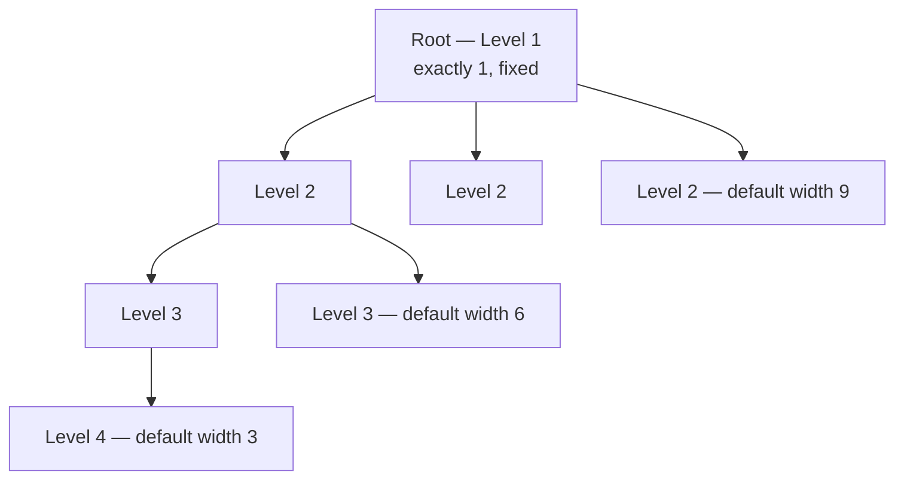
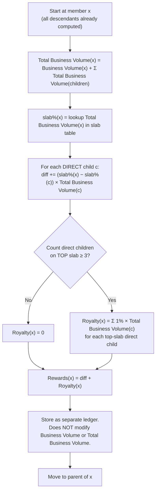
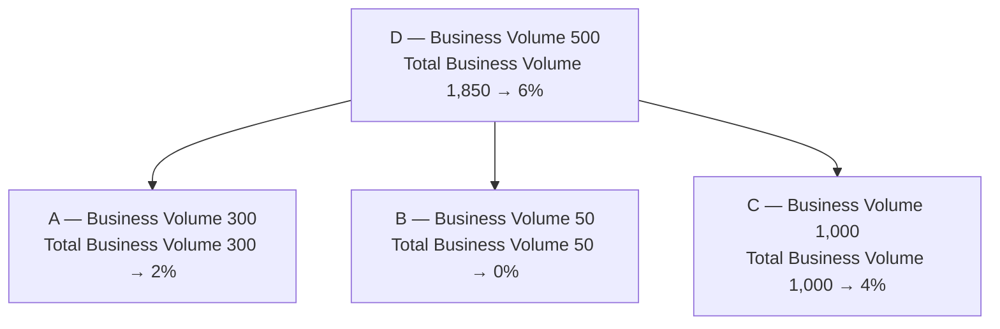
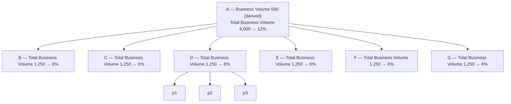
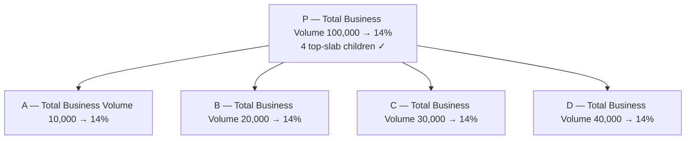
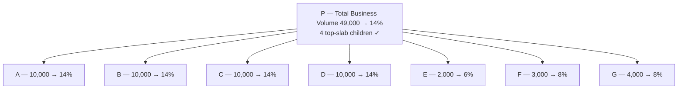
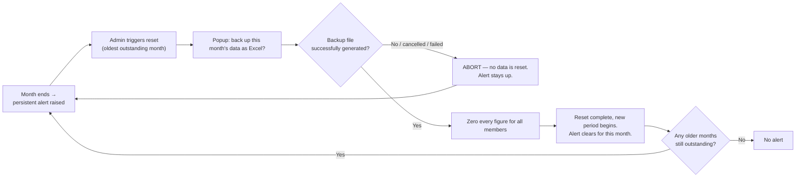

# Distributor Business Volume & Beneficiary Management System
## Requirement Specification — v1.0 (for review)

| | |
|---|---|
| **Client** | Siddharth Patel |
| **Architect / Developer** | Keyur Patel |
| **Source** | [requirement-draft.md](requirement-draft.md) |
| **Status** | All 22 client questions answered and confirmed. No blockers remain. |

> **How to read this document.** Everything stated as a **Rule** is confirmed and implementable. Everything marked **[DERIVED]** was inferred from the draft's worked examples because the draft never states it in prose — these are correct against the numbers but need the client's explicit "yes". Everything marked **[CONFIRMED]** is a derived item the client has since agreed, carrying the date it was settled. Everything in [§9 Open Questions](#9-open-questions) is genuinely unanswered and nothing was assumed in its place; answered items stay there, marked, rather than being deleted.
>
> **Status badges** used throughout:
>
> | Badge | Meaning |
> |---|---|
> | ✅ **CONFIRMED** | Settled. Build on it. |
> | 🟡 **PROVISIONAL** | Agreed, but being re-checked with the client. Design against it; do not treat as final. |
> | ⏸️ **DEFERRED** | Parked pending client input. |
> | ☐ **OPEN** | No answer yet. |

---

## 1. Overview

A single-admin dashboard for managing a hierarchy of members, tracking the Business Volume recorded against each member, rolling those figures up the hierarchy, and computing each member's Rewards from the slab differential between them and the members directly beneath them.

> ## ⚠️ Terminology changed — 3 August 2026
>
> The three core quantities were renamed by the client. **Read this before anything else**, because one of the new names previously meant something different.
>
> | Was called | Is now called | What it actually is |
> |---|---|---|
> | Individual Credit Points | **Business Volume** | What the admin types in directly against one member |
> | Business Volume | **Total Business Volume** | That member's own figure **plus** their whole team below |
> | Earned Points | **Rewards** | The score = differential + royalty |
>
> **⚠️ "Business Volume" has changed meaning.** It used to mean the rolled-up team figure; it now means a member's own directly-entered figure. The rolled-up figure is now **Total Business Volume**. Anyone holding an older copy of this document will read every formula backwards.
>
> Consequently:
> - **Abbreviations are no longer used.** The old `ICP` and `BV` shorthands are gone entirely — reusing `BV` for its new meaning would be the easiest possible way to introduce a silent error. Everything is written out in full.
> - **"Credit points" is gone**, and so is "points" as a unit. Figures are stated bare: *Person A's Business Volume is 300.*
> - **Decisions recorded before this date have been restated in the new wording**, so the document is internally consistent. Change-log entries in §8 keep the words used at the time — they are a dated record, and this table bridges them.
> - **The client's original [requirement-draft.md](requirement-draft.md) is deliberately untouched** and still uses the old vocabulary. It is the historical source, and this document cites its line numbers throughout.

### 1.1 Glossary — the four quantities, kept apart

The client's draft used a single phrase for several different numbers. Every calculation below depends on keeping them apart. This is the single most important clarification in this document.

| Term | Definition | How it changes |
|---|---|---|
| **Business Volume** | Figures recorded directly against one member by the admin on the Business Volume entry screen. | Manual entry only. Reset to 0 at monthly reset. |
| **Total Business Volume** | A member's own Business Volume plus the **already-computed Total Business Volume of each direct child** — one level of addition only. Because each child's figure is itself complete, the total transitively covers every depth without re-walking the tree. | Derived. Recomputed whenever any Business Volume beneath the member changes. |
| **Slab %** | The percentage band a member falls into, looked up from their **Total Business Volume** (not their Business Volume). | Derived from Total Business Volume. |
| **Rewards** | The member's score for the period = Differential + Royalty. | Derived. **A separate ledger** — see Rule 6. |

> **Naming — ✅ [CONFIRMED — client, 2026-08-03].** The **Business Volume** family of terms is used everywhere — screens, column headers, exports and this document alike. The draft's one use of *"total purchase volume"* (line 39) becomes **Total Business Volume**, because *purchase* is on the client's own forbidden list (draft line 45). No renaming to *Group Volume* or *Team Points* is needed.

### 1.2 Vocabulary constraint

No user-visible string — screen label, button, column header, export filename, error message, tooltip — may use *sale*, *purchase*, *order*, *cash*, *payment*, *commission*, *invoice*, or equivalents. Permitted vocabulary: *member, Business Volume, Rewards, royalty, volume, slab, level, leg*.

---

## 2. Hierarchy Model

### 2.1 Structure

- A single tree. Exactly **one root member** at Level 1. This is fixed permanently and can never increase.
- Every non-root member has exactly **one parent**, set at onboarding via a mandatory **Reference ID**.
- Depth is **configurable** in settings.

### 2.2 Level widths — soft defaults, not enforced

**Rule 1.** The per-level width figures (Level 2 = 9, Level 3 = 6, Level 4 = 3) are stored in settings as **informational defaults only**. Onboarding does **not** reject a member for exceeding them.

*Rationale:* the draft's own scenarios contradict a hard limit — Scenario 3 gives a Level-2 member 6 children while Scenario 5 gives a member 7 children. Confirmed with the client that these are advisory. The UI may show a soft warning; it must not block.

### 2.3 Member identity

**Rule 2.** Every member receives a unique **6-digit ID** at onboarding. IDs are the primary lookup key for search, entry and reference linking.

### 2.4 Hierarchy tree



---

## 3. Slab Table

### 3.1 Default slabs

**Rule 3.** A member's slab is the **highest** slab whose threshold is **less than or equal to** the member's **Total Business Volume**. A member below the lowest threshold is on 0%.

| Slab | Threshold | Applies when Total Business Volume is | Notes |
|---|---|---|---|
| 0% | — | 0 – 99 | Implicit base slab, not in the draft's list |
| 2% | 100 | 100 – 399 | |
| 4% | 400 | 400 – 1,199 | |
| 6% | 1,200 | 1,200 – 2,999 | |
| 8% | 3,000 | 3,000 – 4,999 | |
| 10% | 5,000 | 5,000 – 6,999 | |
| 12% | 7,000 | 7,000 – 9,999 | |
| 14% | 10,000 | ≥ 10,000 | **Top slab** — triggers royalty eligibility |

The `>=` boundary rule is proved by the draft: Scenario 2 places C on 8% at exactly 3,000, and Scenario 4 places A on 14% at exactly 10,000.

### 3.2 Configurability

**Rule 4.** Every threshold in the table is editable in settings. The examples given by the client — moving the 2% slab to 200, moving the 6% slab to 1,000 — must both be supported.

The **top slab** (the royalty trigger) is defined as the row with the highest percentage, whatever its threshold currently is. It is not hard-coded to 14% or to 10,000.

**Rule 27 — Slab rows are addable and removable.** ✅ **[CONFIRMED — client, 2026-08-03]** The admin may **add and remove** slab rows, not merely re-threshold the existing seven. The slab table can grow to eight rows or shrink to five. The top slab is always recomputed as the highest-percentage row, so the royalty trigger stays correct without anyone having to update it separately.

---

## 4. Calculation Logic (CRITICAL)

### 4.1 Order of evaluation

**Rule 26 — Recalculation trigger.** ✅ **[CONFIRMED — client, 2026-08-03]** The system recalculates **immediately on every Business Volume entry**. The moment an entry is saved, every affected member's Total Business Volume, slab and Rewards are correct on screen. There is no manual "recalculate" button and no batch-only mode.

> **Scale:** expected size is **500 to 5,000 members**. Immediate recalculation is comfortable at that size, but the implementation should update **only the affected chain upward** from the member who received points, rather than rebuilding the whole tree on every entry. Internal design note — no visible difference to the admin.
>
> ☐ **Still needed:** expected number of Business Volume entries per month. Not yet supplied.

**Rule 5.** Calculation runs **bottom-up** — a post-order traversal of the tree. A member's Total Business Volume cannot be computed until each **direct child's** Total Business Volume is final; the deeper levels are already folded into those figures by the same rule applied one level lower. Results propagate to the root.

### 4.2 The rules

**Rule 6 — Total Business Volume.**
```
Total Business Volume(x) = Business Volume(x) + Σ Total Business Volume(c)   for every direct child c of x
```
**The sum is one level deep.** Only direct children appear in it, and each contributes their *already-computed* Total Business Volume. Full-depth coverage is a consequence of that, not a separate step: because the same rule was applied one level lower, each child's figure already carries their own team. Nothing is double-counted and nothing is missed. **[CONFIRMED — client, 2026-08-03]** — proved by Scenario 3: A's Total Business Volume is 8,000 while six children at 1,250 sum to 7,500, so A's own Business Volume is 500, and D's contribution of 1,250 had already absorbed p1/p2/p3. The `Business Volume(x)` term — a member's own Business Volume always counting toward their own Total Business Volume — is confirmed without exception.

**Rule 7 — Slab.** `slab%(x) = lookup(Total Business Volume(x))` per Rule 3. Driven by Total Business Volume, never by Business Volume.

**Rule 8 — Differential earnings.**
```
Differential(x) = Σ [ (slab%(x) − slab%(c)) × Total Business Volume(c) ]   for every DIRECT child c of x
```
Three things this says, each of which the draft leaves implicit:
- The base is the child's **Total Business Volume**, not the child's Business Volume. **[CONFIRMED — client, 2026-08-03]** — Scenarios 1, 2, 4 and 5 use leaf children where Total Business Volume and Business Volume are identical, so only Scenario 3 disambiguates: it applies 6% to B's *volume* of 1,250. Confirmed as the record of why, not as a request.
- Only **direct children** contribute a term. Grandchildren are already inside the child's Total Business Volume. **[DERIVED]** — consistent across all five scenarios.
- A member earns **nothing on their own Business Volume**. In every scenario the member's own Business Volume inflates their Total Business Volume (and therefore their slab) but never appears as an earning term. **[CONFIRMED — client, 2026-08-03]**

**Rule 9 — The differential can never be negative.** Because `Total Business Volume(parent) ≥ Total Business Volume(child)` by construction (Rule 6), `slab%(parent) ≥ slab%(child)` always holds. No clamping, no negative-earnings case, no error state. This is a structural guarantee, not a check.

**Rule 10 — Royalty qualification.** Let `Q` = the set of **direct children** of x whose slab is the **top slab**.
```
if |Q| >= ROYALTY_MIN_CHILDREN   (default 3, configurable)
    Royalty(x) = Σ [ ROYALTY_RATE × Total Business Volume(c) ]   for every c in Q      (rate default 1%)
else
    Royalty(x) = 0
```
Confirmed with the client: **direct children only**, both for counting and for paying.

**Rule 11 — Royalty and differential never double-pay.** If a child is on the top slab, the parent's Total Business Volume is at least the child's Total Business Volume, so the parent is on the top slab too, so that child's differential term is exactly 0 (Rule 9). The two mechanisms are automatically disjoint — no explicit exclusion logic is needed.

> This is what the draft's confusing sentence on line 133 — *"since P has 0 earned points from his decendants (all are on 14% slab), hence he can now start earning royalty points"* — is actually describing. **(Quoted verbatim from the draft, which predates the rename: "earned points" is today's Rewards. Do not update this quotation.)** It reads like a precondition but it is a **consequence**. Scenario 5 proves it is not a precondition: P there has 580 of differential from E, F and G and still collects royalty from A–D. The only real precondition is the `|Q| >= 3` count.

**Rule 25 — Royalty stacks at every level.** ✅ **[CONFIRMED — client, 2026-08-03]** Each member is assessed **independently** against their own direct children. If a member qualifies under Rule 10, their upline may also qualify on that member's Total Business Volume, and so on to the root — the same underlying volume can therefore attract royalty at several levels of the same chain.

> Worked illustration: A, B and C each hold Total Business Volume 10,000 under P. Total Business Volume(P) = 30,000, three top-slab children, so P collects 1% × 30,000 = **300**. P, Q and R are identical siblings under T. Total Business Volume(T) = 90,000, three top-slab children, so T collects 1% × 90,000 = **900**. Total paid across the chain is 1,800, and A's original 10,000 has attracted royalty twice.
>
> Re-confirmed by the client on 2026-08-03, with the payout consequence understood: royalty applies at every level where the qualifying criteria are met.

**Rule 12 — Rewards.**
```
Rewards(x) = Differential(x) + Royalty(x)
```

**Rule 13 — Rewards are a separate ledger.** Confirmed with the client. Rewards are **never** added to any member's Business Volume. They do not raise the earner's own slab, do not enter any ancestor's Total Business Volume, and do not compound into the next period. The draft's line 60 — *"Always pay Royalty in credit points, not in cash"* — means royalty is **denominated on the same scale as everything else**, not that it credits the member's Business Volume. **(Quoted verbatim from the draft, which predates the rename. Do not update this quotation.)**

**Rule 14 — Unit value.** ✅ **[CONFIRMED — client, 2026-08-03]** `1 unit = 500 Rs`, configurable, retained on the settings screen per draft L56. Business Volume, Total Business Volume and Rewards all share this one scale, so the rate applies to any of them.

It is **reference only**: no rupee figure is displayed on any screen, report or export, and it plays no part in any calculation. All calculation, entry, storage and display are in bare figures with no currency attached.

> ☐ **Minor wording item for confirmation.** The draft phrased this as "1 point = 500 Rs" when "points" was the universal unit. With that word retired, it is stated here as a value per unit on the shared scale. In practice the client applies it to **Rewards** (below), so if it should be worded as "1 Reward = 500 Rs" specifically, say so.

> **Why the setting is kept.** The client converts **final Rewards** into rupees at this rate **by hand, outside the application** (see Q-I8). The setting is their reference figure for doing that sum. Building the conversion into the software is explicitly **not** wanted now, and may be added later if asked.

### 4.3 Per-member calculation flow



---

## 5. Worked Scenarios — re-derived from the rules above

Each scenario below was recomputed from Rules 6–12 alone. All five totals match the draft.

### 5.1 Scenario 1 — basic differential



Total Business Volume(D) = 500 + 300 + 50 + 1,000 = **1,850** → 6% slab.

| Child | Child Total Business Volume | Child slab | D slab | Differential % | Rewards |
|---|---|---|---|---|---|
| A | 300 | 2% | 6% | 4% | **12** |
| B | 50 | 0% | 6% | 6% | **3** |
| C | 1,000 | 4% | 6% | 2% | **20** |
| | | | | **Total** | **35** |

Royalty: 0 direct children on the top slab → not eligible.
**Rewards(D) = 35** ✅ matches draft.

### 5.2 Scenario 2 — differential collapses to zero on an equal slab

Identical to Scenario 1 except C's Business Volume is 3,000.

Total Business Volume(D) = 500 + 300 + 50 + 3,000 = **3,850** → 8% slab.

| Child | Child Total Business Volume | Child slab | D slab | Differential % | Rewards |
|---|---|---|---|---|---|
| A | 300 | 2% | 8% | 6% | **18** |
| B | 50 | 0% | 8% | 8% | **4** |
| C | 3,000 | 8% | 8% | 0% | **0** |
| | | | | **Total** | **22** |

Royalty: C is on 8%, which is not the top slab. 0 qualifying children → not eligible.
**Rewards(D) = 22** ✅ matches draft.

### 5.3 Scenario 3 — multi-depth rollup



Total Business Volume(A) = Business Volume(A) + 6 × 1,250 = Business Volume(A) + 7,500 = **8,000** → so **Business Volume(A) = 500**. The draft never states this figure; it was derived here and the client has since confirmed that a member's own Business Volume always counts toward their own Total Business Volume.

8,000 falls in 7,000–9,999 → **12% slab**.

| Child | Child Total Business Volume | Child slab | A slab | Differential % | Rewards |
|---|---|---|---|---|---|
| B – G (six members) | 1,250 each | 6% | 12% | 6% | **75 each** |
| | | | | **Total** | **450** |

**Key point:** p1, p2 and p3 contribute nothing directly to A's earnings. Their figures are already absorbed into D's Total Business Volume of 1,250, and A earns on D's Total Business Volume. This is what makes the differential model self-limiting.

Royalty: no direct child on the top slab → not eligible.
**Rewards(A) = 450** ✅ matches draft.

### 5.4 Scenario 4 — pure royalty



Total Business Volume(P) = 10,000 + 20,000 + 30,000 + 40,000 = **100,000** → 14% (top slab).

> **Note — settled 2026-08-03.** The draft computes `A + B + C + D` and omits Business Volume(P) entirely, unlike Scenarios 1 and 3 which include the parent's own Business Volume. The client has confirmed this was a **simplification in the write-up, not a different rule**: own Business Volume is always counted. The example therefore stands as shown, with Business Volume(P) = 0.

**Differential:** every child is on 14%, P is on 14% → all four terms are 0. Total **0**.

**Royalty:** 4 direct children on the top slab ≥ 3 → **eligible**.

| Child | Child Total Business Volume | Royalty @ 1% |
|---|---|---|
| A | 10,000 | **100** |
| B | 20,000 | **200** |
| C | 30,000 | **300** |
| D | 40,000 | **400** |
| | **Total** | **1,000** |

**Rewards(P) = 0 + 1,000 = 1,000** ✅ matches draft.

### 5.5 Scenario 5 — differential and royalty together



Total Business Volume(P) = (4 × 10,000) + 2,000 + 3,000 + 4,000 = **49,000** → 14% (top slab). Business Volume(P) is again omitted by the draft, for the same reason settled in §5.4 — a simplification in the example, not a different rule. Taken as Business Volume(P) = 0 here.

**Differential:**

| Child | Child Total Business Volume | Child slab | P slab | Differential % | Rewards |
|---|---|---|---|---|---|
| A | 10,000 | 14% | 14% | 0% | 0 |
| B | 10,000 | 14% | 14% | 0% | 0 |
| C | 10,000 | 14% | 14% | 0% | 0 |
| D | 10,000 | 14% | 14% | 0% | 0 |
| E | 2,000 | 6% | 14% | 8% | **160** |
| F | 3,000 | 8% | 14% | 6% | **180** |
| G | 4,000 | 8% | 14% | 6% | **240** |
| | | | | **Subtotal** | **580** |

**Royalty:** A, B, C, D on the top slab = 4 ≥ 3 → eligible. 1% × 10,000 = 100 each → **400**.

**Rewards(P) = 580 + 400 = 980** ✅ matches draft.

This scenario is the one that settles the royalty rule: P earns a non-zero differential *and* royalty in the same period, so "zero differential" is not a royalty precondition.

---

## 6. Functional Requirements

### FR-1 — Home / Search
Search by member **name** or **6-digit ID**. Selecting a result opens that member's detail view with their hierarchy shown to **one depth only** (direct children).

### FR-2 — Hierarchy chart
Visual tree of members under a chosen member. Each node shows exactly three fields: **name, ID, Business Volume**. Nothing else.

> ✅ **CONFIRMED — client, 2026-08-03.** The node shows **name, ID and own Business Volume — nothing else**. ⚠️ This **differs from the recommendation**, which proposed Total Business Volume on the grounds that the chart exists to show volume building upward; the client re-confirmed own Business Volume.
>
> One factual consequence to be aware of: because the slab is driven by Total Business Volume and not by own Business Volume, a node can display a small own-Business-Volume figure while the member sits on a high slab. The chart will therefore not, on its own, explain why someone is on the slab they are on.

### FR-3 — Member detail
Shows: name, phone number, address, all Rewards detail, direct children (1 depth only) with their figures, total **Total Business Volume**, and **number of legs** = count of direct children.

### FR-4 — Add member
Captures name, phone number, email (optional), **Reference ID (mandatory)**, address, and remaining basic fields. Reference ID must resolve to an existing member. On save, assigns a unique 6-digit ID.

**Rule 30 — Reference and hierarchy integrity.** ✅ **[CONFIRMED — client, 2026-08-03]**
- The Reference ID must resolve to an **existing, active** member. Anything else is rejected at entry with a clear message.
- The single root member is created **once, during initial setup**, as a special step with no Reference ID. The option is never available again — the top level can never grow beyond one person (Rule 1).
- Any move that would place a member **beneath their own descendant** is blocked, with the reason shown.

> **Cycles are now structurally impossible.** With transfers prohibited (Rule 37), a member's parent is set once at creation, must already exist, and never changes thereafter. The hierarchy is therefore **a tree by construction** — there is no sequence of permitted operations that can create a loop. The check above remains as a belt-and-braces guard, but it can never fire in normal use.

**Rule 32 — Depth overflow.** ✅ **[CONFIRMED — client, 2026-08-03]** If onboarding would exceed the configured maximum depth, the system **warns but allows**. Consistent with Rule 1, where the per-level widths are advisory rather than enforced — a real member is never blocked by a settings value.

**Rule 34 — Phone number uniqueness.** ✅ **[CONFIRMED — client, 2026-08-03]** A phone number identifies exactly one member and is **unique across the whole system — active and inactive alike**. Adding a member on a number already in use is rejected with a clear error.

Where the number matches an **inactive** member, the system names that person and offers to **reactivate them**, rather than erroring blindly. Reactivation preserves their **original 6-digit ID, their position in the hierarchy, and their entire history**. A duplicate record is never created.

**Rule 35 — Member ID allocation.** ✅ **[CONFIRMED — client, 2026-08-03]** Each member receives a **randomly chosen, currently-available** 6-digit number in the range **100000–999999**. Allocation is random, never sequential, so IDs reveal nothing about join order or member count.

IDs are **never released**. Because deactivation is not deletion (Rule 28), a deactivated member's number stays permanently taken — which is also what makes reactivation under Rule 34 possible.

> ☐ Minor point for confirmation: "start after 1,00,000" is read here as the natural 6-digit range beginning at 100000. If an exclusive lower bound was meant, the range is 100001–999999 instead. The difference is one number and affects nothing else.

**Rule 37 — Transfers prohibited.** ✅ **[CONFIRMED — client, 2026-08-03]** A member's sponsor is **fixed at creation and can never change**. If Person P is created under Person A, P can never be moved to Person B. The system blocks it outright — there is no override.

> **Reverses an earlier decision.** Rule 28 previously permitted moves with closed months frozen. The client has confirmed transfers are blocked entirely, so the freezing provision is no longer needed.

**Rule 28 — Member lifecycle.** ✅ **[CONFIRMED — client, 2026-08-03]**
- **Edit** — permitted at any time (name, phone, address and so on), subject to Rule 34 for phone numbers.
- **Removal** — a member may be marked **inactive**, so they stop appearing in new periods. They are **never hard-deleted**; their history stays intact.
- ~~**Move to a different sponsor** — permitted, with already-closed months frozen.~~ ⚠️ **SUPERSEDED by Rule 37 (2026-08-03)** — transfers are now blocked outright. Text retained for the record.

> Hard deletion is prohibited because it would silently change past reports, leaving no way to explain why last year's figures no longer match what was seen at the time.

### FR-5 — Points add screen
**Rule 15.** Admin searches by name or ID, selects a member, records Business Volume against them.

**Rule 16 — Points-only entry.** ✅ **[CONFIRMED — client, 2026-08-03]** The admin enters **Business Volume directly**, and nothing else. The field accepts up to **two decimal places** — `250` or `250.50` are both valid. There is no rupee entry mode, no currency conversion, and no rupee field anywhere on this screen.

> **Supersedes an earlier decision.** This replaces the original "two entry modes, admin's choice" rule (rupee mode plus Business Volume mode), which was locked at the start of this work and has now been reversed by the client. Recorded here deliberately rather than rewritten silently.

**Rule 22 — Precision.** ✅ **[CONFIRMED — client, 2026-08-03]** Business Volume and Rewards carry **two decimal places** throughout storage and calculation. Rounding happens **only at the point of display**, never at an intermediate step — no per-child-term rounding before summing, so totals always reconcile against a calculator.

### FR-6 — Settings
All values in [§7](#7-settings-inventory) are editable here.

### FR-7 — Monthly reset (manual, backup-gated)
**Rule 17.** Reset is **manual only** — never automatic. The admin is **prompted** on the 1st of each month but may act later.

**Rule 21 — Period boundaries.** ✅ **[CONFIRMED — client, 2026-08-03]**
- A period is a **calendar month**, 1st to last day.
- The reset closes **whichever month it belongs to**, whenever it is actually pressed. Pressing it on 5 September still closes August.
- ~~Points entered between the 1st and the moment of reset count into the **month being closed**, not the new one.~~ ⚠️ **SUPERSEDED by Rule 36 (2026-08-03)** — entry is now locked the moment a month ends, so no late entries can occur at all. Text retained for the record. The confirmation screen must still name the month it is about to close, explicitly and unambiguously.

**Rule 20 — Persistent reset alert.** ✅ **[CONFIRMED — client, 2026-08-03]** — client-added requirement, not present in the original draft.
- Raised as soon as the month being closed has ended.
- Appears as **both** an undismissable banner on every screen, naming the outstanding month, **and** an entry in the notification list.
- **Clears only on successful completion of the reset.** Not on navigation, not on logout, not on acknowledgement. There is no snooze and no dismiss control.
- Where **several months are outstanding**, the alert lists every one of them. Only the **oldest** can be closed; the next unlocks once it completes.
- Each outstanding month is closed **separately**, keeping its own backup and its own snapshot. Months are never merged into a combined period.
- The alert no longer stands alone: since 2026-08-03 it accompanies a **hard entry lock** (Rule 36). Oldest-first ordering is unaffected.

> ☐ **Flagged for confirmation — empty elapsed months.** Because entry is locked while a reset is outstanding, a whole calendar month can elapse with **no entries at all**. Two months are then outstanding: one holding data, one entirely empty. Whether the empty one should produce a zero snapshot matters, because Rule 23 divides the yearly average by the count of months that *have* a snapshot, and zero-snapshots would drag every member's average down.
>
> **Recommended, not yet confirmed:** an elapsed month with no entries produces **no snapshot** and is excluded from the averaging denominator. Needs a client decision before build.

**Rule 18.** Reset flow is strictly gated:

**A reset must never proceed without a confirmed successful backup.** A failed or cancelled backup leaves the alert in place.

**Rule 38 — Reset scope.** ✅ **[CONFIRMED — client, 2026-08-03]** The reset zeroes **everything**: Business Volume, Total Business Volume, Rewards and royalty all go to 0. No live value survives a reset.

Before anything is cleared, an immutable **snapshot** of the closing period is written, capturing per member:

| Snapshot field | Why it is needed |
|---|---|
| Business Volume | Yearly average and the low-threshold report (Rules 23, 24) |
| Total Business Volume | Yearly average export (draft L46) |
| Slab % | Historical record of where each member stood |
| Rewards | The month's score — nothing else preserves it once zeroed |
| Royalty earned | Breakdown of the above |
| Active / inactive status | So reports reflect who was live that month |

**All yearly reporting is built exclusively from these snapshots, never from live values.** Once a reset completes, the live figures carry no history at all — the snapshot is the only record that the month ever happened.

> ⚠️ **Consequence worth stating plainly.** Because Rewards are zeroed too, a month that is never closed leaves **no permanent record of that month's earnings**. The mandatory backup gate (Rule 18) and the enforced entry lock (Rule 36) are what make this safe.

**Rule 36 — Reset enforcement.** ✅ **[CONFIRMED — client, 2026-08-03]** Once a calendar month ends, **all entry of Business Volume is locked** until that month's reset completes. No entry of any kind is accepted while a reset is outstanding. The Business Volume entry screen shows the lock and the name of the month waiting to be closed.

> **Reverses an earlier decision.** When skipped months were discussed, "block Business Volume entry until the overdue reset is cleared" was offered and **rejected** in favour of a non-blocking alert with oldest-first closing. The client has since confirmed blocking. Rule 20's alert and the oldest-first ordering both stand; the hard lock is added on top of them.
>
> **This also overrides the third bullet of Rule 21.** With entry locked the moment a month ends, there can be no late entries falling into the closing month — that provision is now unreachable.

**Rule 31 — Backup storage and retention.** ✅ **[CONFIRMED — client, 2026-08-03]** Each backup is **downloaded to the administrator's computer and also retained permanently inside the system**, where any past month can be re-downloaded at any time. Nothing is auto-deleted.

> Two independent copies, because the reset is gated on this backup. If the only copy were a file in a downloads folder, a lost or overwritten download would defeat the gate the client deliberately asked for.

### FR-8 — Exports

| Export | Contents |
|---|---|
| **Monthly data** | Default columns: name, ID, phone number, Business Volume. Admin-configurable additional columns. |
| **Yearly average** | Per member: yearly average of volume **and** of own Business Volume, plus the month count each average is based on (Rule 23). Yearly cycle defaults to 1 Jan – 31 Dec, configurable. |
| **Low-threshold report** | Members whose yearly average of **own Business Volume** falls below a configurable threshold (default 100) — Rule 24. |

**Rule 19.** Every exported report includes the member's basic details, phone number, volume and Business Volume, regardless of which optional columns are selected.

**Rule 23 — Yearly average method.** ✅ **[CONFIRMED — client, 2026-08-03]** Sum the member's figures across the periods that **actually have a snapshot**, and divide by the **count of those periods** — not by a fixed 12. The report must **display that month count** next to each average, so a figure based on three months is never mistaken for one based on twelve. This protects members who joined part-way through the year, and protects everybody if a reset is ever late.

**Rule 24 — Low-threshold report metric.** ✅ **[CONFIRMED — client, 2026-08-03]** The report filters on the yearly average of the member's **own Business Volume**, not their Total Business Volume.

> **Client answer differs from the recommendation.** This specification originally recommended filtering on Total Business Volume, reading the 100-threshold as "never reached the lowest slab". The client instead wants the report to reflect what each person personally brought in, independent of the team beneath them. The **yearly-average export still carries both figures** (draft L46) — only the *filter metric* is own Business Volume.

All exports are Excel format.

**Rule 33 — Configurable export columns.** ✅ **[CONFIRMED — client, 2026-08-03]** Every field is offered, with the client's four defaults pre-ticked. Available columns: **name, ID, phone number, Business Volume** (defaults), plus email address, address, reference number, name of the person they work under, level in the hierarchy, number of direct legs, Total Business Volume, slab percentage, Rewards, royalty earned, joining date, and active/inactive status.

### FR-9 — Authentication

**Rule 29 — Access control.** ✅ **[CONFIRMED — client, 2026-08-03]**
- **One administrator account**, used solely by the client. There are no other user accounts and no roles.
- **Members never log in** and have no access of any kind to the system.
- Protected by either a **6-digit PIN or a complex password** — ⏸️ the client will decide which. Both must be supported in design until that choice is made.

> **Security requirement, applying to either choice.** A 6-digit PIN is one million combinations and is trivially brute-forced if attempts are unlimited. **Failed-attempt limiting with lockout is mandatory, not optional** — this single account guards every member's personal details and phone number. If the PIN route is chosen, this is the only thing standing between the PIN and an attacker.

---

## 7. Settings Inventory

Everything the draft describes as configurable, in one place.

| # | Setting | Default | Source |
|---|---|---|---|
| 1 | Slab thresholds (7 rows) | 100 / 400 / 1,200 / 3,000 / 5,000 / 7,000 / 10,000 | draft L21–32 |
| 2 | Slab percentages | 2 / 4 / 6 / 8 / 10 / 12 / 14 | draft L21–27 |
| 3 | Point value in Rs — **reference only, never displayed elsewhere** (Rule 14) | 500 | draft L56 |
| 4 | Hierarchy depth | not specified | draft L15 |
| 5 | Level 2 width (advisory) | 9 | draft L12 |
| 6 | Level 3 width (advisory) | 6 | draft L13 |
| 7 | Level 4 width (advisory) | 3 | draft L14 |
| 8 | Royalty min. qualifying direct children | 3 | draft L59 |
| 9 | Royalty rate — ✅ confirmed configurable | 1% | draft L59 |
| 9a | Slab rows — add / remove permitted (Rule 27) | 7 rows | ✅ confirmed 2026-08-03 |
| 10 | Yearly cycle start / end | 1 Jan – 31 Dec | draft L46 |
| 11 | Low-average threshold | 100 | draft L47 |
| 12 | Export column selection | name, ID, phone, Business Volume | draft L44 |

---

## 8. Verification of this Document

Every scenario in [§5](#5-worked-scenarios--re-derived-from-the-rules-above) was recomputed from Rules 6–12 alone, without reference to the draft's stated answers. All five totals reconcile:

| Scenario | Differential | Royalty | Total | Draft says | Match |
|---|---|---|---|---|---|
| 1 | 35 | 0 | 35 | 35 | ✅ |
| 2 | 22 | 0 | 22 | 22 | ✅ |
| 3 | 450 | 0 | 450 | 450 | ✅ |
| 4 | 0 | 1,000 | 1,000 | 1,000 | ✅ |
| 5 | 580 | 400 | 980 | 980 | ✅ |

The calculation model in §4 is therefore **arithmetically consistent with every example the client provided**. What remains is confirming the model's *interpretation*, which is what §9 asks.

> **Change log — 2026-08-03 (terminology rename).** The client renamed the three core quantities: *Individual Credit Points* → **Business Volume**, *Business Volume* → **Total Business Volume**, *Earned Points* → **Rewards**. "Credit points" is retired entirely, and so is "points" as a unit — figures are now stated bare.
>
> Because "Business Volume" is **both a source and a target** of this rename, it was applied in strict order — old Business Volume first, then old Individual Credit Points — so the two meanings could never collide. Reversing that order would have swept the per-member figures into the rolled-up term and silently corrupted every formula and worked example.
>
> Three confirmed decisions **invert** under the new vocabulary and were rewritten by hand rather than swept up mechanically: **Q-B1** (differential base is now the child's *Total* Business Volume), **Q-B7** (low-threshold filter is now *Business Volume*), and **Q-I2** (chart shows *Business Volume*). Read with the old vocabulary, Q-I2 in particular would appear to say the opposite of what the client chose.
>
> **The `ICP` and `BV` abbreviations were dropped entirely.** Reusing `BV` for its new meaning was the single most dangerous option available — anyone holding an older copy would misread every formula. Everything is spelled out.
>
> **All five scenario totals were re-derived from the renamed rules and are unchanged: 35, 22, 450, 1000, 980.** No rule number changed. Earlier change-log entries below keep the vocabulary used at the time; the mapping table in §1 bridges them.
>
> **Change log — 2026-08-03 (final three answers + five new client requirements — all questions closed).** Position is now **22 confirmed, 0 provisional, 0 deferred, 0 open. No blockers remain.**
>
> **Answers:**
> - **Q-B5 — the last blocker, now cleared.** The reset zeroes **everything** — Business Volume, Total Business Volume, Rewards and royalty. A full snapshot is written first, and **all yearly reporting reads from snapshots only**. New **Rule 38**, including the required snapshot field list. ⚠️ Differs from the recommendation, which proposed keeping Rewards live.
> - **Q-I2** — re-confirmed: chart shows name, ID and own Business Volume, nothing else. Promoted from provisional.
> - **Q-I4** — re-confirmed: royalty stacks at every qualifying level. Rule 25 promoted from provisional.
>
> **Five new client requirements:**
> - **New Rule 34** — phone numbers unique across active and inactive members; a match on an inactive member offers **reactivation**, preserving their original ID, hierarchy position and history.
> - **New Rule 35** — member IDs are **randomly allocated** from available numbers in 100000–999999, never sequential, never released once taken.
> - **New Rule 36** — reset is **enforced**: all entry of Business Volume is locked once a month ends, until that month is closed.
> - **New Rule 37** — member **transfers are prohibited outright**; a sponsor is fixed at creation.
> - **Rule 30** — noted that with transfers blocked the hierarchy is now **a tree by construction**; cycles are structurally impossible and the loop check can never fire in normal use.
>
> **Two reversals, recorded rather than rewritten:**
> - Rule 36 reverses the earlier decision to keep the reset alert **non-blocking** — blocking was explicitly offered and rejected at the time. Rule 20's alert and oldest-first closing both stand; the lock is added on top. It also **supersedes Rule 21's late-entry bullet**, which is struck through but retained.
> - Rule 37 reverses **Rule 28's move provision**, likewise struck through and retained.
>
> ☐ **One new item flagged, not decided:** whether a month that elapses with no entries (possible now that entry locks) should produce a zero snapshot. It affects Rule 23's averaging denominator. Recommendation recorded; needs client confirmation before build.
>
> No calculation, formula or scenario total changed. Rules 1–33 were not renumbered.
>
> **Change log — 2026-08-03 (Q-I7, Q-I8 and all Minor questions answered — every question now has an answer).** The final seven landed. Position is now **19 confirmed, 2 provisional, 1 deferred, 0 open**.
> - **Q-I8 — the suspected missing feature does not exist.** The client corrected the wording: draft line 7's *"final discounts"* means **final Rewards**, already modelled by Rule 12. No discount feature, nothing extra to build. The rupee conversion is done **by hand, outside the application**, which retrospectively explains why Rule 14's point-value setting is kept but never displayed.
> - **New Rule 29 — authentication.** One administrator account (the client only); members never log in. PIN or complex password, ⏸️ choice still with the client. ⚠️ **Failed-attempt lockout recorded as mandatory either way** — a 6-digit PIN is one million combinations and this account guards every member's personal details.
> - **New Rule 28** — member lifecycle: edit freely, deactivate but never hard-delete, ~~moves permitted with closed months frozen so past reports never change retrospectively~~ ⚠️ **SUPERSEDED by Rule 37 (2026-08-03)** — transfers are now blocked outright.
> - **New Rule 30** — reference must resolve to an existing active member; root created once at setup; loop-creating moves blocked.
> - **New Rule 31** — backups downloaded locally *and* retained permanently in the system.
> - **New Rule 32** — depth overflow warns but allows, consistent with Rule 1.
> - **New Rule 33** — full configurable export column list.
> - **§10** — authentication removed (now answered); the data-volume line narrowed to entries-per-month only.
>
> No calculation, formula or scenario total changed. Rules 1–27 were not renumbered. **Q-B5 remains the sole blocker.**
>
> **Change log — 2026-08-03 (Q-I1 to Q-I6 answered; Q-B5 deferred; status badges introduced).** Six of the eight "Important" questions landed, and a four-state badge model was introduced (confirmed / provisional / deferred / open) because two answers are subject to a client re-check:
> - **Naming** — the Business Volume family of terms throughout; draft L39's "total purchase volume" replaced. §1.1 note rewritten as settled.
> - **Chart value** 🟡 — shows **own Business Volume**. ⚠️ Differs from the recommendation of Total Business Volume; provisional pending client re-check. FR-2 rewritten, with a note that a node may show small own Business Volume while sitting on a high slab.
> - **Royalty rate** — confirmed configurable; settings row 9 caveat dropped.
> - **Royalty stacking** 🟡 — allowed at every level, each assessed independently. New **Rule 25**, provisional, with a worked illustration showing the same volume attracting royalty twice in one chain.
> - **Slab rows** — add and remove permitted; top slab always the highest-percentage row. New **Rule 27**, replacing the unresolved paragraph in §3.2.
> - **Recalculation** — immediate on every entry. New **Rule 26**, with expected scale 500–5,000 members and a note to update only the affected chain upward. Entries per month still outstanding.
>
> **Q-B5 is deferred**, not answered, and remains the sole blocker on architecture. No calculation, formula or scenario total changed. Rules 1–24 were not renumbered.
>
> **Change log — 2026-08-03 (Q-B6 closed; Q-B7 and Q-B8 answered; rupee removed).** Three answers landed:
> - **Yearly average** — divide by the count of periods that actually have a snapshot, displaying that count alongside (new **Rule 23**). This closes the second half of Q-B6; the partial flag is removed and Q-B6 now names its two checklist questions explicitly, so the split cannot cause confusion again.
> - **Low-threshold report** — filters on the yearly average of **own Business Volume** (new **Rule 24**). ⚠️ Differs from the recommendation, which proposed Total Business Volume. The export still carries both figures; only the filter metric changed.
> - **Rupee entry removed entirely** — Business Volume is the only thing ever entered, decimals accepted on the field (**Rule 16** rewritten), two decimal places throughout with rounding only at display (new **Rule 22**). ⚠️ This **reverses the original "both entry modes" decision** locked at the start of this work. The `1 = 500 Rs` setting is retained on the settings screen per draft L56 but is reference only and never displayed elsewhere (**Rule 14** rewritten).
>
> No calculation, formula or scenario total changed. Rules 1–21 were not renumbered. **Seven of eight blocking questions are now answered** — only Q-B5 remains.
>
> **Change log — 2026-08-03 (Q-B6 period boundaries answered; new alert requirement).** The client confirmed the calendar-month period rule, and **added a requirement not present in the original draft**: a persistent, undismissable alert — banner on every screen plus a notification entry — that stays up until the reset actually completes. Where several months are outstanding, all are listed and the **oldest closes first**, each keeping its own backup and snapshot. Captured as new **Rules 20 and 21** in FR-7; no existing rule was renumbered. This supersedes the earlier assumption that a skipped month would simply have no snapshot. The **averaging-denominator half of Q-B6 remains open** (checklist Question 7). No calculation, formula or scenario total changed.
>
> **Change log — 2026-08-03 (Q-B3 and Q-B4 answered).** The client confirmed that a member's own Business Volume is **always** counted in their Total Business Volume, and that Person P's absence from the Scenario 4 and 5 sums was a simplification in the draft's write-up rather than a different rule. **Rule 6 is unchanged and no scenario total moved**; its marker moved from `[DERIVED]` to `[CONFIRMED]`, and the explanatory notes on §5.4 and §5.5 moved from open queries to settled statements. This closes the Total Business Volume definition end to end — formula, one-level rollup and own-Business-Volume term are all now client-confirmed. Four blocking questions remain.
>
> **Change log — 2026-08-03 (Q-B2 answered).** The client confirmed that a member earns **nothing on their own Business Volume** — own Business Volume still feed Total Business Volume and therefore still set the member's slab, but never produce an earning term. This matched the recommendation already carried, so **Rule 8 is unchanged and no scenario total moved**; the marker on that bullet moved from `[DERIVED]` to `[CONFIRMED]`. Six blocking questions remain.
>
> **Change log — 2026-08-03 (Q-B1 answered).** The client confirmed that the differential percentage applies to the child's **Total Business Volume**, not their individually-added Business Volume. This matched the recommendation the specification already carried, so **Rule 8 is unchanged and no scenario total moved** — the marker on that bullet moved from `[DERIVED]` to `[CONFIRMED]`. Seven blocking questions remain.
>
> **Change log — 2026-08-03 (Total Business Volume wording).** The definition of Total Business Volume was reworded to lead with the method rather than the effect: the sum is **one level deep**, taking each direct child's already-computed figure. Full-depth coverage follows transitively because each child's figure is itself complete. Confirmed with the client. **The formula in Rule 6 is unchanged and no scenario total moved** — the table above still holds.
>
> **Change log — 2026-08-03.** Three mislabelled slab percentages in the draft's Scenario 1, 2 and 3 working (draft lines 74, 89 and 109–113) were corrected by the client. All three were labelling errors in the intermediate steps; **no scenario total changed** and no rule in §4 was affected. The draft is now internally consistent throughout, and the table above still holds.

---

## 9. Open Questions

Nothing below has been assumed. These are ordered by how much they block work. **Answered questions stay here, marked, rather than being deleted** — the reasoning is the record of why a rule is what it is.

### Blocking
*Calculation cannot be built until these are answered. **8 of 8 answered.** No blockers remain.*

**Q-B1 — Differential base.** ✅ **ANSWERED — 2026-08-03: use the child's Total Business Volume.** Confirmed by the client; no longer open. Original question, retained for the record: confirm the differential applies to the child's **Total Business Volume** (their own Business Volume plus each of *their* direct children's Total Business Volume), not the child's individually-added points. Only Scenario 3 distinguishes the two, and it points to Total Business Volume. If the client had meant Business Volume, every multi-level result in §5 would have changed.

**Q-B2 — Self-earning.** ✅ **ANSWERED — 2026-08-03: no, a member does not earn on their own Business Volume.** Confirmed by the client; no longer open. Original question, retained for the record: does a member earn a differential on their **own** Business Volume? No scenario shows it — a member's own Business Volume raise their slab but never generate an earning term. Confirm this is intended and not an omission from the examples.

**Q-B3 — Parent's own Business Volume inside Total Business Volume.** ✅ **ANSWERED — 2026-08-03: yes, a member's own Business Volume is always counted in their Total Business Volume.** Confirmed by the client; no longer open. Original question, retained for the record: confirm Total Business Volume always includes the member's own Business Volume. Scenarios 1 and 3 include it (D's 500, A's derived 500); Scenarios 4 and 5 compute `P = A+B+C+D…` with no P term at all. Was P's contribution zero, or was it simply left out of the write-up?

**Q-B4 — Scenario 4 & 5 arithmetic.** ✅ **ANSWERED — 2026-08-03: Person P's own Business Volume was left out of the write-up for simplicity. The rule stands — own Business Volume is always counted.** Confirmed by the client; no longer open. Original question, retained for the record: directly following from Q-B3 — should Total Business Volume(P) in Scenario 4 be 100,000 (as written) or 100,000 + Business Volume(P)? If P holds points, P's slab is unchanged (already top) but the numbers in any report differ.

**Q-B5 — What the monthly reset zeroes.** ✅ **ANSWERED — 2026-08-03: everything.** Business Volume, Total Business Volume, Rewards and royalty all go to 0. A full snapshot is written before anything is cleared, and **all yearly reporting reads from snapshots only**. See Rule 38. ⚠️ **Differs from the recommendation**, which proposed keeping Rewards as a live running record. Original question, retained: Business Volume only? Rewards too? Are Total Business Volumes recomputed to zero as a consequence, or archived? Precisely what is written to the mandatory backup before zeroing — a point-in-time snapshot of every member's Business Volume, Total Business Volume, slab and Rewards?

**Q-B6 — Period boundaries and the yearly average denominator.** ✅ **ANSWERED — 2026-08-03.** This entry bundles two separate things, which the client checklist splits into **Question 6** and **Question 7**. Both are now settled:
> - **Period boundaries** (checklist Question 6) — a period is a calendar month; the reset closes the month it belongs to; entries made before the reset count into the month being closed. The client additionally required a **persistent undismissable alert** until the reset completes, and **oldest-first closing** when several months are outstanding — see Rules 20 and 21. This supersedes the earlier assumption that a skipped month would simply have no snapshot: outstanding months stay outstanding and are eventually closed with their own backup and snapshot.
> - **Yearly average denominator** (checklist Question 7) — divide by the count of periods that actually have a snapshot, and display that count alongside each average. See Rule 23.
>
> Original question, retained for the record: since reset is manual, a "month" is not necessarily a calendar month. Is a period the calendar month, or the interval between two resets? What happens if the admin resets on the 12th, resets twice in one month, or skips a month entirely? And is the yearly average divided by a fixed 12, by the number of periods that actually have a snapshot, or by the months since the member joined? Yearly reporting is unbuildable without this.

**Q-B7 — Low-performer metric.** ✅ **ANSWERED — 2026-08-03: the yearly average of the member's own Business Volume.** ⚠️ **This differs from the recommendation**, which proposed Total Business Volume; the client wants the report to reflect what each person personally brought in. See Rule 24. Original question, retained for the record: "Yearly average below 100" — the average of **which** value? Business Volume, Total Business Volume, or Rewards? The three give very different member lists.

**Q-B8 — Rounding.** ✅ **ANSWERED — 2026-08-03: two decimal places throughout, rounded only for display (Rule 22). Rupee entry is removed entirely** — Business Volume is the only thing ever entered, decimals accepted on the field itself (Rule 16). ⚠️ **The rupee half differs from the recommendation** and reverses the original "both entry modes" decision; the point-value setting is retained but never displayed (Rule 14). Original question, retained for the record: Are Rewards stored with decimals or rounded? At what precision, and rounded at which step — per child term, or on the total? Separately: when a rupee amount is not a multiple of 500, does the system round the resulting points down, to nearest, or reject the entry?

### Important
*Needed before design is finalised. **8 of 8 answered.** Nothing provisional remains — Q-I2 and Q-I4 were re-confirmed by the client on 2026-08-03.*

**Q-I1 — Naming.** ✅ **ANSWERED — 2026-08-03: use the Business Volume family of terms throughout.** The draft's "total purchase volume" (L39) is replaced by it; *purchase* is on the client's forbidden list, *Total Business Volume* is not. See §1.1. Original question, retained: what generic term replaces "Total Business Volume" / "purchase volume" in the UI and exports, given the client's no-trade-vocabulary rule? Suggested: *Group Volume* or *Team Points*.

**Q-I2 — Hierarchy chart value.** ✅ **ANSWERED — 2026-08-03: show name, ID and the member's own Business Volume, nothing else.** ⚠️ **Differs from the recommendation** of Total Business Volume; re-confirmed by the client. See FR-2. Original question, retained: the chart node shows "Business Volume" — Business Volume or Total Business Volume? Total Business Volume is more informative; Business Volume is more literal.

**Q-I3 — Royalty rate configurability.** ✅ **ANSWERED — 2026-08-03: yes, the 1% rate is configurable** alongside the qualifying-child count. Original question, retained: the draft confirms the qualifying-child count (3) is configurable. Is the 1% rate configurable too?

**Q-I4 — Royalty stacking up the chain.** ✅ **ANSWERED — 2026-08-03: yes, allowed at every level** where the qualifying criteria are met, each assessed independently against its own direct children. Re-confirmed by the client with the payout consequence understood. See Rule 25. Original question, retained: if P qualifies for royalty, and P's own parent has 3+ top-slab direct children including P, that parent also earns 1% of P's Total Business Volume — and so on to the root. Confirm this compounding at every level is intended, or whether royalty is capped at some level count.

**Q-I5 — Slab table editing.** ✅ **ANSWERED — 2026-08-03: rows can be added and removed**, and the top slab is always the highest-percentage row. See Rule 27. Original question, retained: can the admin **add or remove** slab rows, or only change thresholds and percentages on the existing seven? If rows can be added, is the top slab always the highest-percentage row?

**Q-I6 — Recalculation trigger.** ✅ **ANSWERED — 2026-08-03: recalculate immediately on every Business Volume entry.** Expected scale is 500–5,000 members, which supports this comfortably; implementation should update only the affected chain upward. See Rule 26. ☐ Points entries per month still not supplied. Original question, retained: is the whole tree recomputed live on every point entry, on demand via a button, or only at period close? This drives the entire data model — live recomputation on a deep tree is very different work from a batch job.

**Q-I7 — Member lifecycle.** ✅ **ANSWERED — 2026-08-03: edit freely; deactivate but never hard-delete;** ~~moves permitted with closed months frozen~~ ⚠️ **SUPERSEDED by Rule 37 (2026-08-03)** — transfers are now blocked outright. See Rule 28. Original question, retained: can a member be edited, deactivated, deleted, or **moved to a different sponsor**? If a member moves, are past periods recalculated, or frozen as they were?

**Q-I8 — "Final discounts."** ✅ **ANSWERED — 2026-08-03: it is not a discount. The draft means "final Rewards".** The client has corrected the wording: draft line 7's *"final discounts"* refers to the **final Rewards** already modelled by Rule 12. **No discount feature exists and nothing extra is to be built.** The client separately converts final Rewards into rupees at 1 = 500 Rs **manually, outside the application** — that conversion must not appear anywhere in the software, though it may be added later if requested (see Rule 14).
>
> This closes the one item previously flagged as a possible missing feature. There is no missing feature.
>
> Original question, retained for the record: line 7 of the draft says the system will *"calculate final discounts based on calculated points and user hierarchy"*, but no scenario ever produces a discount. Is the slab % itself the discount, or is a discount a separate output that hasn't been specified at all?

### Minor
*Can be settled during design. **5 of 5 answered.***

**Q-M1** — ✅ **ANSWERED — 2026-08-03.** Reference must resolve to an existing active member; the single root is created once at setup without one; moves creating a loop are blocked. See Rule 30. Original question, retained: reference ID validation: must the referenced member already exist? How is the root member created, given the Reference ID is mandatory? How are cycles prevented if members can be re-parented?

**Q-M2** — ✅ **ANSWERED — 2026-08-03: one administrator account (the client only); members never log in.** Protected by a 6-digit PIN or a complex password, ⏸️ the client to decide which. **Failed-attempt lockout is mandatory either way.** See Rule 29. Original question, retained: authentication: the draft never mentions login. Is this a single admin account, or multiple users with roles? Do members ever log in to see their own data?

**Q-M3** — ✅ **ANSWERED — 2026-08-03: all fields offered, four defaults pre-ticked.** Full list in Rule 33. Original question, retained: full list of fields available as configurable export columns.

**Q-M4** — ✅ **ANSWERED — 2026-08-03: downloaded locally and retained permanently in the system; nothing auto-deleted.** See Rule 31. Original question, retained: where backup files are written, and how long they are retained.

**Q-M5** — ✅ **ANSWERED — 2026-08-03: warn but allow.** See Rule 32. Original question, retained: behaviour when hierarchy depth exceeds the configured maximum at onboarding: block, warn, or allow?

---

## 10. Not Covered by the Draft

Deliberately out of scope for this document because the draft says nothing about them. Each needs its own decision before architecture:

- Hosting, deployment, backup infrastructure
- Points entries per month — still not supplied. Member count is settled at 500–5,000 (Rule 26); only the entry rate remains unknown
- Audit trail / who-changed-what
- Non-functional targets: response time, concurrent users, browser support
- Mobile / responsive requirements
- Localisation and currency beyond INR
- Migration of any existing member or Business Volume data

---

*All 22 questions are answered and confirmed. **No blockers remain — architecture can begin.**

Three small items are still outstanding, none of which hold up design:
- Points entries per month (Rule 26) — sizing information only.
- PIN versus complex password (Rule 29) — the lockout requirement applies either way.
- ☐ Whether an elapsed month with no entries produces a zero snapshot (Rules 20, 23) — newly raised, affects the yearly averaging denominator.*
